# Mr. Xokananh KHAMSOMPHOU No: 52 Start
# 🔌 Core Boards & Interfaces

## 1. [ ]Arduino Uno board

#### 1. ອະທິບາຍອຸປະກອນແມ່ນຫຍັງ?

**Arduino Uno** ແມ່ນແຜງວົງຈອນໄມໂຄຣຄອນໂທນເລີ (Microcontroller Board) ແບບເປີດເຜີຍແຫຼ່ງຂໍ້ມູນ (Open-Source) ທີ່ອີງໃສ່ຊິບ **ATmega328P**. ມັນຖືກອອກແບບມາເພື່ອໃຫ້ຜູ້ຄົນສາມາດສ້າງໂຄງການອີເລັກໂທຣນິກແບບໂຕ້ຕອບໄດ້ງ່າຍຂຶ້ນ.

**ອຸປະກອນຫຼັກໃນແຜງວົງຈອນປະກອບມີ:**

- **ໄມໂຄຣຄອນໂທນເລີ (ATmega328P):** ເປັນ "ສະໝອງ" ຂອງ Arduino, ເປັນຊິບທີ່ເກັບຮັກສາ ແລະ ປະຕິບັດໂຄຣແກຣມທີ່ທ່ານຂຽນ.
    
- **ຜອດ USB (USB Port):** ໃຊ້ສຳລັບການເຊື່ອມຕໍ່ກັບຄອມພິວເຕີ, ເພື່ອ:
    
    - ສະໜອງພະລັງງານໃຫ້ແກ່ແຜງວົງຈອນ.
        
    - ອັບໂຫຼດ (Upload) ໂຄຣແກຣມໃສ່ໄມໂຄຣຄອນໂທນເລີ.
        
    - ສື່ສານກັບຄອມພິວເຕີ (Serial Communication).
        
- **ແຈັກສຽບພະລັງງານ (Power Jack):** ໃຊ້ສຳລັບສຽບສາຍໄຟຟ້າຈາກພາຍນອກ (ເຊັ່ນ: ຈາກອະແດັບເຕີ ຫຼື ແບັດເຕີຣີ) ເພື່ອໃຫ້ແຜງວົງຈອນເຮັດວຽກໂດຍບໍ່ຕ້ອງເຊື່ອມຕໍ່ກັບຄອມພິວເຕີ.
    
- **ເຂັມສັນຍານດິຈິຕອນ (Digital I/O Pins 0-13):** ໃຊ້ສຳລັບສັນຍານແບບເປີດ-ປິດ (HIGH/LOW).
    
- **ເຂັມສັນຍານອະນາລັອກ (Analog Input Pins A0-A5):** ໃຊ້ສຳລັບອ່ານຄ່າສັນຍານທີ່ມີການປ່ຽນແປງຢ່າງຕໍ່ເນື່ອງ (ເຊັ່ນ: ຈາກເຊັນເຊີແສງ, ເຊັນເຊີອຸນຫະພູມ).
    
- **ເຂັມພະລັງງານ (Power Pins: $5\text{V}$, $3.3\text{V}$, GND):** ໃຊ້ສຳລັບສະໜອງພະລັງງານຄົງທີ່ໃຫ້ກັບອຸປະກອນ ຫຼື ວົງຈອນພາຍນອກທີ່ເຊື່ອມຕໍ່.
    
- **ປຸ່ມ Reset:** ໃຊ້ສຳລັບເລີ່ມຕົ້ນການເຮັດວຽກຂອງໂຄຣແກຣມຄືນໃໝ່.
    

---

#### 2. ການໃຊ້ງານຂອງອຸປະກອນເຮັດວຽກແນວໃດ?

**ການເຮັດວຽກຫຼັກຂອງ Arduino Uno ແມ່ນການປະຕິບັດຕາມຫຼັກການຂອງການປ້ອນຂໍ້ມູນ (Input) $\rightarrow$ ການປະມວນຜົນ (Process) $\rightarrow$ ການສະແດງຜົນ (Output).**

| **ອຸປະກອນ/ສ່ວນປະກອບ**           | **ການໃຊ້ງານ ແລະ ວິທີເຮັດວຽກ**                                                                                                                                                                                          |
| ------------------------------- | ---------------------------------------------------------------------------------------------------------------------------------------------------------------------------------------------------------------------- |
| **ໄມໂຄຣຄອນໂທນເລີ (ATmega328P)** | **ການປະມວນຜົນ:** ມັນຈະອ່ານຊຸດຄຳສັ່ງທີ່ທ່ານຂຽນ (ເອີ້ນວ່າ Sketch) ໂດຍໃຊ້ໂປຣແກຣມ **Arduino IDE** ແລະ ເກັບໄວ້ໃນໜ່ວຍຄວາມຈຳ. ຈາກນັ້ນ, ມັນຈະປະຕິບັດຄຳສັ່ງເຫຼົ່ານັ້ນຊ້ຳໆຢູ່ໃນຟັງຊັນ `loop()`.                                  |
| **ເຂັມດິຈິຕອນ (I/O Pins)**      | **Input:** ຮັບສັນຍານຈາກອຸປະກອນເຊັ່ນ: ປຸ່ມກົດ (Push Button), ຖ້າກົດແມ່ນ HIGH ($\text{5V}$), ຖ້າບໍ່ກົດແມ່ນ LOW ($\text{0V}$). **Output:** ສົ່ງສັນຍານເພື່ອຄວບຄຸມອຸປະກອນເຊັ່ນ: ເປີດ (HIGH) ຫຼື ປິດ (LOW) ໄຟ LED ຫຼື Relay. |
| **ເຂັມອະນາລັອກ (Analog Pins)**  | **Input:** ຮັບສັນຍານແຮງດັນໄຟຟ້າທີ່ມີການປ່ຽນແປງຕໍ່ເນື່ອງຈາກ $0$ ຫາ $5\text{V}$ (ເຊັ່ນ: ຈາກເຊັນເຊີ). ມັນຈະປ່ຽນແຮງດັນໄຟຟ້າອະນາລັອກນີ້ໃຫ້ເປັນຄ່າຕົວເລກດິຈິຕອນ (ປົກກະຕິ $0$ ຫາ $1023$) ເພື່ອໃຫ້ໂຄຣແກຣມໃຊ້ໃນການຕັດສິນໃຈ.     |
| **ຜອດ USB**                     | **ການສື່ສານ:** ນອກຈາກການອັບໂຫຼດໂຄຣແກຣມແລ້ວ, ມັນຍັງໃຊ້ສຳລັບການສົ່ງຂໍ້ມູນໄປຫາຄອມພິວເຕີ (Serial Monitor) ເພື່ອກວດສອບຄ່າຂອງເຊັນເຊີ ຫຼື ຂໍ້ຜິດພາດໃນໂຄຣແກຣມ.                                                                 |

## 2. [ ] Breadboards

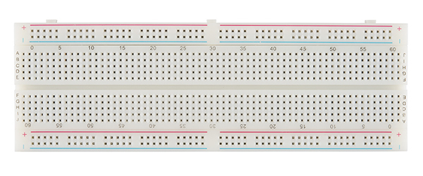

#### 1. ອະທິບາຍອຸປະກອນແມ່ນຫຍັງ?

**Breadboard** (ບາງຄັ້ງເອີ້ນວ່າ Solderless Breadboard ຫຼື Plugboard) ແມ່ນເຄື່ອງມືທີ່ຈຳເປັນໃນການອອກແບບ ແລະ ທົດລອງວົງຈອນອີເລັກໂທຣນິກ.

- **ຄຳນິຍາມ:** ມັນແມ່ນແຜງພລາສຕິກທີ່ມີຮູຂະໜາດນ້ອຍໆຈຳນວນຫຼວງຫຼາຍ ເຊິ່ງຖືກໃຊ້ສຳລັບສຽບຂາອຸປະກອນຕ່າງໆ (ເຊັ່ນ: Resistors, LEDs, Wires, Microcontrollers) ເພື່ອເຊື່ອມຕໍ່ກັນເປັນວົງຈອນໂດຍ **ບໍ່ຕ້ອງໄດ້ບັດກຣີ (solder)**.
    
- **ຈຸດປະສົງ:** ຖືກອອກແບບມາເພື່ອສ້າງວົງຈອນທົດລອງ (Prototype) ຫຼື ທົດສອບການອອກແບບວົງຈອນຊົ່ວຄາວ. ຍ້ອນວ່າມັນບໍ່ຕ້ອງບັດກຣີ, ເຮົາສາມາດຖອດ ແລະ ປະກອບອຸປະກອນຄືນໃໝ່ໄດ້ຢ່າງງ່າຍດາຍ ແລະ ນຳກັບມາໃຊ້ໃໝ່ໄດ້ຕະຫຼອດ.
    

#### 2. ການໃຊ້ງານຂອງອຸປະກອນເຮັດວຽກແນວໃດ?

ການເຮັດວຽກຂອງ Breadboard ແມ່ນອີງໃສ່ການຈັດລຽງຂອງແຖບໂລຫະທີ່ຢູ່ພາຍໃຕ້ຮູສຽບ. ແຖບໂລຫະເຫຼົ່ານີ້ຈະເຮັດໜ້າທີ່ເຊື່ອມຕໍ່ໄຟຟ້າໃຫ້ກັບອຸປະກອນທີ່ສຽບໃສ່ໃນແຕ່ລະຮູບແບບ.

**ໂຄງສ້າງການເຊື່ອມຕໍ່ພາຍໃນມີ 2 ພາກສ່ວນຫຼັກຄື:**

#### ກ. ແຖບພະລັງງານ (Power Rails / Bus Strips)

- **ຕຳແໜ່ງ:** ຕັ້ງຢູ່ແຄມຂອງ Breadboard (ປົກກະຕິຢູ່ດ້ານເທິງ ແລະ ດ້ານລຸ່ມ), ຖືກໝາຍດ້ວຍສັນຍາລັກ **$+$** (ບວກ/ໄຟ) ແລະ **$-$** (ລົບ/Ground).
    
- **ວິທີເຊື່ອມຕໍ່:** ຮູສຽບທັງໝົດໃນແຖວຕາມລວງຍາວ (Horizontal) ຈະເຊື່ອມຕໍ່ເຂົ້າກັນໝົດ.
    
- **ການໃຊ້ງານ:** ໃຊ້ສຳລັບສະໜອງພະລັງງານ ແລະ Ground (ດິນ) ໃຫ້ກັບວົງຈອນ. ທ່ານສາມາດສຽບສາຍໄຟຈາກແຫຼ່ງພະລັງງານ (ເຊັ່ນ: Arduino ຫຼື ແບັດເຕີຣີ) ໃສ່ຮູໃດໜຶ່ງໃນແຖບນີ້, ແລ້ວທຸກຮູໃນແຖວนั้นກໍ່ຈະມີສາຍໄຟຟ້າເຊື່ອມຕໍ່ເຂົ້າກັນ.
    

#### ຂ. ພື້ນທີ່ວົງຈອນຫຼັກ (Main Circuit Area / Component Area)

- **ຕຳແໜ່ງ:** ຕັ້ງຢູ່ບໍລິເວນກາງຂອງ Breadboard, ມີເສັ້ນແບ່ງກາງ.
    
- **ວິທີເຊື່ອມຕໍ່:** ຮູສຽບທັງໝົດໃນແຖວຕາມລວງຕັ້ງ (Vertical) ຈະເຊື່ອມຕໍ່ເຂົ້າກັນໝົດ (ປົກກະຕິແມ່ນ 5 ຮູຕໍ່ແຖວ), ແຕ່ແຖວຕັ້ງແຖວຕໍ່ແຖວແມ່ນບໍ່ເຊື່ອມຕໍ່ກັນ.
    
- **ການໃຊ້ງານ:** ໃຊ້ສຳລັບວາງອຸປະກອນຕ່າງໆ ເຊັ່ນ: Resistors, LEDs, ແລະ Microchips. ເມື່ອທ່ານສຽບຂາອຸປະກອນສອງອັນໃສ່ໃນແຖວຕັ້ງດຽວກັນ, ມັນຈະຖືກເຊື່ອມຕໍ່ທາງໄຟຟ້າເຂົ້າກັນ.

## 3. [ ] USB cable.

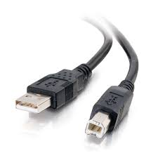

#### 1. ອະທິບາຍອຸປະກອນແມ່ນຫຍັງ?

**USB** ຫຍໍ້ມາຈາກ **Universal Serial Bus**. ສາຍເຊື່ອມຕໍ່ USB ແມ່ນສາຍໄຟມາດຕະຖານທີ່ຖືກອອກແບບມາເພື່ອສ້າງມາດຕະຖານດຽວໃນການເຊື່ອມຕໍ່ອຸປະກອນອີເລັກໂທຣນິກຕ່າງໆ ເຊັ່ນ: ຄອມພິວເຕີ, ໂທລະສັບ, ເຄື່ອງພິມ, ແລະ ອຸປະກອນເສີມ (Peripherals).

**ອົງປະກອບຫຼັກຂອງສາຍ USB:**

- **ສາຍໄຟພາຍໃນ (Internal Wires):** ປົກກະຕິແລ້ວມີສີ່ສາຍຫຼັກ (ຫຼືຫຼາຍກວ່ານັ້ນສຳລັບມາດຕະຖານໃໝ່) ເຊິ່ງປະກອບມີ:
    
    - **ສາຍພະລັງງານ:** ສາຍສີແດງ ($+5\text{V}$ ຫຼື ແຮງດັນທີ່ສູງກວ່າຕາມມາດຕະຖານ PD) ແລະ ສາຍສີດຳ (Ground/ດິນ).
        
    - **ສາຍຂໍ້ມູນ:** ສາຍສີຂາວ ແລະ ສີຂຽວ (ໃຊ້ສຳລັບການຖ່າຍໂອນຂໍ້ມູນ).
        
- **ຫົວເຊື່ອມຕໍ່ (Connectors):** ເປັນສ່ວນປາຍຂອງສາຍທີ່ສຽບໃສ່ຜອດ (Port) ຂອງອຸປະກອນ. ຫົວເຊື່ອມຕໍ່ມີຫຼາຍປະເພດ, ເຊິ່ງກຳນົດວ່າສາຍສາມາດເຊື່ອມຕໍ່ກັບອຸປະກອນໃດໄດ້:
    
    - **Type-A:** ຫົວສີ່ຫຼ່ຽມມົນທີ່ພົບເຫັນຫຼາຍທີ່ສຸດໃນຄອມພິວເຕີ ຫຼື ເຄື່ອງສາກ.
        
    - **Type-B:** ຫົວສີ່ຫຼ່ຽມເກືອບຈະເປັນຮູບສີ່ຫຼ່ຽມມົນ, ພົບເຫັນຫຼາຍໃນເຄື່ອງພິມ.
        
    - **Mini-USB ແລະ Micro-USB:** ຫົວຂະໜາດນ້ອຍທີ່ເຄີຍໃຊ້ໃນໂທລະສັບລຸ້ນເກົ່າ ແລະ ອຸປະກອນພົກພາ.
        
    - **Type-C (USB-C):** ຫົວຮູບສ້ວຍທີ່ເປັນມາດຕະຖານໃໝ່, ສາມາດສຽບໄດ້ທັງສອງດ້ານ, ແລະ ຮອງຮັບການຖ່າຍໂອນຂໍ້ມູນ ແລະ ພະລັງງານສູງສຸດ.
        

#### 2. ການໃຊ້ງານຂອງອຸປະກອນເຮັດວຽກແນວໃດ?

ສາຍເຊື່ອມຕໍ່ USB ເຮັດວຽກເປັນຊ່ອງທາງສື່ສານແບບຄົບວົງຈອນ (Dual-purpose conduit) ເຊິ່ງສາມາດຖ່າຍໂອນທັງ **ຂໍ້ມູນ (Data)** ແລະ **ພະລັງງານໄຟຟ້າ (Power)** ໄປພ້ອມໆກັນ.

#### ກ. ການຖ່າຍໂອນຂໍ້ມູນ (Data Transfer)

- **ວິທີເຮັດວຽກ:** ສາຍສີຂຽວ ແລະ ສີຂາວ (ຫຼື ສາຍຂໍ້ມູນອື່ນໆໃນ Type-C) ຈະສົ່ງຂໍ້ມູນແບບລຳດັບ (Serial Data) ລະຫວ່າງອຸປະກອນຫຼັກ (Host, ເຊັ່ນ: ຄອມພິວເຕີ) ແລະ ອຸປະກອນເສີມ (Peripheral, ເຊັ່ນ: ໂທລະສັບ, Flash Drive, Arduino).
    
- **ການໃຊ້ງານ:**
    
    - **ໂອນໄຟລ໌:** ສົ່ງຮູບພາບ, ເອກະສານ, ຫຼື ວິດີໂອ.
        
    - **ສື່ສານ ແລະ ຄວບຄຸມ:** ໃຊ້ສຳລັບການສັ່ງການເຄື່ອງພິມ, ໃຊ້ເມົ້າ/ຄີບອດ, ຫຼື ອັບໂຫຼດໂຄຣແກຣມໃສ່ໄມໂຄຣຄອນໂທນເລີ (ເຊັ່ນ: Arduino Uno).
        

#### ຂ. ການສະໜອງພະລັງງານ (Power Delivery)

- **ວິທີເຮັດວຽກ:** ສາຍສີແດງ ແລະ ສີດຳ (ສາຍພະລັງງານ ແລະ Ground) ຈະສະໜອງແຮງດັນໄຟຟ້າຈາກອຸປະກອນຕົ້ນທາງ (ເຊັ່ນ: ຜອດ USB ຂອງຄອມພິວເຕີ) ໄປຍັງອຸປະກອນປາຍທາງ.
    
- **ການໃຊ້ງານ:**
    
    - **ສາກແບັດເຕີຣີ:** ສາກໂທລະສັບ, ແທັບເລັດ, ຫຼື Power Bank.
        
    - **ໃຫ້ພະລັງງານໂດຍກົງ:** ໃຫ້ພະລັງງານແກ່ອຸປະກອນນ້ອຍໆເຊັ່ນ: ໄຟ LED, ພັດລົມ USB, ຫຼື ແຜງວົງຈອນເຊັ່ນ Arduino Uno (ເຊິ່ງປົກກະຕິແມ່ນ $5\text{V}$ ຕາມມາດຕະຖານ USB ເລີ່ມຕົ້ນ).
        
    - **USB Power Delivery (USB-PD):** ມາດຕະຖານໃໝ່ທີ່ໃຊ້ໃນ USB-C ຊ່ວຍໃຫ້ສາມາດສົ່ງພະລັງງານໄດ້ສູງເຖິງ $240$ ວັດ ເຊິ່ງພຽງພໍສຳລັບສາກຄອມພິວເຕີ Laptop.

# 🧵 Wiring & Connectors.

## 4. [ ] Jumper wires (male-to-male).

#### 1. ອະທິບາຍອຸປະກອນແມ່ນຫຍັງ?

**Jumper Wires**  ແມ່ນສາຍໄຟທີ່ມີຄວາມຍືດຫຍຸ່ນ, ໃຊ້ສຳລັບການເຊື່ອມຕໍ່ອົງປະກອບຕ່າງໆໃນວົງຈອນອີເລັກໂທຣນິກຊົ່ວຄາວ **ໂດຍບໍ່ຕ້ອງບັດກຣີ**.

**ສາຍ Male-to-Male** ແມ່ນປະເພດສະເພາະຂອງສາຍ, ເຊິ່ງມີລັກສະນະຄື:

- **ສາຍໄຟ:** ເປັນສາຍໄຟນຳໄຟຟ້າທີ່ຖືກຫຸ້ມດ້ວຍສນວນ (Insulation). ມັກຈະມາໃນຫຼາຍສີ (ເຊັ່ນ: ແດງ, ດຳ, ຂຽວ, ເຫຼືອງ) ເພື່ອຊ່ວຍຈັດລະບຽບ ແລະ ແຍກສັນຍານຕ່າງໆ (ເຊັ່ນ: ແດງສຳລັບໄຟ, ດຳສຳລັບ Ground).
    
- **ຫົວເຊື່ອມຕໍ່ທັງສອງສົ້ນ:** ມີຫົວເຊື່ອມຕໍ່ແບບ **ຜູ້ (Male)** ຢູ່ທັງສອງສົ້ນ.
    
    - **ຫົວຜູ້ (Male Connector):** ແມ່ນປາຍທີ່ເປັນໂລຫະແຫຼມນ້ອຍໆ (Pin) ທີ່ຢືນອອກມາ, ເຊິ່ງຖືກອອກແບບມາເພື່ອສຽບເຂົ້າໄປໃນຫົວເຊື່ອມຕໍ່ແບບ **ແມ່ (Female Connector)**, ເຊັ່ນ: ຮູຂອງ Breadboard, ຫຼື ຜອດ Female Header ຂອງແຜງ Arduino.
        

#### 2. ການໃຊ້ງານຂອງອຸປະກອນເຮັດວຽກແນວໃດ?

ສາຍ Male-to-Male Jumper Wires ເຮັດວຽກເປັນ "ຂົວ" ນຳໄຟຟ້າຊົ່ວຄາວໃນວົງຈອນທົດລອງ.

| **ການໃຊ້ງານ**                           | **ວິທີເຮັດວຽກ**                                                                                                                                   |
| --------------------------------------- | ------------------------------------------------------------------------------------------------------------------------------------------------- |
| **ເຊື່ອມຕໍ່ອຸປະກອນໃນ Breadboard**       | ຫົວຜູ້ທັງສອງສົ້ນຈະຖືກສຽບເຂົ້າໄປໃນຮູຂອງ Breadboard ເພື່ອເຊື່ອມຕໍ່ອົງປະກອບສອງຢ່າງທີ່ຢູ່ຕ່າງຕຳແໜ່ງກັນ (ເຊັ່ນ: ເຊື່ອມຕໍ່ຂາຂອງ Resistor ກັບຂາຂອງ LED). |
| **ເຊື່ອມຕໍ່ Breadboard ກັບ Breadboard** | ໃຊ້ສຳລັບເຊື່ອມຕໍ່ແຖບພະລັງງານ (Power Rails) ຫຼື ພື້ນທີ່ວົງຈອນຫຼັກຂອງ Breadboard ສອງແຜງເຂົ້າກັນ.                                                    |
| **ເຊື່ອມຕໍ່ກັບແຜງວົງຈອນທົດລອງອື່ນໆ**    | ຫົວຜູ້ສາມາດສຽບເຂົ້າໄປໃນຜອດ Female Header ຂອງແຜງຄວບຄຸມຕ່າງໆ (ເຊັ່ນ: ເຊື່ອມຕໍ່ສັນຍານຈາກ Breadboard ໄປຫາຜອດ Digital Pin ຂອງ Arduino Uno).            |
| **ສ້າງການເຊື່ອມຕໍ່ພະລັງງານ/Ground**     | ໃຊ້ສາຍສີແດງ ແລະ ສີດຳ ເພື່ອເຊື່ອມຕໍ່ໄຟ ($+5\text{V}$ ຫລື $3.3\text{V}$) ແລະ Ground ຈາກແຜງຄວບຄຸມໄປຫາແຖບພະລັງງານຂອງ Breadboard.                      |
|                                         |                                                                                                                                                   |

## 5. [ ] Jumper wires (male-to-female).

#### 1. ອະທິບາຍອຸປະກອນແມ່ນຫຍັງ?

**Male-to-Female Jumper Wires** ແມ່ນສາຍໄຟທີ່ໃຊ້ສຳລັບການສ້າງການເຊື່ອມຕໍ່ໄຟຟ້າຊົ່ວຄາວໃນວົງຈອນອີເລັກໂທຣນິກ ແລະ ໂຄງການທົດລອງ.

- **ຄຳນິຍາມ:** ມັນແມ່ນສາຍໄຟນຳໄຟຟ້າທີ່ຫຸ້ມສນວນ ເຊິ່ງມີຫົວເຊື່ອມຕໍ່ສອງປະເພດຢູ່ຄົນລະສົ້ນ:
    
    - **ສົ້ນຜູ້ (Male End):** ເປັນປາຍໂລຫະແຫຼມ (Pin) ທີ່ຢືນອອກມາ, ອອກແບບມາເພື່ອສຽບເຂົ້າໄປໃນຮູ (Female Sockets), ເຊັ່ນ: ຮູໃນ Breadboard.
        
    - **ສົ້ນແມ່ (Female End):** ເປັນປາຍທີ່ມີເບົ້າ ຫຼື ຊ່ອງຮັບ (Socket) ທີ່ສາມາດສຽບຫົວຜູ້ (Male Pin) ເຂົ້າໄປໄດ້, ເຊັ່ນ: ຂາຂອງ Sensor ຫຼື Pin Header ທີ່ຢືນອອກມາຈາກ Microcontroller.
        

#### 2. ການໃຊ້ງານຂອງອຸປະກອນເຮັດວຽກແນວໃດ?

ສາຍ Male-to-Female Jumper Wires ເຮັດວຽກເປັນ "ຕົວເຊື່ອມຕໍ່ລະຫວ່າງສອງອຸປະກອນທີ່ມີປະເພດຫົວເຊື່ອມຕໍ່ກົງກັນຂ້າມ" ເຊິ່ງມັນມີປະໂຫຍດຢ່າງຍິ່ງໃນການເຊື່ອມຕໍ່ລະຫວ່າງແຜງວົງຈອນ (Board) ແລະ ອຸປະກອນເສີມ (Modules/Sensors).

| **ການໃຊ້ງານ**                                     | **ວິທີເຮັດວຽກ**                                                                                                                                                                        |
| ------------------------------------------------- | -------------------------------------------------------------------------------------------------------------------------------------------------------------------------------------- |
| **ເຊື່ອມຕໍ່ Sensor/Module ກັບ Arduino**           | ຫົວ **ແມ່ (Female End)** ຈະຖືກສຽບໃສ່ກັບຂາຜູ້ (Male Pin) ທີ່ຢືນອອກມາຈາກເຊັນເຊີ (ເຊັ່ນ: Ultrasonic Sensor, DHT11) ຫຼື Module ອື່ນໆ.                                                      |
| **ເຊື່ອມຕໍ່ Sensor/Module ກັບ Breadboard**        | ຫົວ **ຜູ້ (Male End)** ຈະຖືກສຽບເຂົ້າໄປໃນຮູຂອງ Breadboard, ແລະ ຫົວ **ແມ່ (Female End)** ຈະຖືກສຽບໃສ່ກັບຂາ Pin ຂອງອຸປະກອນ (ທີ່ເປັນຫົວຜູ້).                                                |
| **ເຊື່ອມຕໍ່ກັບ Microcontroller (ເຊັ່ນ: Arduino)** | ຫົວ **ແມ່ (Female End)** ຈະຖືກສຽບໂດຍກົງໃສ່ກັບ Digital ຫຼື Analog Pins ຂອງແຜງ Arduino (ເຊິ່ງເປັນ Female Headers), ແລະ ຫົວ **ຜູ້ (Male End)** ຈະຖືກສຽບໃສ່ກັບ Breadboard ເພື່ອສ້າງວົງຈອນ. |
| **ໃຊ້ເປັນສາຍຕໍ່ເສີມ (Extension)**                 | ສາມາດນຳໃຊ້ເພື່ອຂະຫຍາຍໄລຍະຫ່າງການເຊື່ອມຕໍ່, ໂດຍການສຽບຫົວຜູ້ເຂົ້າກັບຫົວແມ່ຂອງສາຍ Jumper ອື່ນໆ ເພື່ອສ້າງສາຍເຊື່ອມຕໍ່ທີ່ຍາວຂຶ້ນ.                                                           |

## 6. [ ] Jumper wires (female-to-female).

#### 1. ອະທິບາຍອຸປະກອນແມ່ນຫຍັງ?

**Female-to-Female Jumper Wires** ແມ່ນສາຍໄຟນຳໄຟຟ້າທີ່ມີຄວາມຍືດຫຍຸ່ນ, ໃຊ້ສຳລັບສ້າງການເຊື່ອມຕໍ່ໄຟຟ້າຊົ່ວຄາວໃນໂຄງການອີເລັກໂທຣນິກ.

- **ຄຳນິຍາມ:** ມັນແມ່ນສາຍໄຟທີ່ຖືກຫຸ້ມດ້ວຍສນວນ, ເຊິ່ງມີຫົວເຊື່ອມຕໍ່ແບບ **ແມ່ (Female Connector)** ຢູ່ທັງສອງສົ້ນ.
    
    - **ຫົວແມ່ (Female End):** ແມ່ນປາຍທີ່ມີເບົ້າ (Socket) ຫຼື ຮູຮັບ ເຊິ່ງອອກແບບມາເພື່ອຮັບ ຫຼື ສຽບຫົວ **ຜູ້ (Male Pin)** ທີ່ຢືນອອກມາຈາກອຸປະກອນອື່ນໆ.
        

#### 2. ການໃຊ້ງານຂອງອຸປະກອນເຮັດວຽກແນວໃດ?

ສາຍ Female-to-Female Jumper Wires ເຮັດວຽກເປັນ "ສາຍຕໍ່" ທີ່ເຊື່ອມຕໍ່ລະຫວ່າງສອງຈຸດທີ່ມີຂາຕໍ່ແບບຜູ້ (Male Pins) ຢືນອອກມາ. ມັນເປັນສິ່ງທີ່ຈຳເປັນເມື່ອທ່ານບໍ່ສາມາດໃຊ້ Breadboard ໄດ້ໂດຍກົງ ຫຼື ເມື່ອຕ້ອງການເຊື່ອມຕໍ່ອຸປະກອນສອງຢ່າງທີ່ມີຂາຕໍ່ເປັນແບບຜູ້ທັງຄູ່.

| **ການໃຊ້ງານຫຼັກ**                        | **ວິທີເຮັດວຽກ**                                                                                                                                                                                                                                                                     |
| ---------------------------------------- | ----------------------------------------------------------------------------------------------------------------------------------------------------------------------------------------------------------------------------------------------------------------------------------- |
| **ເຊື່ອມຕໍ່ Microcontroller ກັບ Sensor** | ໃຊ້ສຳລັບການເຊື່ອມຕໍ່ໂດຍກົງລະຫວ່າງ: 1. **Pins ທີ່ຢືນອອກມາຈາກແຜງຄວບຄຸມ** (ເຊັ່ນ: ຂາ $5\text{V}$, GND, ແລະ I/O ຂອງ Arduino ທີ່ຢືນອອກມາຈາກ Shield ຫຼື Pin Headers). 2. **Pins ທີ່ຢືນອອກມາຈາກ Sensor ຫຼື Module** (ເຊັ່ນ: ຂາ $5\text{V}$, GND, ແລະ Signal Pin ຂອງ Sensor ທີ່ເປັນຫົວຜູ້). |
| **ເຊື່ອມຕໍ່ Module ສອງອັນ**              | ໃຊ້ເພື່ອເຊື່ອມຕໍ່ Modules ສອງອັນທີ່ຕັ້ງຢູ່ຫ່າງກັນ ເຊິ່ງມີຂາຕໍ່ເປັນຫົວຜູ້ (Male Pins) ທັງຄູ່ ເຂົ້າກັນ (ເຊັ່ນ: ການເຊື່ອມຕໍ່ ໜ້າຈໍ LCD Module ກັບ Bluetooth Module).                                                                                                                   |
| **ໃຊ້ເປັນສາຍຕໍ່ແບບພົກພາ**                | ເນື່ອງຈາກມັນບໍ່ໄດ້ຖືກຈຳກັດຢູ່ກັບ Breadboard, ມັນຈຶ່ງເໝາະສຳລັບໂຄງການທີ່ຕ້ອງນຳພາ ຫຼື ຕ້ອງການການເຊື່ອມຕໍ່ໄລຍະໄກພາຍໃນກ່ອງໃສ່ອຸປະກອນ (Enclosure).                                                                                                                                        |
| **ການທົດລອງກັບ Pin Headers**             | ເຮັດໃຫ້ການສຽບຫົວແມ່ເຂົ້າກັບ Pin Headers ທີ່ຢືນອອກມາຈາກແຜງວົງຈອນຕ່າງໆ ເປັນເລື່ອງງ່າຍ ແລະ ຮັບປະກັນການເຊື່ອມຕໍ່ທີ່ໝັ້ນຄົງ.                                                                                                                                                             |

## 7. [ ] 9V Battery Connector.

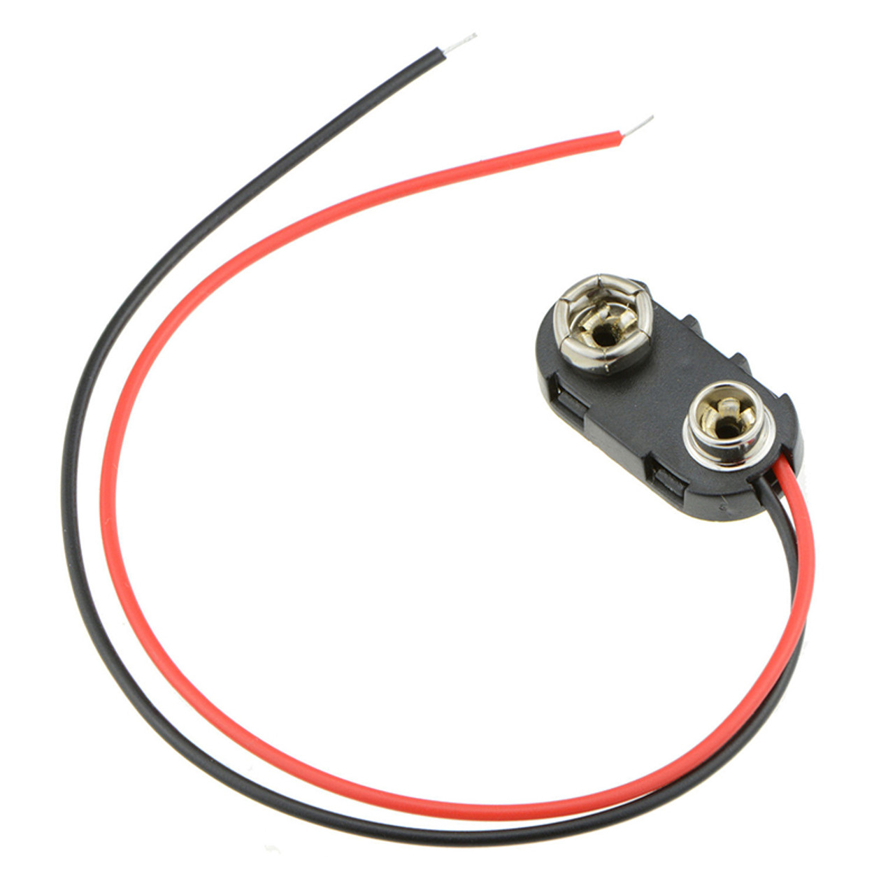

#### 1. ອະທິບາຍອຸປະກອນແມ່ນຫຍັງ?

**9V Battery Connector** (ຫຼືມັກຈະເອີ້ນວ່າ **PP3 Connector** ຫຼື **9V Battery Clip**) ແມ່ນອຸປະກອນເຊື່ອມຕໍ່ໄຟຟ້າຂະໜາດນ້ອຍ ທີ່ຖືກອອກແບບສະເພາະເພື່ອສຽບໃສ່ກັບຂົ້ວໄຟ (terminals) ດ້ານເທິງຂອງແບັດເຕີຣີຂະໜາດ $9\text{V}$ (ເຊິ່ງມີລັກສະນະເປັນຮູບສີ່ຫຼ່ຽມມຸມສາກ).

**ລັກສະນະໂຄງສ້າງ:**

- **ຫົວສຽບ (Snap Connector):** ປະກອບດ້ວຍສອງເບົ້າໂລຫະຂະໜາດນ້ອຍທີ່ວາງຕຳແໜ່ງໃຫ້ກົງກັບຂົ້ວບວກ (+) ແລະ ຂົ້ວລົບ (-) ທີ່ຢືນອອກມາຈາກແບັດເຕີຣີ $9\text{V}$. ຫົວສຽບນີ້ຖືກອອກແບບໃຫ້ສາມາດ "ງັບ" ໃສ່ຂົ້ວແບັດເຕີຣີໄດ້ຢ່າງໝັ້ນຄົງ.
    
- **ສາຍໄຟ (Wires):** ຫົວເຊື່ອມຕໍ່ຈະມີສາຍໄຟສອງເສັ້ນເຊື່ອມຕໍ່ອອກມາ:
    
    - **ສີແດງ:** ເຊື່ອມຕໍ່ກັບຂົ້ວ **ບວກ (+)** ຂອງແບັດເຕີຣີ.
        
    - **ສີດຳ:** ເຊື່ອມຕໍ່ກັບຂົ້ວ **ລົບ (-) / Ground**.
        
- **ວັດສະດຸ:** ຫົວສຽບມັກຈະຫຸ້ມດ້ວຍພລາສຕິກ ຫຼື ໜັງສັງເຄາະ ເພື່ອປ້ອງກັນການລັດວົງຈອນ (short circuit) ຂອງຂົ້ວໄຟ.
    

#### 2. ການໃຊ້ງານຂອງອຸປະກອນເຮັດວຽກແນວໃດ?

ການໃຊ້ງານຫຼັກຂອງ 9V Battery Connector ແມ່ນການ **ສະໜອງພະລັງງານໄຟຟ້າ** ໃຫ້ກັບວົງຈອນອີເລັກໂທຣນິກ ແລະ ອຸປະກອນຂະໜາດນ້ອຍ.

| **ການໃຊ້ງານ**                      | **ວິທີເຮັດວຽກ**                                                                                                                                                                               |
| ---------------------------------- | --------------------------------------------------------------------------------------------------------------------------------------------------------------------------------------------- |
| **ໃຫ້ພະລັງງານແກ່ວົງຈອນທົດລອງ**     | ນຳໃຊ້ສາຍສີແດງ ແລະ ສີດຳ ໄປເຊື່ອມຕໍ່ກັບວົງຈອນທີ່ຕ້ອງການໄຟ $9\text{V}$ (ເຊັ່ນ: ໂຄງການ Breadboard, ວົງຈອນ Amplifier ຂະໜາດນ້ອຍ, ຫຼື ໂຄງການ Arduino ທີ່ບໍ່ໄດ້ໃຊ້ USB).                              |
| **ເປັນແຫຼ່ງພະລັງງານສຳລັບ Arduino** | ສາຍ $9\text{V}$ Connector ມັກຈະຖືກນຳມາເຊື່ອມຕໍ່ກັບ DC Power Jack (ຫົວສຽບໄຟ DC) ເພື່ອໃຊ້ເປັນແຫຼ່ງພະລັງງານສຳລັບແຜງ Arduino Uno ຫຼື ແຜງຄວບຄຸມອື່ນໆ ທີ່ຕ້ອງການໄຟພາຍນອກ.                           |
| **ໃຊ້ໃນອຸປະກອນພົກພາ**              | ໃຊ້ໃນອຸປະກອນອີເລັກໂທຣນິກທີ່ໃຊ້ແບັດເຕີຣີ $9\text{V}$ ເປັນປະຈຳ ເຊັ່ນ: ເຄື່ອງກວດຈັບຄວັນ (Smoke Detectors), ວິທະຍຸສື່ສານ (Walkie-talkies), ຫຼື ກ່ອງຜົນກະທົບສຽງສຳລັບກີຕ້າ (Guitar effects pedals). |
| **ການທົດສອບ**                      | ໃຊ້ສຳລັບສຽບໃສ່ກັບແບັດເຕີຣີ $9\text{V}$ ເພື່ອວັດແທກແຮງດັນໄຟຟ້າທີ່ຍັງເຫຼືອຢູ່ໃນແບັດເຕີຣີ ໂດຍການຕໍ່ເຂົ້າກັບ Multimeter.                                                                          |

# 💡 Basic Components

## 8. [ ] LEDs (Red: 5, Yellow: 5, Blue: 5, RGB: 1).

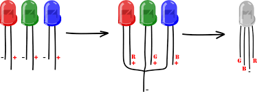

#### 1. ອະທິບາຍອຸປະກອນແມ່ນຫຍັງ?

**LED** (Light-Emitting Diode) ແມ່ນອຸປະກອນເຊມິຄອນດັກເຕີ (semiconductor) ປະເພດໜຶ່ງ ທີ່ປ່ອຍແສງສະຫວ່າງອອກມາເມື່ອກະແສໄຟຟ້າໄຫຼຜ່ານມັນໃນທິດທາງທີ່ຖືກຕ້ອງ (forward bias). ມັນແມ່ນໄດໂອດທີ່ປ່ຽນພະລັງງານໄຟຟ້າໃຫ້ເປັນພະລັງງານແສງສະຫວ່າງໂດຍກົງ, ເຮັດໃຫ້ມັນມີປະສິດທິພາບພະລັງງານສູງ.

ໃນຊຸດຂອງທ່ານມີສອງປະເພດຄື:

##### 1.1. LED ສີດ່ຽວ (Single-Color LEDs: Red: 5, Yellow: 5, Blue: 5)

- **ຄຳນິຍາມ:** ແມ່ນໄຟ LED ທົ່ວໄປທີ່ມີສອງຂາ (ຂາ $+$ Anode ແລະ ຂາ $-$ Cathode). ມັນຈະປ່ອຍແສງສະຫວ່າງອອກມາເປັນ **ສີດຽວ** ເທົ່ານັ້ນ, ເຊິ່ງຖືກກຳນົດໂດຍວັດສະດຸ semiconductor ທີ່ໃຊ້.
    
- **ລັກສະນະ:** ຂາຍາວແມ່ນຂົ້ວ **ບວກ (+)**, ແລະຂາສັ້ນແມ່ນຂົ້ວ **ລົບ (–)**. ມັນຕ້ອງການຕົວຕ້ານທານ (Resistor) ເພື່ອຈຳກັດກະແສໄຟຟ້າທີ່ໄຫຼເຂົ້າ ເພື່ອປ້ອງກັນບໍ່ໃຫ້ LED ເສຍຫາຍ.
    

##### 1.2. RGB LED (RGB: 1)

- **ຄຳນິຍາມ:** ແມ່ນໄຟ LED ອັນດຽວທີ່ປະກອບດ້ວຍ **ໄດໂອດສາມສີ** ຢູ່ພາຍໃນ: **ສີແດງ (Red), ສີຂຽວ (Green), ແລະ ສີຟ້າ (Blue)**.
    
- **ລັກສະນະ:** ມັນມີຫຼາຍກວ່າສອງຂາ (ສ່ວນຫຼາຍມີ 4 ຂາ). ການປະສົມຄວາມເຂັ້ມຂອງແສງສາມສີພື້ນຖານນີ້ສາມາດສ້າງສີສັນໄດ້ເກືອບທຸກສີ (ຕາມຫຼັກການ **Additive Color Model**).
    
    - **Common Cathode (ແຄໂທດຮ່ວມ):** ມີຂາລົບ (-) ຮ່ວມກັນ, ສ່ວນຂາອື່ນແມ່ນຂາບວກ (+).
        
    - **Common Anode (ອາໂນດຮ່ວມ):** ມີຂາບວກ (+) ຮ່ວມກັນ, ສ່ວນຂາອື່ນແມ່ນຂາລົບ (-).
        

#### 2. ການໃຊ້ງານຂອງອຸປະກອນເຮັດວຽກແນວໃດ?

ການເຮັດວຽກຂອງໄຟ LED ທັງສອງປະເພດແມ່ນຂຶ້ນກັບການໃຫ້ກະແສໄຟຟ້າທີ່ເໝາະສົມ.

##### 2.1. ການໃຊ້ງານຂອງ LED ສີດ່ຽວ (Red, Yellow, Blue)

- **ການເຮັດວຽກ:**
    
    1. **ໃຫ້ກະແສໄຟຟ້າ:** ກະແສໄຟຟ້າຖືກສົ່ງຜ່ານ LED ໂດຍໃຫ້ຂົ້ວບວກ (+) ເຊື່ອມຕໍ່ກັບ Anode ແລະ ຂົ້ວລົບ (-) ເຊື່ອມຕໍ່ກັບ Cathode.
        
    2. **ຈຳກັດກະແສໄຟຟ້າ:** ຕ້ອງໃຊ້ **ຕົວຕ້ານທານ (Resistor)** ຕໍ່ແບບອະນຸກົມ (Series) ເພື່ອຈຳກັດກະແສໄຟຟ້າໃຫ້ຢູ່ໃນລະດັບທີ່ປອດໄພ (ປົກກະຕິແລ້ວແມ່ນ $20\text{mA}$), ເພື່ອບໍ່ໃຫ້ LED ໄໝ້.
        
- **ຕົວຢ່າງການໃຊ້ງານ:**
    
    - ໄຟຕົວຊີ້ບອກ (Indicator lights): ສະແດງສະຖານະເປີດ/ປິດ ຫຼື ສະຖານະການເຮັດວຽກ.
        
    - ໄຟຈະລາຈອນແບບຈຳລອງໃນການທົດລອງ.
        

##### 2.2. ການໃຊ້ງານຂອງ RGB LED

- **ການເຮັດວຽກ:**
    
    1. **ຄວບຄຸມສີ:** ແສງສະຫວ່າງທີ່ປ່ອຍອອກມາແມ່ນຂຶ້ນກັບ **ກະແສໄຟຟ້າທີ່ໄຫຼຜ່ານແຕ່ລະໄດໂອດສີ** (R, G, ຫຼື B).
        
    2. **ການປະສົມສີ:** ເພື່ອສ້າງສີອື່ນໆ, ຕ້ອງໃຊ້ເທັກນິກ **PWM (Pulse Width Modulation)** ຈາກ Microcontroller (ເຊັ່ນ: Arduino) ເພື່ອຄວບຄຸມຄວາມສະຫວ່າງຂອງແຕ່ລະສີ (R, G, ແລະ B) ຢ່າງອິດສະຫຼະ.
        
        - **ຕົວຢ່າງ:** ການເປີດສີແດງ ແລະ ສີຂຽວດ້ວຍຄວາມເຂັ້ມເທົ່າກັນຈະສ້າງສີ **ເຫຼືອງ**.
            
        - **ຕົວຢ່າງ:** ການເປີດສີແດງ, ສີຂຽວ, ແລະ ສີຟ້າ ພ້ອມກັນຈະສ້າງສີ **ຂາວ**.
            
- **ຕົວຢ່າງການໃຊ້ງານ:**
    
    - ໄຟຕົກແຕ່ງ ຫຼື ໄຟສະແດງອາລົມ (Mood Lighting).
        
    - ໄຟສະແດງສະຖານະທີ່ສາມາດປ່ຽນສີໄດ້ຕາມຂໍ້ມູນ ຫຼື ອຸນຫະພູມ.

## 9. [ ] RGB module.

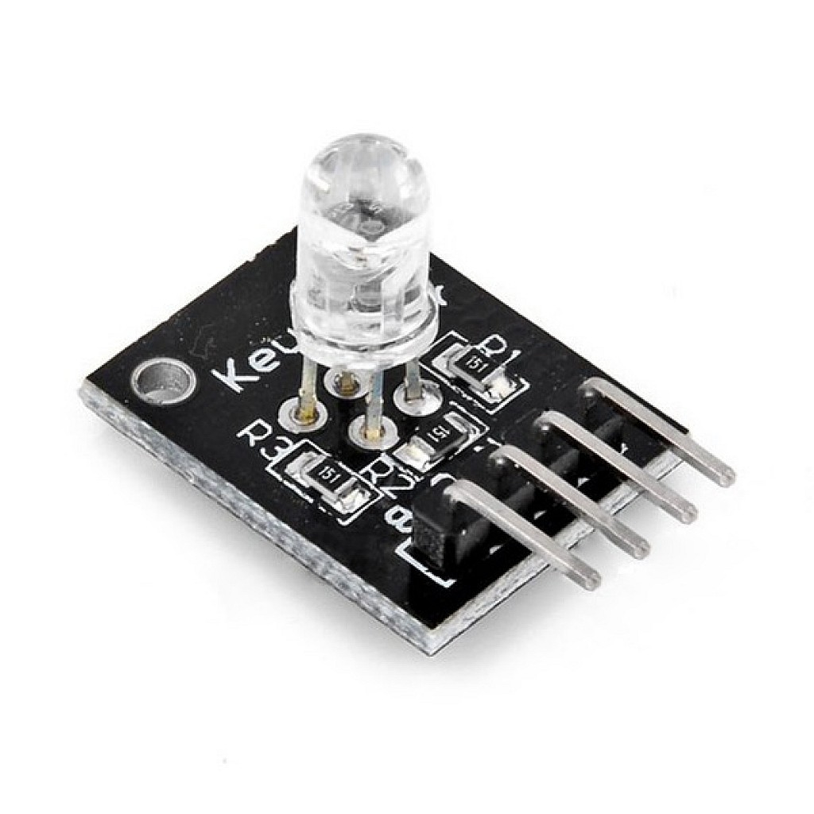

#### 1. ອະທິບາຍອຸປະກອນແມ່ນຫຍັງ?

**RGB Module** ແມ່ນແຜງວົງຈອນອີເລັກໂທຣນິກຂະໜາດນ້ອຍທີ່ປະກອບດ້ວຍໄຟ **RGB LED** (Red, Green, Blue) ທີ່ຖືກເຊື່ອມຕໍ່ກັບຕົວຕ້ານທານ (resistors) ທີ່ຈຳເປັນ ແລະ Pin Header ເພື່ອໃຫ້ສາມາດເຊື່ອມຕໍ່ກັບ Microcontroller (ເຊັ່ນ: Arduino ຫຼື Raspberry Pi) ໄດ້ຢ່າງສະດວກ.

- **RGB LED:** ຢູ່ໃນໂມດູນມີໄຟ LED ດຽວທີ່ປະກອບດ້ວຍໄດໂອດສາມສີ: ສີແດງ (R), ສີຂຽວ (G), ແລະ ສີຟ້າ (B).
    
- **ຕົວຕ້ານທານ (Resistors):** ໂມດູນນີ້ມີຕົວຕ້ານທານທີ່ຖືກຕິດຕັ້ງໄວ້ລ່ວງໜ້າສຳລັບແຕ່ລະສີ (R, G, B) ເພື່ອປ້ອງກັນບໍ່ໃຫ້ກະແສໄຟຟ້າຫຼາຍເກີນໄປໄຫຼເຂົ້າໄປໃນ LED, ເຮັດໃຫ້ຜູ້ໃຊ້ບໍ່ຈຳເປັນຕ້ອງຕໍ່ຕົວຕ້ານທານເພີ່ມໃສ່ Breadboard.
    
- **Pin Headers:** ມັກຈະມີ 4 ຂາຕໍ່ (Pins) ສຳລັບການເຊື່ອມຕໍ່ກັບ Microcontroller:
    
    - $\text{R}$: ຄວບຄຸມສີແດງ.
        
    - $\text{G}$: ຄວບຄຸມສີຂຽວ.
        
    - $\text{B}$: ຄວບຄຸມສີຟ້າ.
        
    - $\text{GND}$ (ຫຼື VCC): ຂົ້ວລົບ (Ground) ຫຼື ຂົ້ວບວກ (Voltage supply), ຂຶ້ນກັບວ່າໂມດູນນັ້ນເປັນແບບ Common Cathode ຫຼື Common Anode.
        

#### 2. ການໃຊ້ງານຂອງອຸປະກອນເຮັດວຽກແນວໃດ?

ໂມດູນ $\text{RGB}$ ເຮັດວຽກໂດຍການ **ຄວບຄຸມຄວາມສະຫວ່າງຂອງແຕ່ລະສີ (R, G, B) ແຍກກັນ** ເພື່ອສ້າງສີສັນຕ່າງໆ ຜ່ານຫຼັກການປະສົມສີແບບເພີ່ມ (Additive Color Mixing).

|**ການໃຊ້ງານຫຼັກ**|**ວິທີເຮັດວຽກ**|
|---|---|
|**ການຄວບຄຸມສີ**|ການເຊື່ອມຕໍ່ຂາ $\text{R}, \text{G}, \text{B}$ ຂອງໂມດູນເຂົ້າກັບ Digital Pins ຂອງ Microcontroller.|
|**ການສ້າງສີຕ່າງໆ**|ໃຊ້ **PWM (Pulse Width Modulation)** ຈາກ Microcontroller ເພື່ອປັບຄວາມເຂັ້ມຂອງແຕ່ລະສີ (R, G, B) ຕັ້ງແຕ່ 0 ຫາ 255 (ໃນລະບົບ $8\text{-bit}$). - ຄວາມເຂັ້ມ $0$: ໄຟປິດ. - ຄວາມເຂັ້ມ $255$: ໄຟເປີດສຸດ.|
|**ຕົວຢ່າງສີ**|- **ສີແດງສູງສຸດ** ($\text{R}=255, \text{G}=0, \text{B}=0$) ຈະໄດ້ສີແດງສົດ. - **ສີເຫຼືອງ** ($\text{R}=255, \text{G}=255, \text{B}=0$): ປະສົມສີແດງ ແລະ ສີຂຽວ. - **ສີຂາວ** ($\text{R}=255, \text{G}=255, \text{B}=255$): ປະສົມທັງສາມສີສູງສຸດ.|
|**ການນຳໃຊ້**|ໂມດູນ RGB ຖືກນຳໃຊ້ຢ່າງກວ້າງຂວາງໃນໂຄງການທົດລອງເພື່ອເປັນ: 1. **ຕົວຊີ້ບອກສະຖານະ:** ສະແດງຂໍ້ຜິດພາດ (ສີແດງ), ພ້ອມໃຊ້ງານ (ສີຂຽວ), ຫຼື ການໂຫຼດ (ສີຟ້າ). 2. **ຜົນກະທົບແສງສະຫວ່າງ:** ສ້າງຜົນກະທົບການປ່ຽນສີແບບອັດຕະໂນມັດ ຫຼື ໄຟຕົກແຕ່ງ.|

## 10. [ ]  Resistors (220Ω, 1kΩ, 10kΩ).

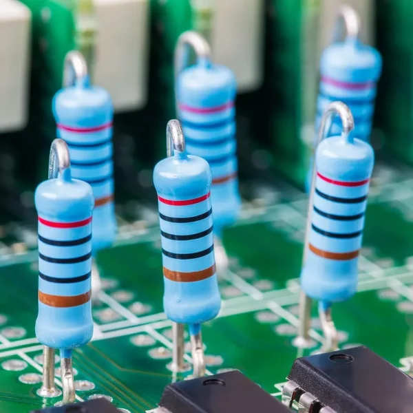

#### 1. ອະທິບາຍອຸປະກອນແມ່ນຫຍັງ?

**Resistor** (ຕົວຕ້ານທານ) ແມ່ນອົງປະກອບອີເລັກໂທຣນິກແບບ **Passive** ທີ່ມີສອງຂາ ເຊິ່ງມີໜ້າທີ່ຫຼັກຄືການ **ສະກັດກັ້ນການໄຫຼຂອງກະແສໄຟຟ້າ** ພາຍໃນວົງຈອນ. ຄວາມສາມາດໃນການສະກັດກັ້ນນີ້ຖືກວັດແທກເປັນຄ່າ **ໂອມ ($\Omega$)**.

**ຄ່າຕ່າງໆໃນຫົວຂໍ້:**

|**ຄ່າຕົວຕ້ານທານ**|**ຄ່າຕົວຈິງ**|**ການອ່ານສີແຖບ (4 ແຖບທົ່ວໄປ)**|**ໜ້າທີ່ໂດຍປະມານ**|
|---|---|---|---|
|$\mathbf{220\Omega}$ (220 ໂອມ)|$220\text{ Ohms}$|ແດງ - ແດງ - ນ້ຳຕານ - ທອງ/ເງິນ|ຕ້ານທານຕ່ຳ/ກາງ|
|$\mathbf{1\text{k}\Omega}$ (1 ກິໂລໂອມ)|$1,000\text{ Ohms}$|ນ້ຳຕານ - ດຳ - ແດງ - ທອງ/ເງິນ|ຕ້ານທານກາງ|
|$\mathbf{10\text{k}\Omega}$ (10 ກິໂລໂອມ)|$10,000\text{ Ohms}$|ນ້ຳຕານ - ດຳ - ສົ້ມ - ທອງ/ເງິນ|ຕ້ານທານສູງ|

#### 2. ການໃຊ້ງານຂອງອຸປະກອນເຮັດວຽກແນວໃດ?

ຕົວຕ້ານທານທັງສາມຄ່ານີ້ຖືກນຳໃຊ້ຕາມຫຼັກການຂອງ **ກົດໂອມ (Ohm's Law)**, ເຊິ່ງກຳນົດຄວາມສຳພັນລະຫວ່າງແຮງດັນ ($\text{V}$), ກະແສໄຟຟ້າ ($\text{I}$), ແລະ ຄວາມຕ້ານທານ ($\text{R}$):

$$\text{V} = \text{I} \times \text{R}$$

##### 2.1. 220$\Omega$ (ການຈຳກັດກະແສໄຟຟ້າສູງ)

- **ການເຮັດວຽກ:** ຖືກໃຊ້ເປັນຫຼັກໃນການ **ຈຳກັດກະແສໄຟຟ້າ** ທີ່ໄຫຼເຂົ້າໄປໃນອຸປະກອນທີ່ຕ້ອງການກະແສໄຟຟ້າຂ້ອນຂ້າງສູງແຕ່ມີຄວາມອ່ອນໄຫວຕໍ່ການໄຫຼວຽນເກີນຂະໜາດ.
    
- **ຕົວຢ່າງການໃຊ້ງານ:**
    
    - **ຈຳກັດກະແສໄຟຟ້າສຳລັບ LED:** ມັກຖືກໃຊ້ຕໍ່ອະນຸກົມກັບໄຟ $\text{LED}$ (ເມື່ອໃຊ້ແຮງດັນ $5\text{V}$ ຫຼື $3.3\text{V}$) ເພື່ອປ້ອງກັນບໍ່ໃຫ້ $\text{LED}$ ໄໝ້, ພ້ອມທັງຮັບປະກັນໃຫ້ $\text{LED}$ ມີຄວາມສະຫວ່າງພຽງພໍ.
        

##### 2.2. 1k$\Omega$ (ການຄວບຄຸມກະແສໄຟຟ້າລະດັບກາງ)

- **ການເຮັດວຽກ:** ເປັນຄ່າທີ່ດີທີ່ສຸດສຳລັບການຄວບຄຸມກະແສໄຟຟ້າໃນລະດັບກາງ, ເຊິ່ງມີຄວາມຕ້ານທານພຽງພໍທີ່ຈະລົດກະແສໄຟຟ້າລົງຢ່າງເຫັນໄດ້ຊັດ, ແຕ່ກໍຍັງປ່ອຍໃຫ້ກະແສໄຟຟ້າທີ່ຈຳເປັນໄຫຼຜ່ານໄດ້.
    
- **ຕົວຢ່າງການໃຊ້ງານ:**
    
    - **ການຈຳກັດກະແສໄຟຟ້າ:** ໃຊ້ກັບ $\text{LED}$ ໃນວົງຈອນທີ່ຕ້ອງການກະແສໄຟຟ້າຕ່ຳກວ່າ (ເພາະຈະໃຫ້ຄວາມສະຫວ່າງໜ້ອຍກວ່າ $220\Omega$).
        
    - **ຕົວຕ້ານທານດຶງຂຶ້ນ/ດຶງລົງ ($\text{Pull-Up/Pull-Down}$):** ບາງຄັ້ງກໍໃຊ້ໃນການກຳນົດສະຖານະເລີ່ມຕົ້ນຂອງ $\text{Pin}$ ດິຈິຕອລ (Digital Pin).
        

##### 2.3. 10k$\Omega$ (ການຄວບຄຸມກະແສໄຟຟ້າຕ່ຳ/ການແບ່ງແຮງດັນ)

- **ການເຮັດວຽກ:** ຖືກໃຊ້ເພື່ອສະກັດກັ້ນກະແສໄຟຟ້າໃຫ້ຢູ່ໃນລະດັບທີ່ **ຕ່ຳຫຼາຍ**, ໂດຍມີຜົນກະທົບຕໍ່ແຮງດັນຫຼາຍກວ່າຜົນກະທົບຕໍ່ກະແສໄຟຟ້າ.
    
- **ຕົວຢ່າງການໃຊ້ງານ:**
    
    - **ຕົວຕ້ານທານດຶງຂຶ້ນ/ດຶງລົງ ($\text{Pull-Up/Pull-Down}$):** ເປັນການໃຊ້ງານທົ່ວໄປທີ່ສຸດສຳລັບຄ່າ $\text{10k}\Omega$. ໃຊ້ເພື່ອດຶງແຮງດັນຂອງ Digital Pin ໄປຫາ $\text{VCC}$ (ດຶງຂຶ້ນ) ຫຼື $\text{GND}$ (ດຶງລົງ) ເມື່ອປຸ່ມກົດ (Button) ຍັງບໍ່ຖືກກົດ, ເພື່ອປ້ອງກັນບໍ່ໃຫ້ Pin ມີສະຖານະ "ລອຍ" (floating state).
        
    - **ຕົວແບ່ງແຮງດັນ (Voltage Divider):** ໃຊ້ຄ່າ $\text{10k}\Omega$ ສອງອັນ (ຫຼືຫຼາຍກວ່ານັ້ນ) ເພື່ອລົດແຮງດັນໄຟຟ້າທີ່ສູງລົງມາເປັນແຮງດັນທີ່ຕ່ຳກວ່າ ເພື່ອໃຫ້ Microcontroller ສາມາດອ່ານຄ່າໄດ້.

## 11. [ ]  Push Buttons (x4 with Lids ).

#### 1. ອະທິບາຍອຸປະກອນແມ່ນຫຍັງ?

**Push Button** (ປຸ່ມກົດ) ແມ່ນອົງປະກອບອີເລັກໂທຣນິກປະເພດ **Switch** (ສະວິດ) ເຊິ່ງເປັນອຸປະກອນທີ່ໃຊ້ໃນການ **ເປີດ ຫຼື ປິດວົງຈອນ** ໄຟຟ້າ.

- **ລັກສະນະ:** ໂດຍທົ່ວໄປແລ້ວ, ປຸ່ມກົດທີ່ໃຊ້ໃນໂຄງການທົດລອງອີເລັກໂທຣນິກ (ເຊັ່ນ: ກັບ Arduino) ແມ່ນປະເພດ **Momentary Switch** (ສະວິດແບບຊົ່ວຄາວ). ໝາຍຄວາມວ່າ ມັນຈະປ່ຽນສະຖານະຂອງວົງຈອນ (ເຊັ່ນ: ເປີດວົງຈອນ) **ສະເພາະເວລາທີ່ຜູ້ໃຊ້ກົດປຸ່ມຄ້າງໄວ້ເທົ່ານັ້ນ**, ແລະຈະກັບຄືນສູ່ສະຖານະເດີມເມື່ອປ່ອຍມື.
    
- **ໂຄງສ້າງ:** ປຸ່ມກົດມັກຈະມີ 4 ຂາ (terminals) ທີ່ຖືກຈັດລຽງເປັນສອງຄູ່, ເຊິ່ງຈະເຊື່ອມຕໍ່ກັນພາຍໃນສະເພາະເວລາທີ່ກົດປຸ່ມ.
    
- **ຝາປິດ (Lids):** ການປະກອບຝາປິດສີຕ່າງໆ (ເຊັ່ນ: ສີແດງ, ສີຂຽວ, ສີຟ້າ, ສີເຫຼືອງ) ເທິງປຸ່ມກົດນັ້ນແມ່ນເພື່ອ:
    
    1. **ຄວາມສະດວກໃນການນຳໃຊ້:** ເຮັດໃຫ້ກົດງ່າຍຂຶ້ນ.
        
    2. **ການລະບຸ:** ໃຊ້ສີເພື່ອແຍກແຍະໜ້າທີ່ຂອງແຕ່ລະປຸ່ມໃນວົງຈອນ (ເຊັ່ນ: ສີແດງ = ຢຸດ, ສີຂຽວ = ເລີ່ມ).
        

#### 2. ການໃຊ້ງານຂອງອຸປະກອນເຮັດວຽກແນວໃດ?

ປຸ່ມກົດເຮັດວຽກໂດຍການ **ປ່ຽນສະຖານະທາງໄຟຟ້າ** ຂອງສັນຍານ Digital (0 ຫຼື 1) ເມື່ອຖືກກົດ:

#### ຫຼັກການພື້ນຖານ:

1. **ສະຖານະປົກກະຕິ (ບໍ່ກົດ):**
    
    - ປຸ່ມກົດທົ່ວໄປແມ່ນແບບ **Normally Open (NO)**. ໃນສະຖານະນີ້, ວົງຈອນຈະຖືກ **ເປີດ** (ຕັດການເຊື່ອມຕໍ່) ແລະບໍ່ມີກະແສໄຟຟ້າໄຫຼຜ່ານ ຫຼື ມີສັນຍານຕ່ຳ (LOW ຫຼື 0) ໄປຫາ Microcontroller (ເມື່ອໃຊ້ Pull-Down Resistor).
        
2. **ເມື່ອກົດປຸ່ມ:**
    
    - ເມື່ອກົດປຸ່ມ, ກົນໄກພາຍໃນຈະເຊື່ອມຕໍ່ຂາທັງສອງຄູ່ເຂົ້າກັນ, ເຮັດໃຫ້ວົງຈອນ **ປິດ** (ເຊື່ອມຕໍ່ກັນ).
        
    - ກະແສໄຟຟ້າຈະສາມາດໄຫຼຜ່ານໄດ້, ເຮັດໃຫ້ Microcontroller ໄດ້ຮັບສັນຍານສູງ (HIGH ຫຼື 1).
        
3. **ເມື່ອປ່ອຍມື:**
    
    - ປຸ່ມຈະກັບຄືນສູ່ຕຳແໜ່ງເດີມໂດຍອັດຕະໂນມັດ (Momentary), ວົງຈອນຈະເປີດຄືນ.
        

##### ການນຳໃຊ້ທີ່ສຳຄັນ:

- **ການປ້ອນຂໍ້ມູນ Digital:** ໃຊ້ປຸ່ມກົດເພື່ອສົ່ງຄຳສັ່ງງ່າຍໆໄປຫາ Microcontroller (ເຊັ່ນ: Arduino) ເພື່ອ:
    
    - **ເລີ່ມ/ຢຸດ:** ເປີດ ຫຼື ປິດໄຟ LED.
        
    - **ປ່ຽນໂໝດ:** ປ່ຽນການຕັ້ງຄ່າ ຫຼື ໂໝດການເຮັດວຽກຂອງໂຄງການ.
        
    - **ການນັບ:** ໃຊ້ເປັນຕົວນັບ (Counter) ໃນເກມ ຫຼື ລະບົບ.
        
- **ການປ້ອງກັນການລອຍ (Debouncing):** ໂດຍປົກກະຕິ, ປຸ່ມກົດຕົວຈິງຈະສ້າງສັນຍານສັ່ນສະເທືອນທາງອີເລັກໂທຣນິກສັ້ນໆເມື່ອກົດ (ເອີ້ນວ່າ "Switch Bounce"). ຜູ້ໃຊ້ຈຳເປັນຕ້ອງໃຊ້ **Software Debouncing** ໃນ Code (ເຊັ່ນ: ໃຊ້ເວລາໜ່ວງ 50 ມິນລິວິນາທີ) ຫຼື **Hardware Debouncing** (ເຊັ່ນ: ໃຊ້ Resistor ແລະ Capacitor) ເພື່ອຮັບປະກັນວ່າ Microcontroller ອ່ານການກົດປຸ່ມພຽງແຕ່ເທື່ອດຽວຕໍ່ການກົດ 1 ຄັ້ງ.

## 12. [ ]  Potentiometer (5kΩ).

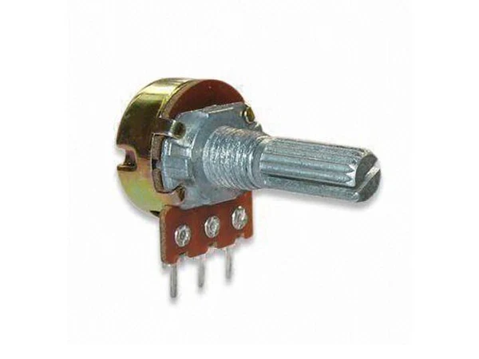

#### 1. ອະທິບາຍອຸປະກອນແມ່ນຫຍັງ?

**Potentiometer** (ໂພເທນຊິໂອເມີເຕີ ຫຼື ຕົວຕ້ານທານປັບຄ່າໄດ້) ແມ່ນອົງປະກອບອີເລັກໂທຣນິກແບບ **Passive** ທີ່ມີ 3 ຂາ (terminals) ແລະຖືກໃຊ້ເປັນ **ຕົວຕ້ານທານທີ່ມີຄ່າປ່ຽນແປງໄດ້ (Variable Resistor)**.

- **ຄ່າ $5\text{k}\Omega$:** ໝາຍເຖິງ **ຄ່າຕ້ານທານສູງສຸດ** ລະຫວ່າງສອງຂາປາຍສຸດແມ່ນ $5,000$ ໂອມ ($5\text{k}\Omega$).
    
- **ໂຄງສ້າງ ແລະ ສ່ວນປະກອບ:**
    
    1. **ຂາປາຍສຸດ (End Terminals - 1 ແລະ 3):** ສອງຂານີ້ເຊື່ອມຕໍ່ກັບປາຍສຸດຂອງແຖບວັດສະດຸຕ້ານທານ. ຄວາມຕ້ານທານລະຫວ່າງສອງຂານີ້ແມ່ນຄົງທີ່ຢູ່ທີ່ $5\text{k}\Omega$.
        
    2. **ຂາເຊັດ/ຂາປັບຄ່າ (Wiper Terminal - 2):** ຂານີ້ເຊື່ອມຕໍ່ກັບປຸ່ມທີ່ສາມາດໝູນ (ໃນແບບ rotary) ຫຼື ເລື່ອນ (ໃນແບບ slider) ໄດ້. ເມື່ອປັບ, ມັນຈະເຄື່ອນທີ່ໄປຕາມແຖບວັດສະດຸຕ້ານທານ.
        

#### 2. ການໃຊ້ງານຂອງອຸປະກອນເຮັດວຽກແນວໃດ?

Potentiometer ສາມາດຖືກໃຊ້ໄດ້ສອງຮູບແບບຫຼັກ: ເປັນຕົວຕ້ານທານປ່ຽນແປງຄ່າໄດ້ (Rheostat) ຫຼື ເປັນຕົວແບ່ງແຮງດັນ (Voltage Divider).

##### **2.1. ເປັນຕົວແບ່ງແຮງດັນ (Voltage Divider) - ການໃຊ້ງານທົ່ວໄປທີ່ສຸດ (ໃຊ້ທັງ 3 ຂາ)**

- **ຫຼັກການເຮັດວຽກ:** ແຮງດັນອ້າງອີງຈະຖືກນຳໃຊ້ເຂົ້າໃສ່ຂາປາຍສຸດ (ຂາ 1 ແລະ 3). ໂດຍການໝູນປຸ່ມ, ຂາເຊັດ (ຂາ 2) ຈະປ່ຽນຕຳແໜ່ງຕາມແຖບຕ້ານທານ, ເຊິ່ງຈະ **ແບ່ງແຮງດັນ** ຕົ້ນສະບັບອອກເປັນສອງສ່ວນທີ່ສາມາດຄວບຄຸມໄດ້.
    
- **ຜົນລัพธ์:** ແຮງດັນອອກທີ່ຂາ 2 ຈະປ່ຽນແປງຢ່າງຕໍ່ເນື່ອງຈາກ $0\text{V}$ (ເມື່ອໝຸນໄປສຸດດ້ານໜຶ່ງ) ໄປຫາແຮງດັນສູງສຸດ (ເມື່ອໝຸນໄປສຸດອີກດ້ານໜຶ່ງ).
    
- **ຕົວຢ່າງການໃຊ້ງານ:**
    
    - **ຄວບຄຸມຄວາມໄວ/ຄວາມເຂັ້ມ:** ໃຊ້ເພື່ອປັບຄ່າການປ້ອນຂໍ້ມູນແບບ Analog ໃຫ້ກັບ Microcontroller (ເຊັ່ນ: ປັບລະດັບສຽງ, ປັບຄວາມສະຫວ່າງຂອງໄຟ, ປັບຄວາມໄວຂອງມໍເຕີ).
        
    - **ປຸ່ມປັບລະດັບສຽງ (Volume Control):** ໃນວົງຈອນສຽງ, ມັນຖືກໃຊ້ເພື່ອປັບແຮງດັນຂອງສັນຍານສຽງ.
        

##### **2.2. ເປັນຕົວຕ້ານທານປ່ຽນແປງຄ່າໄດ້ (Rheostat) - ໃຊ້ 2 ຂາ (1 ຂາປາຍສຸດ ແລະ ຂາເຊັດ)**

- **ຫຼັກການເຮັດວຽກ:** ໃຊ້ຂາປາຍສຸດຂາໜຶ່ງ (ເຊັ່ນ: ຂາ 1) ແລະ ຂາເຊັດ (ຂາ 2). ເມື່ອໝູນປຸ່ມ, ຄວາມຕ້ານທານລະຫວ່າງຂາ 1 ແລະ ຂາ 2 ຈະປ່ຽນແປງຈາກ $0\Omega$ ໄປຫາຄ່າສູງສຸດທີ່ $5\text{k}\Omega$.
    
- **ຜົນລັບ:** ການປ່ຽນແປງຄວາມຕ້ານທານໂດຍກົງຈະ **ຄວບຄຸມປະລິມານກະແສໄຟຟ້າ** ທີ່ໄຫຼໃນວົງຈອນ (ອີງຕາມ $\text{I} = \text{V} / \text{R}$).
    
- **ຕົວຢ່າງການໃຊ້ງານ:**
    
    - **ການປັບກະແສໄຟຟ້າ:** ໃຊ້ເພື່ອຄວບຄຸມກະແສໄຟຟ້າໂດຍກົງໃນວົງຈອນ.

## 13. [ ]  Active Buzzer.

#### **1. ໃຫ້ອະທິບາຍອຸປະກອນແມ່ນຫຍັງ?**

Active Buzzer ແມ່ນອຸປະກອນຜະລິດສຽງ (ລຳໂພງນ້ອຍ) ທີ່ຖືກນໍາໃຊ້ທົ່ວໄປໃນເຄື່ອງເອເລັກໂຕຣນິກເພື່ອສ້າງສຽງເຕືອນ ຫຼື ສັນຍານສຽງ.

- **ລັກສະນະສຳຄັນ:** ມັນມີ **ວົງຈອນ oscillation (ວົງຈອນກຳເນີດສັນຍານ)** ຢູ່ພາຍໃນໂຕເອງແລ້ວ.
    
- **ການຈັດປະເພດ:** ມັນຖືກຈັດເປັນປະເພດໜຶ່ງຂອງ Buzzer ທີ່ແຕກຕ່າງຈາກ Passive Buzzer (ລຳໂພງນ້ອຍແບບບໍ່ມີວົງຈອນໃນໂຕ) ທີ່ຕ້ອງໃຊ້ສັນຍານຄື້ນສີ່ຫຼ່ຽມຈາກພາຍນອກເພື່ອສ້າງສຽງ.
    
- **ການໃຊ້ງານພື້ນຖານ:** ຜູ້ໃຊ້ພຽງແຕ່ໃຫ້ແຮງດັນໄຟຟ້າກະແສກົງ (DC voltage) ທີ່ເໝາະສົມເທົ່ານັ້ນ, Buzzer ກໍຈະສົ່ງສຽງອອກມາທັນທີດ້ວຍຄວາມຖີ່ທີ່ຖືກກໍານົດໄວ້ລ່ວງໜ້າ.
    

#### **2. ການໃຊ້ງານຂອງອຸປະກອນເຮັດວຽກແນວໃດ?**

ຫຼັກການເຮັດວຽກຂອງ Active Buzzer ແມ່ນອີງໃສ່ການມີວົງຈອນພາຍໃນ:

- **ການສ້າງສັນຍານ:** ເມື່ອມີການປ້ອນແຮງດັນໄຟຟ້າກະແສກົງ (DC) ທີ່ເໝາະສົມເຂົ້າໄປ, ວົງຈອນ oscillation ທີ່ຢູ່ພາຍໃນ Active Buzzer ຈະເລີ່ມສ້າງສັນຍານຄື້ນສີ່ຫຼ່ຽມທີ່ມີຄວາມຖີ່ສະເພາະ.
    
- **ການປ່ຽນເປັນສຽງ:** ສັນຍານຄື້ນສີ່ຫຼ່ຽມທີ່ຖືກສ້າງຂຶ້ນນີ້ຈະຖືກສົ່ງໄປຂັບເຄື່ອນອົງປະກອບສຽງ (ເຊັ່ນ: ແຜ່ນໂລຫະສັ່ນສະເທືອນໃນ Buzzer ແມ່ເຫຼັກໄຟຟ້າ ຫຼື ເຊລາມິກ Piezoelectric) ເຮັດໃຫ້ເກີດການສັ່ນສະເທືອນ ແລະ ສົ່ງສຽງ "ບີບ" (beep) ອອກມາ.
    
- **ການຄວບຄຸມ:** ເພື່ອໃຫ້ Active Buzzer ດັງ, ຕ້ອງເຊື່ອມຕໍ່ມັນກັບແຫຼ່ງພະລັງງານ. ເພື່ອຢຸດສຽງ, ຕ້ອງຕັດແຮງດັນໄຟຟ້າອອກ. ໂດຍທົ່ວໄປ, ມັນມັກຖືກຄວບຄຸມດ້ວຍອຸປະກອນເຊັ່ນ: Microcontroller (ເຊັ່ນ Arduino) ໂດຍການສົ່ງສັນຍານ "ສູງ" (ON) ຫຼື "ຕ່ຳ" (OFF) ໄປຫາຂາຄວບຄຸມຂອງມັນ.

## 14. [ ]  Passive Buzzer.

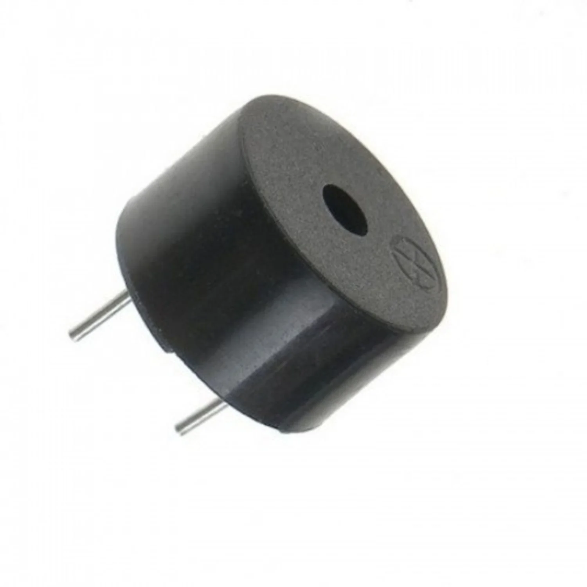

#### **1. ໃຫ້ອະທິບາຍອຸປະກອນແມ່ນຫຍັງ?**

Passive Buzzer ແມ່ນອຸປະກອນຜະລິດສຽງ (ລຳໂພງນ້ອຍ) ທີ່ໃຊ້ໃນເຄື່ອງເອເລັກໂຕຣນິກຄືກັນກັບ Active Buzzer, ແຕ່ມີຄວາມແຕກຕ່າງທີ່ສຳຄັນ:

- **ລັກສະນະສຳຄັນ:** ມັນ **ບໍ່ມີວົງຈອນ oscillation (ວົງຈອນກຳເນີດສັນຍານ) ຢູ່ພາຍໃນໂຕເອງ**.
    
- **ການຈັດປະເພດ:** ມັນເຮັດໜ້າທີ່ຄືກັບລຳໂພງຂະໜາດນ້ອຍ (Mini Speaker).
    
- **ການໃຊ້ງານພື້ນຖານ:** ມັນຈະບໍ່ສົ່ງສຽງອອກມາ ພຽງແຕ່ປ້ອນແຮງດັນໄຟຟ້າກະແສກົງ (DC) ເຂົ້າໄປເທົ່ານັ້ນ. ເພື່ອໃຫ້ມັນດັງ, ມັນຈຳເປັນຕ້ອງມີການປ້ອນ **ສັນຍານຄື້ນສີ່ຫຼ່ຽມ (Square Wave)** ທີ່ມີຄວາມຖີ່ທີ່ປ່ຽນແປງໄດ້ຈາກແຫຼ່ງພາຍນອກ (ເຊັ່ນ: Microcontroller).
    

#### **2. ການໃຊ້ງານຂອງອຸປະກອນເຮັດວຽກແນວໃດ?**

ຫຼັກການເຮັດວຽກຂອງ Passive Buzzer ແມ່ນອີງໃສ່ການຄວບຄຸມສັນຍານຈາກພາຍນອກ:

- **ການສ້າງສັນຍານ:** ອຸປະກອນຄວບຄຸມ (ເຊັ່ນ: Arduino ຫຼື Microcontroller ອື່ນໆ) ຕ້ອງສ້າງສັນຍານໄຟຟ້າທີ່ມີການປ່ຽນແປງຢູ່ຕະຫຼອດເວລາ (ສັນຍານຄື້ນສີ່ຫຼ່ຽມ) ດ້ວຍຄວາມຖີ່ທີ່ຕ້ອງການ (ເຊັ່ນ: $440 Hz$ ສຳລັບສຽງ "A").
    
- **ການປ່ຽນເປັນສຽງ:** ສັນຍານຄື້ນສີ່ຫຼ່ຽມນີ້ຈະຖືກສົ່ງໄປຫາ Passive Buzzer. ສັນຍານໄຟຟ້າທີ່ມີການປ່ຽນແປງນີ້ຈະໄປຂັບເຄື່ອນອົງປະກອບສຽງ (ເຊັ່ນ: ແຜ່ນໂລຫະສັ່ນສະເທືອນ) ໃຫ້ສັ່ນສະເທືອນຕາມຄວາມຖີ່ຂອງສັນຍານທີ່ປ້ອນເຂົ້າ.
    
- **ຜົນໄດ້ຮັບ:**
    
    - **ຄວບຄຸມຄວາມຖີ່ສຽງ:** ໂດຍການປ່ຽນແປງຄວາມຖີ່ຂອງຄື້ນສີ່ຫຼ່ຽມທີ່ປ້ອນເຂົ້າ, ຜູ້ໃຊ້ສາມາດປ່ຽນແປງສຽງດັງ (Tone) ຂອງ Buzzer ໄດ້, ເຮັດໃຫ້ສາມາດສ້າງສຽງເພງ ຫຼື ສຽງເຕືອນທີ່ແຕກຕ່າງກັນໄດ້.
        
    - **ຄວບຄຸມຄວາມດັງ:** ສາມາດຄວບຄຸມຄວາມດັງ (Volume) ໄດ້ໂດຍການປ່ຽນແປງຄວາມກວ້າງຂອງຄື້ນ (Duty Cycle) ຫຼື ການເພີ່ມ-ຫຼຸດແຮງດັນທີ່ປ້ອນເຂົ້າ.

# 📟 Displays & Output.

## 15. [ ]  16x2 LCD display.

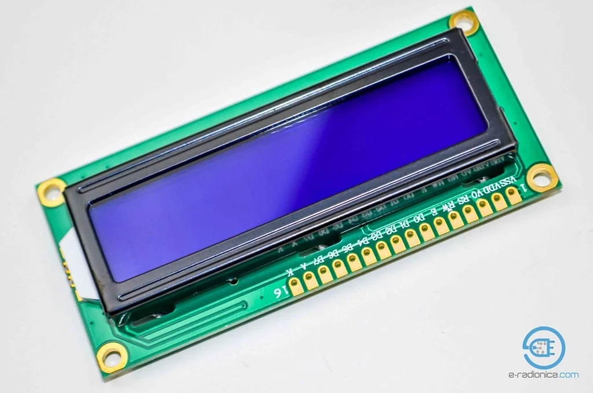

#### **1. ໃຫ້ອະທິບາຍອຸປະກອນແມ່ນຫຍັງ?**

**16x2 LCD Display** ແມ່ນຈໍສະແດງຜົນແບບອັກສອນ ແລະ ຕົວເລກ (Alphanumeric) ຊະນິດໜຶ່ງທີ່ໃຊ້ເທັກໂນໂລຍີຄຣິສຕັລແຫຼວ (Liquid Crystal Display).

- **ຄວາມໝາຍຂອງ 16x2:** ຕົວເລກນີ້ບົ່ງບອກເຖິງຂະໜາດຂອງການສະແດງຜົນ:
    
    - **16:** ໝາຍເຖິງສາມາດສະແດງ **16 ຕົວອັກສອນ (Characters)** ຕໍ່ແຖວໄດ້.
        
    - **2:** ໝາຍເຖິງມີ **2 ແຖວ (Rows)** ຂອງການສະແດງຜົນ.
        
    - ລວມແລ້ວສາມາດສະແດງໄດ້ $16 \times 2 = 32$ ຕົວອັກສອນໃນເວລາດຽວກັນ.
        
- **ໂຄງສ້າງຕົວອັກສອນ:** ແຕ່ລະຕົວອັກສອນແມ່ນຖືກສ້າງຂຶ້ນຈາກຕາໜ່າງຈຸດ (Dot Matrix) ຂະໜາດ $5 \times 7$ ຫຼື $5 \times 8$ ພິກເຊວ.
    
- **ການໃຊ້ງານ:** ມັນເປັນອຸປະກອນທີ່ນິຍົມໃຊ້ໃນໂຄງການເອເລັກໂຕຣນິກຝັງຕົວ (Embedded Systems) ເຊັ່ນ: Arduino, Microcontrollers, ເຄື່ອງຄິດໄລ່, ເຄື່ອງວັດແທກ, ຫຼື ອຸປະກອນອຸດສາຫະກຳງ່າຍໆ ເພື່ອສະແດງຂໍ້ມູນທີ່ເປັນຂໍ້ຄວາມ ແລະ ຕົວເລກ.
    
- **ສ່ວນປະກອບສຳຄັນ:** ໂດຍທົ່ວໄປມັນປະກອບມີໄມໂຄຣຄອນໂທຣເລີ (Controller) ເຊັ່ນ: Hitachi HD44780 ທີ່ໃຊ້ຄວບຄຸມການສະແດງຜົນ.
    

#### **2. ການໃຊ້ງານຂອງອຸປະກອນເຮັດວຽກແນວໃດ?**

ການເຮັດວຽກຂອງ 16x2 LCD ແມ່ນອີງໃສ່ການສື່ສານກັບໄມໂຄຣຄອນໂທຣເລີພາຍນອກ (ເຊັ່ນ: Arduino):

1. **ການສົ່ງຄຳສັ່ງ ແລະ ຂໍ້ມູນ:**
    
    - ໄມໂຄຣຄອນໂທຣເລີຈະສົ່ງສັນຍານຜ່ານສາຍໄຟຟ້າຫຼາຍເສັ້ນ (ໂດຍທົ່ວໄປແມ່ນ $4$ ຫຼື $8$ ສາຍຂໍ້ມູນ) ໄປຫາ LCD.
        
    - ສັນຍານທີ່ສົ່ງໄປຈະຖືກແບ່ງອອກເປັນ **ຄຳສັ່ງ (Commands)** ແລະ **ຂໍ້ມູນ (Data)**:
        
        - **ຄຳສັ່ງ:** ເປັນການບອກ LCD ໃຫ້ເຮັດວຽກສະເພາະເຊັ່ນ: ການລຶບຈໍ, ການເລື່ອນຂໍ້ຄວາມ, ການກຳນົດຕຳແໜ່ງ (ແຖວ/ຖັນ) ທີ່ຈະຂຽນ, ຫຼື ການເປີດ/ປິດ Backlight.
            
        - **ຂໍ້ມູນ:** ເປັນຕົວອັກສອນ (ໃນຮູບແບບລະຫັດ ASCII) ທີ່ຕ້ອງການສະແດງຢູ່ເທິງຈໍ.
            
2. **ການຈັດການຂອງ LCD Controller:**
    
    - Controller ທີ່ຢູ່ພາຍໃນ LCD (ເຊັ່ນ: HD44780) ຈະຮັບຄຳສັ່ງ ແລະ ຂໍ້ມູນ.
        
    - ມັນຈະແປງລະຫັດຕົວອັກສອນ (Data) ໃຫ້ເປັນຮູບແບບຈຸດ (Dots) ແລະ ສົ່ງສັນຍານໄຟຟ້າທີ່ເໝາະສົມໄປຄວບຄຸມຄຣິສຕັລແຫຼວໃນຕຳແໜ່ງພິກເຊວທີ່ສອດຄ່ອງກັນ.
        
3. **ຫຼັກການຂອງຄຣິສຕັລແຫຼວ:**
    
    - ໂດຍພື້ນຖານແລ້ວ, ຄຣິສຕັລແຫຼວຈະບິດເມື່ອບໍ່ມີໄຟຟ້າ, ເຮັດໃຫ້ແສງສະຫວ່າງຈາກ Backlight ສາມາດຜ່ານແຜ່ນກອງແສງ (Polarizer) ໄດ້.
        
    - ເມື່ອມີໄຟຟ້າປ້ອນເຂົ້າໄປທີ່ພິກເຊວໃດໜຶ່ງ, ຄຣິສຕັລແຫຼວຈະຈັດລຽງຕົວ, ເຮັດໃຫ້ແສງບໍ່ສາມາດຜ່ານໄດ້ ຫຼື ຖືກບິດເບືອນ, ເຊິ່ງກໍແມ່ນການສ້າງເປັນຈຸດສີເຂັ້ມ ຫຼື ຮູບຮ່າງຂອງຕົວອັກສອນທີ່ປາກົດໃຫ້ເຫັນ.
        
4. **ໂໝດການສື່ສານ (Common Modes):**
    
    - **$4$-Bit Mode:** ໃຊ້ສາຍຂໍ້ມູນພຽງ $4$ ເສັ້ນເທົ່ານັ້ນ ເພື່ອປະຢັດ Pins ໃນ Microcontroller. ຂໍ້ມູນຈະຖືກສົ່ງເປັນ $2$ ຄັ້ງ (Nibbles). ໂໝດນີ້ເປັນທີ່ນິຍົມທີ່ສຸດ.
        
    - **$8$-Bit Mode:** ໃຊ້ສາຍຂໍ້ມູນ $8$ ເສັ້ນ, ສົ່ງຂໍ້ມູນໄດ້ໄວກວ່າ, ແຕ່ໃຊ້ Pins ຫຼາຍກວ່າ.
        
    - **I2C (ໂດຍຜ່ານ Module ເສີມ):** ໃຊ້ສາຍພຽງ $2$ ເສັ້ນ (SDA ແລະ SCL) ເພື່ອຄວບຄຸມ, ເຮັດໃຫ້ການເຊື່ອມຕໍ່ງ່າຍຂຶ້ນຫຼາຍ.

## 16. [ ] I2C Serial Adapter board module.

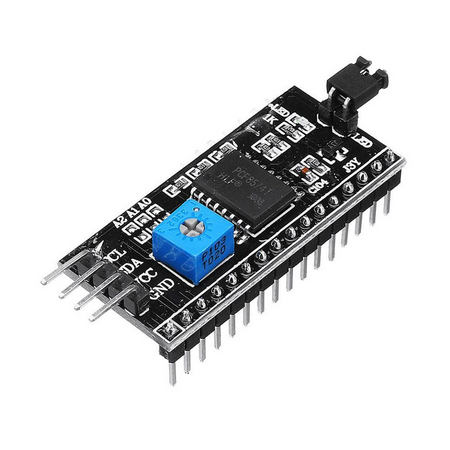

#### **1. ໃຫ້ອະທິບາຍອຸປະກອນແມ່ນຫຍັງ?**

**I2C Serial Adapter Board Module** (ບາງຄັ້ງເອີ້ນວ່າ I2C Backpack) ແມ່ນແຜງວົງຈອນຂະໜາດນ້ອຍທີ່ຖືກອອກແບບມາເພື່ອປ່ຽນການສື່ສານແບບຂະໜານ (Parallel) ທີ່ໃຊ້ Pins ຫຼາຍຂອງຈໍສະແດງຜົນເຊັ່ນ: $16 \times 2$ ຫຼື $20 \times 4$ LCD ໃຫ້ເປັນການສື່ສານແບບອະນຸກົມ (Serial) ໂດຍໃຊ້ໂປຣໂຕຄອລ **I2C (Inter-Integrated Circuit)**.

- **ໜ້າທີ່ຫຼັກ:** ຫຼຸດຈຳນວນສາຍໄຟທີ່ຕ້ອງການເຊື່ອມຕໍ່ລະຫວ່າງ Microcontroller (ເຊັ່ນ Arduino) ກັບ LCD.
    
- **ອົງປະກອບສຳຄັນ:** ມັນບັນຈຸຊິບຂະຫຍາຍ I/O (I/O Expander) ເຊັ່ນ: **PCF8574** ຫຼືຄ້າຍຄືກັນ.
    
- **ການປະຢັດ Pins:** ປົກກະຕິແລ້ວ, ການຄວບຄຸມ LCD ແບບ $16 \times 2$ ຕ້ອງໃຊ້ສາຍຂໍ້ມູນຢ່າງໜ້ອຍ $4$ ເສັ້ນ ແລະ ສາຍຄວບຄຸມ $3$ ເສັ້ນ, ລວມເປັນ $7$ Pins ຂອງ Microcontroller. ແຕ່ເມື່ອໃຊ້ I2C Module ແລ້ວ, ຈະໃຊ້ພຽງ $2$ Pins ສໍາລັບຂໍ້ມູນ/ໂມງເທົ່ານັ້ນ:
    
    - **SDA** (Serial Data Line)
        
    - **SCL** (Serial Clock Line)
        
- **ຄຸນສົມບັດເພີ່ມເຕີມ:** ມັກຈະມີຕົວປັບປ່ຽນ (Potentiometer) ຕິດມາໃນໂຕເພື່ອປັບຄວາມຄົມຊັດ (Contrast) ແລະ ບາງລຸ້ນມີ Jumper ເພື່ອຄວບຄຸມການເປີດ/ປິດ Backlight (ໄຟຫຼັງ).
    

#### **2. ການໃຊ້ງານຂອງອຸປະກອນເຮັດວຽກແນວໃດ?**

ຫຼັກການເຮັດວຽກຂອງ I2C Serial Adapter ແມ່ນເປັນຕົວແປພາສາລະຫວ່າງ Microcontroller ແລະ LCD:

1. **ການສື່ສານແບບ I2C:**
    
    - Microcontroller ສົ່ງຂໍ້ມູນ (ທັງຄຳສັ່ງ ແລະ ຂໍ້ມູນຕົວອັກສອນ) ໄປຫາ I2C Adapter ໂດຍໃຊ້ສາຍ **SDA** (ຂໍ້ມູນ) ແລະ **SCL** (ໂມງ).
        
    - ການສື່ສານນີ້ແມ່ນເປັນແບບ Serial, ໝາຍຄວາມວ່າຂໍ້ມູນຖືກສົ່ງໄປເທື່ອລະ Bit ຜ່ານສາຍໄຟຟ້າພຽງ $2$ ເສັ້ນ.
        
2. **ການຂະຫຍາຍ I/O (I/O Expansion):**
    
    - ຊິບ I/O Expander (ເຊັ່ນ PCF8574) ທີ່ຢູ່ເທິງ Module ຈະຮັບຂໍ້ມູນ I2C ທີ່ເຂົ້າມາ.
        
    - ຊິບນີ້ເຮັດໜ້າທີ່ປ່ຽນຂໍ້ມູນ Serial ($2$ Pins) ທີ່ໄດ້ຮັບ ໃຫ້ກາຍເປັນສັນຍານຂະໜານ (Parallel) ທີ່ຫຼາຍກວ່າ ($8$ Pins) ເຊິ່ງ LCD ເຂົ້າໃຈ (ເຊັ່ນ: ສັນຍານ $RS, EN, D4-D7$).
        
3. **ການຄວບຄຸມ LCD:**
    
    - I/O Expander ຈະໃຊ້ສັນຍານຂະໜານທີ່ຖືກປ່ຽນມາແລ້ວນັ້ນໄປຄວບຄຸມ Pins ຂອງ LCD ໂດຍກົງ.
        
    - LCD ຈະປະຕິບັດຕາມຄຳສັ່ງ (ເຊັ່ນ: ສະແດງຕົວອັກສອນ, ປ່ຽນແຖວ, ປັບ Backlight) ຄືກັນກັບວ່າມັນຖືກເຊື່ອມຕໍ່ກັບ Microcontroller ໂດຍກົງດ້ວຍ $7$ ຫຼື $8$ Pins.

## 17. [ ] 7-segment display (Common Cathode +).

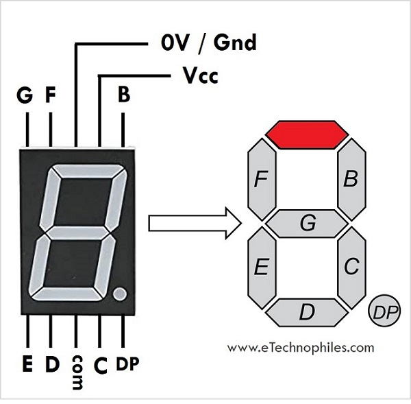

#### **1. ໃຫ້ອະທິບາຍອຸປະກອນແມ່ນຫຍັງ?**

**7-Segment Display** ແມ່ນອຸປະກອນສະແດງຜົນແບບເອເລັກໂຕຣນິກທີ່ໃຊ້ເພື່ອສະແດງຕົວເລກຖານສິບ (Decimal Numerals) ແລະ ຕົວອັກສອນຈຳກັດຈຳນວນໜຶ່ງ. ມັນປະກອບດ້ວຍ:

- **7 ສ່ວນ (Segments):** ເປັນໄດໂອດເປັ່ງແສງ (LEDs) ຂະໜາດນ້ອຍ 7 ໜ່ວຍ ທີ່ຖືກຈັດລຽງໃນຮູບຮ່າງສີ່ຫຼ່ຽມ (ຄືກັບຕົວເລກ "8") ແລະ ຕິດປ້າຍຊື່ເປັນ $a, b, c, d, e, f, g$.
    
- **1 ຈຸດ (Decimal Point - DP):** ບາງລຸ້ນມີ LED ໂຕທີ 8 ສໍາລັບສະແດງຈຸດທົດສະນິຍົມ.
    

**Common Cathode (CC) Type:**

- **ຫຼັກການ:** ທຸກໆຂົ້ວ **ຄາໂທດ (Cathode)** (ຂົ້ວລົບ) ຂອງ LEDs ທັງ 7 (ແລະ DP) ແມ່ນຖືກເຊື່ອມຕໍ່ເຂົ້າກັນທັງໝົດ ແລະ ອອກມາເປັນຂົ້ວລວມ (Common Pin) ພຽງຂົ້ວດຽວ.
    
- **ການເຊື່ອມຕໍ່ພື້ນຖານ:** ຂົ້ວລວມ (Common Pin) ຂອງ Common Cathode ຈະຖືກເຊື່ອມຕໍ່ກັບສາຍ **ລົບ (GND/0V)** ຂອງວົງຈອນຢູ່ສະເໝີ.
    

#### **2. ການໃຊ້ງານຂອງອຸປະກອນເຮັດວຽກແນວໃດ?**

ການເຮັດວຽກຂອງ 7-Segment Display (Common Cathode) ແມ່ນອີງຕາມຫຼັກການຂອງໄດໂອດເປັ່ງແສງ (LED):

1. **ການເປີດໄຟ (Turning ON) ແຕ່ລະສ່ວນ:**
    
    - ເນື່ອງຈາກຂົ້ວລວມ (Cathode) ຖືກເຊື່ອມຕໍ່ກັບ GND ແລ້ວ, ເພື່ອໃຫ້ LED ຂອງສ່ວນໃດສ່ວນໜຶ່ງ (ເຊັ່ນ: segment 'a') ສາມາດເປັ່ງແສງໄດ້, ເຮົາຕ້ອງປ້ອນສັນຍານ **ສູງ (HIGH/Logic 1)** ຫຼື ແຮງດັນບວກ ($VCC$) ໄປຫາຂົ້ວ **ອາໂນດ (Anode)** ຂອງສ່ວນນັ້ນ.
        
    - ເມື່ອປ້ອນສັນຍານ HIGH, ກະແສໄຟຟ້າຈະໄຫຼຈາກຂົ້ວອາໂນດ (HIGH) ຜ່ານ LED ໄປຫາຂົ້ວຄາໂທດ (GND), ເຮັດໃຫ້ LED ເປັ່ງແສງ.
        
2. **ການປິດໄຟ (Turning OFF) ແຕ່ລະສ່ວນ:**
    
    - ເພື່ອປິດສ່ວນໃດໜຶ່ງ, ຕ້ອງປ້ອນສັນຍານ **ຕ່ຳ (LOW/Logic 0)** ຫຼື ເຊື່ອມຕໍ່ກັບ GND ໄປຫາຂົ້ວອາໂນດຂອງສ່ວນນັ້ນ.
        
    - ເມື່ອຂົ້ວອາໂນດ ແລະ ຂົ້ວຄາໂທດມີທ່າແຮງໄຟຟ້າເທົ່າກັນ (ທັງສອງເຊື່ອມຕໍ່ກັບ GND), ຈະບໍ່ມີກະແສໄຟຟ້າໄຫຼຜ່ານ LED, ເຮັດໃຫ້ມັນດັບ.
        
3. **ການສະແດງຕົວເລກ:**
    
    - ເພື່ອສະແດງຕົວເລກໃດໜຶ່ງ (ເຊັ່ນ: ເລກ $5$), Microcontroller ຫຼື Driver IC (ເຊັ່ນ: 74LS48) ຈະຕ້ອງສົ່ງສັນຍານ **HIGH** ໄປຫາຂົ້ວອາໂນດຂອງສ່ວນທີ່ກ່ຽວຂ້ອງ (ໃນກໍລະນີຂອງເລກ $5$ ແມ່ນ $a, f, g, c, d$) ແລະ ສົ່ງສັນຍານ **LOW** ໄປຫາສ່ວນທີ່ເຫຼືອ.

## 18. [ ] 4-Digit 7-Segment Display.

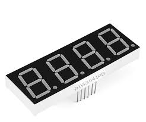

#### **1. ໃຫ້ອະທິບາຍອຸປະກອນແມ່ນຫຍັງ?**

**4-Digit 7-Segment Display** ແມ່ນໂມດູນສະແດງຜົນເອເລັກໂຕຣນິກທີ່ລວມເອົາຈໍສະແດງຜົນ $7$-segment ໄວ້ $4$ ໂຕ ຢູ່ໃນຊຸດອຸປະກອນດຽວກັນ.

- **ໂຄງສ້າງພາຍໃນ:**
    
    - ມັນປະກອບດ້ວຍ LED $7$ ໜ່ວຍ (ເຊັ່ນ $a$ ຫາ $g$) ສໍາລັບການສະແດງຕົວເລກໃນແຕ່ລະຕໍາແໜ່ງ.
        
    - ສິ່ງສໍາຄັນຄື: **ທຸກໆສ່ວນ (Segment)** ທີ່ຢູ່ຕໍາແໜ່ງດຽວກັນໃນ $4$ ຕົວເລກແມ່ນຖືກເຊື່ອມຕໍ່ເຂົ້າກັນ (ເຊັ່ນ: segment 'a' ຂອງຕົວເລກ $1, 2, 3, 4$ ແມ່ນເຊື່ອມຕໍ່ເຂົ້າກັນ).
        
    - ແຕ່ລະ **ຕົວເລກ (Digit)** ມີຂົ້ວລວມ (Common Pin) ຂອງຕົນເອງ (ເຊັ່ນ: Cathode ລວມ ຫຼື Anode ລວມ).
        
- **ຈຳນວນ Pins ທີ່ຈຳກັດ:** ເນື່ອງຈາກການເຊື່ອມຕໍ່ພາຍໃນແບບນີ້, ມັນບໍ່ໄດ້ໃຊ້ $4 \times 8 = 32$ Pins (ຖ້າລວມ DP) ແຕ່ໃຊ້ພຽງແຕ່:
    
    - $8$ Pins ສໍາລັບການຄວບຄຸມສ່ວນ (Segments $a$ ຫາ $g$ ແລະ DP).
        
    - $4$ Pins ສໍາລັບການເລືອກຕົວເລກ (Digit Select Pins).
        
    - ລວມມີປະມານ $12$ Pins ເທົ່ານັ້ນ.
        
- **ປະເພດ:** ຄືກັນກັບ $7$-segment ທົ່ວໄປ, ມັນມີ $2$ ປະເພດຄື: **Common Cathode** ຫຼື **Common Anode**.

#### **2. ການໃຊ້ງານຂອງອຸປະກອນເຮັດວຽກແນວໃດ?**

ການສະແດງຜົນຕົວເລກທີ່ແຕກຕ່າງກັນໃນ $4$ ຕຳແໜ່ງພ້ອມກັນ ແມ່ນບໍ່ສາມາດເຮັດໄດ້ໂດຍການສົ່ງສັນຍານຄັ້ງດຽວ, ແຕ່ຕ້ອງໃຊ້ເຕັກນິກທີ່ເອີ້ນວ່າ **Time Multiplexing (ການແບ່ງເວລາ)**:

1. **ຫຼັກການ Multiplexing:**
    
    - Microcontroller ຈະເປີດໄຟໃຫ້ແຕ່ລະຕົວເລກເທື່ອລະຕຳແໜ່ງ (Digit) ຢ່າງວ່ອງໄວຕໍ່ເນື່ອງກັນ.
        
    - ຄວາມໄວໃນການປ່ຽນຕຳແໜ່ງແມ່ນໄວຫຼາຍ (ປົກກະຕິແມ່ນຫຼາຍຮ້ອຍເທື່ອຕໍ່ວິນາທີ) ເຊິ່ງເຮັດໃຫ້ຕາຂອງຄົນເຮົາບໍ່ສາມາດຈັບຄວາມແຕກຕ່າງໄດ້ (Visual Persistence).
        
2. **ຂັ້ນຕອນການເຮັດວຽກ (ຕົວຢ່າງສຳລັບ Common Cathode):**
    
    - **ຂັ້ນຕອນທີ 1 (ສະແດງຕົວເລກທີ 1):**
        
        - **ການເລືອກຕົວເລກ:** ສົ່ງສັນຍານ **LOW** ໄປຫາຂົ້ວ Cathode ລວມຂອງ **ຕົວເລກທີ 1** ເພື່ອເປີດການໃຊ້ງານ (Digit Select Pin).
            
        - **ການສະແດງສ່ວນ:** ສົ່ງຮູບແບບສັນຍານ **HIGH/LOW** ທີ່ຖືກຕ້ອງໄປຫາ Pins ຂອງ segments $a$ ຫາ $g$ ເພື່ອໃຫ້ມັນສະແດງຕົວເລກທີ່ຕ້ອງການ.
            
        - **ປິດຕົວເລກອື່ນ:** ຕ້ອງຮັບປະກັນວ່າຂົ້ວ Cathode ລວມຂອງຕົວເລກ $2, 3, 4$ ຍັງຄົງເປັນ HIGH (ປິດການໃຊ້ງານ).
            
    - **ຂັ້ນຕອນທີ 2 (ສະແດງຕົວເລກທີ 2):**
        
        - ປິດຕົວເລກທີ 1 ຢ່າງວ່ອງໄວ.
            
        - **ການເລືອກຕົວເລກ:** ສົ່ງສັນຍານ **LOW** ໄປຫາຂົ້ວ Cathode ລວມຂອງ **ຕົວເລກທີ 2** ເພື່ອເປີດການໃຊ້ງານ.
            
        - **ການສະແດງສ່ວນ:** ສົ່ງຮູບແບບສັນຍານ **HIGH/LOW** ໃໝ່ໄປຫາ Pins ຂອງ segments $a$ ຫາ $g$ ເພື່ອສະແດງຕົວເລກທີ $2$.
            
    - **ຂັ້ນຕອນຕໍ່ໄປ:** ເຮັດຊໍ້າຂັ້ນຕອນດຽວກັນນີ້ສໍາລັບຕົວເລກ $3$ ແລະ $4$.
        
3. **ຜົນທີ່ໄດ້ຮັບ:** ໂດຍການເຮັດຊ້ຳການເປີດ-ປິດຢ່າງວ່ອງໄວນີ້, ຕາຂອງຄົນເຮົາຈະຮັບຮູ້ວ່າທັງ $4$ ຕົວເລກສະແດງຢູ່ພ້ອມກັນຢ່າງຕໍ່ເນື່ອງ.

## 19. [ ] 8x8 Dot Matrix display.

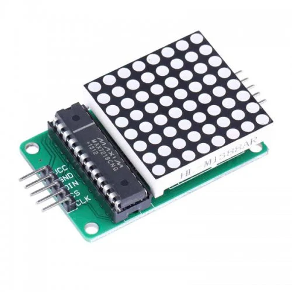

#### **1. ໃຫ້ອະທິບາຍອຸປະກອນແມ່ນຫຍັງ?**

**8x8 Dot Matrix Display** ແມ່ນອຸປະກອນສະແດງຜົນເອເລັກໂຕຣນິກທີ່ໃຊ້ໄດໂອດເປັ່ງແສງ (LEDs) ເປັນສ່ວນປະກອບຫຼັກ, ໂດຍຖືກຈັດລຽງເປັນຮູບແບບຕາຂ່າຍ $2$ ມິຕິ (Two-dimensional array).

- **ໂຄງສ້າງ:** ມັນປະກອບດ້ວຍ LEDs ທັງໝົດ $64$ ໜ່ວຍ ($8$ ແຖວ $\times$ $8$ ຖັນ). ແຕ່ລະ LED ທີ່ຈຸດຕັດຂອງແຖວ (Row) ແລະ ຖັນ (Column) ເອີ້ນວ່າ **Pixel (ພິກເຊລ)**.
    
- **ການເຊື່ອມຕໍ່ພາຍໃນ (Row-Column Interconnection):** ເພື່ອຫຼຸດຜ່ອນຈຳນວນ Pins ທີ່ຈຳເປັນ (ເຊິ່ງຖ້າເຊື່ອມຕໍ່ແບບທຳມະດາຈະຕ້ອງການ $64$ Pins), ໄດໂອດທັງໝົດຈະຖືກເຊື່ອມຕໍ່ກັນໃນຮູບແບບມາຕຣິກ (Matrix):
    
    - ຂົ້ວໄຟຟ້າຂອງ LEDs ທັງໝົດໃນ **ແຖວດຽວກັນ** ຈະຖືກເຊື່ອມຕໍ່ເຂົ້າກັນ (ເຊັ່ນ: ຂົ້ວອາໂນດທັງໝົດ).
        
    - ຂົ້ວໄຟຟ້າຂອງ LEDs ທັງໝົດໃນ **ຖັນດຽວກັນ** ຈະຖືກເຊື່ອມຕໍ່ເຂົ້າກັນ (ເຊັ່ນ: ຂົ້ວຄາໂທດທັງໝົດ).
        
- **ຈຳນວນ Pins ທີ່ຈຳກັດ:** ດ້ວຍການຈັດລຽງແບບນີ້, ມັນຕ້ອງການພຽງແຕ່ $8$ Pins ສຳລັບການຄວບຄຸມແຖວ ແລະ $8$ Pins ສຳລັບການຄວບຄຸມຖັນ, ລວມເປັນພຽງ $16$ Pins ເທົ່ານັ້ນ ເພື່ອຄວບຄຸມ $64$ LEDs.
    
- **ປະເພດ:**
    
    - **Row Anode - Column Cathode:** ຂົ້ວອາໂນດ (ຂົ້ວບວກ) ເປັນຂົ້ວລວມຂອງແຖວ, ແລະຂົ້ວຄາໂທດ (ຂົ້ວລົບ) ເປັນຂົ້ວລວມຂອງຖັນ.
        
    - **Row Cathode - Column Anode:** ຂົ້ວຄາໂທດ (ຂົ້ວລົບ) ເປັນຂົ້ວລວມຂອງແຖວ, ແລະຂົ້ວອາໂນດ (ຂົ້ວບວກ) ເປັນຂົ້ວລວມຂອງຖັນ.
        
- **ການນຳໃຊ້:** ເໝາະສຳລັບການສະແດງຕົວອັກສອນ, ຕົວເລກ, ສັນຍາລັກ, ແລະຂໍ້ຄວາມທີ່ສາມາດເລື່ອນໄດ້ (Scrolling Text).
    

#### **2. ການໃຊ້ງານຂອງອຸປະກອນເຮັດວຽກແນວໃດ?**

ເນື່ອງຈາກການເຊື່ອມຕໍ່ແບບມາຕຣິກ, ມັນບໍ່ສາມາດເປີດໄຟໃຫ້ LEDs ທັງ $64$ ໜ່ວຍພ້ອມກັນໄດ້ຢ່າງອິດສະຫຼະໂດຍໃຊ້ພຽງ $16$ Pins ເທົ່ານັ້ນ. ດັ່ງນັ້ນ, ມັນຈຶ່ງໃຊ້ຫຼັກການ **Dynamic Scanning (ການສະແກນແບບໄດນາມິກ)** ຫຼື **Multiplexing** ຄືກັນກັບ $4$-Digit $7$-Segment Display.

- **ຫຼັກການ:** Microcontroller ຈະເປີດໄຟໃຫ້ແຕ່ລະ **ແຖວ (Row)** ຫຼື **ຖັນ (Column)** ເທື່ອລະອັນ (ເປັນໄລຍະເວລາສັ້ນໆ) ແລະ ປ່ຽນຮູບແບບສັນຍານເພື່ອເປີດ/ປິດ LEDs ທີ່ຕ້ອງການໃນແຖວ ຫຼື ຖັນນັ້ນ. ການປ່ຽນແປງນີ້ຈະຖືກເຮັດຊໍ້າຢ່າງໄວວາຈົນຕາຂອງຄົນເຮົາຮັບຮູ້ວ່າມັນສະຫວ່າງຕໍ່ເນື່ອງກັນ.
    
- **ຂັ້ນຕອນການເຮັດວຽກ (ຕົວຢ່າງ: ສຳລັບ Row Anode - Column Cathode):**
    
    1. **ການເລືອກແຖວ:** ເລີ່ມຕົ້ນດ້ວຍການເປີດໃຊ້ງານ **ແຖວທີ 1** ໂດຍການປ້ອນສັນຍານ **HIGH** ໃຫ້ກັບ Pin ຂອງແຖວທີ 1. ປິດການໃຊ້ງານແຖວທີ່ເຫຼືອ (ປ້ອນ LOW).
        
    2. **ການສະແດງຜົນຖັນ:**
        
        - ເພື່ອເປີດ Pixel ຢູ່ຈຸດຕັດໃດໜຶ່ງໃນແຖວທີ 1, ຕ້ອງສົ່ງສັນຍານ **LOW** ໄປຫາ Pin ຂອງຖັນນັ້ນ.
            
        - ເພື່ອປິດ Pixel ຢູ່ຈຸດຕັດໃດໜຶ່ງໃນແຖວທີ 1, ຕ້ອງສົ່ງສັນຍານ **HIGH** ໄປຫາ Pin ຂອງຖັນນັ້ນ.
            
    3. **ການສະແກນ:** ຫຼັງຈາກໄລຍະເວລາສັ້ນໆ (ເຊັ່ນ: $1$ ຫາ $5$ ມິນລິວິນາທີ), ໃຫ້ປິດແຖວທີ 1.
        
    4. **ເຮັດຊ້ຳ:** ເຮັດຊ້ຳຂັ້ນຕອນ $1$ ແລະ $2$ ສຳລັບແຖວທີ $2$, ທີ $3$, ຈົນຮອດແຖວທີ $8$, ແລ້ວວົນກັບໄປແຖວທີ $1$ ໃໝ່.
        
- **ຜົນທີ່ໄດ້ຮັບ:** ການສະແກນທັງ $8$ ແຖວ/ຖັນ ດ້ວຍຄວາມໄວສູງ (ປົກກະຕິຫຼາຍກວ່າ $50$ ເທື່ອຕໍ່ວິນາທີ) ຈະເຮັດໃຫ້ຮູບພາບທີ່ຕ້ອງການປາກົດຂຶ້ນໂດຍບໍ່ມີການກະພິບ (Flicker).
    
- **Driver ICs (ຕົວຂັບ):** ໃນການນຳໃຊ້ຕົວຈິງ, ມັກຈະໃຊ້ IC ຄວບຄຸມສະເພາະເຊັ່ນ **MAX7219** ເຊິ່ງເຮັດໜ້າທີ່ໃນການ Multiplexing, ຄວບຄຸມຄວາມສະຫວ່າງ, ແລະ ຫຼຸດຜ່ອນຈຳນວນສາຍທີ່ຕ້ອງເຊື່ອມຕໍ່ກັບ Microcontroller ໃຫ້ເຫຼືອພຽງ $3$ ສາຍເທົ່ານັ້ນ (ເຊັ່ນ: VCC, GND, DIN, CLK, CS).

# 📡 Sensors & Input Modules

## 20. [ ] Temperature and humidity sensor (DHT11).

.webp)

#### **1. ໃຫ້ອະທິບາຍອຸປະກອນແມ່ນຫຍັງ?**

**DHT11** ແມ່ນເຊັນເຊີວັດແທກອຸນຫະພູມ ແລະ ຄວາມຊຸ່ມຊື່ນແບບດິຈິຕອລ (Digital Temperature and Humidity Sensor) ທີ່ມີລາຄາຖືກ ແລະ ພື້ນຖານ, ເຊິ່ງໃຫ້ສັນຍານຜົນໄດ້ຮັບທີ່ຖືກປັບແຕ່ງ (Calibrated Digital Signal Output).

- **ສ່ວນປະກອບພາຍໃນ:** DHT11 ປະກອບມີສ່ວນປະກອບຫຼັກ $3$ ຢ່າງຄື:
    
    - **ເຊັນເຊີວັດແທກຄວາມຊຸ່ມຊື່ນ (Capacitive Humidity Sensor):** ໃຊ້ອົງປະກອບວັດແທກຄວາມຕ້ານທານແບບ Capacitive. ເມື່ອຄວາມຊຸ່ມຊື່ນປ່ຽນແປງ, ຄວາມສາມາດໃນການເກັບປະຈຸ (Capacitance) ຂອງເຊັນເຊີກໍປ່ຽນແປງຕາມໄປນຳ.
        
    - **ເຊັນເຊີວັດແທກອຸນຫະພູມ (NTC Thermistor):** ໃຊ້ຕົວຕ້ານທານທີ່ປ່ຽນຄ່າຕາມອຸນຫະພູມ (NTC = Negative Temperature Coefficient) ຊຶ່ງໝາຍຄວາມວ່າຄວາມຕ້ານທານຈະຫຼຸດລົງເມື່ອອຸນຫະພູມສູງຂຶ້ນ.
        
    - **Microcontroller 8-bit:** ໃຊ້ໃນການອ່ານສັນຍານອະນາລັອກຈາກເຊັນເຊີທັງ $2$ ແລະ ແປງໃຫ້ເປັນສັນຍານດິຈິຕອລທີ່ພ້ອມສົ່ງອອກ.
        
- **ຄຸນລັກສະນະສະເພາະ (ໂດຍປະມານ):**
    
    - ໄລຍະອຸນຫະພູມ: $0^\circ\text{C}$ ຫາ $50^\circ\text{C}$ (ຄວາມຄາດເຄື່ອນ $\pm 2^\circ\text{C}$).
        
    - ໄລຍະຄວາມຊຸ່ມຊື່ນ: $20\% \text{RH}$ ຫາ $90\% \text{RH}$ (ຄວາມຄາດເຄື່ອນ $\pm 5\% \text{RH}$).
        
    - ແຮງດັນໄຟຟ້າ: $3$ ຫາ $5\text{V}$.
        
    - ອັດຕາການອ່ານ: ບໍ່ເກີນ $1$ ຄັ້ງຕໍ່ວິນາທີ ($1\text{Hz}$).
        
- **ການເຊື່ອມຕໍ່:** ໃຊ້ການໂຕ້ຕອບແບບສາຍດຽວ (Single-Wire Digital Interface) ໃນການສົ່ງຂໍ້ມູນໃຫ້ກັບ Microcontroller ເຊັ່ນ Arduino ຫຼື Raspberry Pi.
    

#### **2. ການໃຊ້ງານຂອງອຸປະກອນເຮັດວຽກແນວໃດ?**

DHT11 ເຮັດວຽກໂດຍການສື່ສານກັບ Microcontroller ຜ່ານສາຍ Data ພຽງສາຍດຽວ ໂດຍໃຊ້ໂປຣໂຕຄໍການສື່ສານທີ່ເປັນເອກະລັກ:

1. **ການຮ້ອງຂໍ (Request/Start Pulse) ຈາກ Microcontroller:**
    
    - Microcontroller ຈະສົ່ງສັນຍານເລີ່ມຕົ້ນໄປຫາ DHT11 ເພື່ອບອກວ່າມັນພ້ອມທີ່ຈະອ່ານຂໍ້ມູນແລ້ວ.
        
    - ສັນຍານນີ້ແມ່ນການປ່ຽນແປງຂອງສັນຍານ (ເຊັ່ນ: ຈາກ HIGH ເປັນ LOW) ເປັນໄລຍະເວລາທີ່ແນ່ນອນ (ປົກກະຕິແມ່ນ LOW ຢ່າງໜ້ອຍ $18$ ມິນລິວິນາທີ).
        
2. **ການຕອບສະໜອງ (Response) ຈາກ DHT11:**
    
    - ເມື່ອ DHT11 ກວດພົບສັນຍານຮ້ອງຂໍທີ່ຖືກຕ້ອງ, ມັນຈະຕອບສະໜອງກັບ Microcontroller ໂດຍການສົ່ງສັນຍານ $2$ ໄລຍະຄື: LOW ໄລຍະໜຶ່ງ ແລະ HIGH ໄລຍະໜຶ່ງ (ປົກກະຕິແມ່ນ LOW $80\mu\text{s}$ ຕາມດ້ວຍ HIGH $80\mu\text{s}$).
        
3. **ການສົ່ງຂໍ້ມູນ (Data Transmission):**
    
    - ຫຼັງຈາກການຕອບສະໜອງແລ້ວ, DHT11 ຈະເລີ່ມສົ່ງຂໍ້ມູນລວມທັງໝົດ $40$ Bits.
        
    - **ໂຄງສ້າງຂໍ້ມູນ $40$ Bits:**
        
        - $8$ Bits (ຈຳນວນເຕັມ): ຄວາມຊຸ່ມຊື່ນ (Humidity Integer)
            
        - $8$ Bits (ຈຳນວນຈຸດ): ຄວາມຊຸ່ມຊື່ນ (Humidity Decimal - ສ່ວນໃຫຍ່ແມ່ນ $00000000$ ຍ້ອນຄວາມລະອຽດຕໍ່າ)
            
        - $8$ Bits (ຈຳນວນເຕັມ): ອຸນຫະພູມ (Temperature Integer)
            
        - $8$ Bits (ຈຳນວນຈຸດ): ອຸນຫະພູມ (Temperature Decimal - ສ່ວນໃຫຍ່ແມ່ນ $00000000$)
            
        - $8$ Bits: Checksum (ຜົນລວມຂອງ $4$ ໄບຣທ໌ກ່ອນໜ້າ)
            
    - **ການແຍກຂໍ້ມູນ:** Microcontroller ຈະວັດແທກຄວາມຍາວຂອງແຕ່ລະສັນຍານ HIGH/LOW ທີ່ສົ່ງອອກມາ.
        
        - ຖ້າໄລຍະເວລາ HIGH ສັ້ນ: ໝາຍເຖິງ Logic '0'.
            
        - ຖ້າໄລຍະເວລາ HIGH ຍາວ: ໝາຍເຖິງ Logic '1'.
            
4. **ການຢືນຢັນ (Checksum):**
    
    - Microcontroller ຈະຄິດໄລ່ຜົນລວມຂອງ $4$ ໄບຣທ໌ຂໍ້ມູນ (ຄວາມຊຸ່ມຊື່ນ ແລະ ອຸນຫະພູມ) ທີ່ໄດ້ຮັບ, ແລະປຽບທຽບກັບໄບຣທ໌ Checksum ທີ່ສົ່ງມາ. ຖ້າຜົນອອກມາເທົ່າກັນ, ຖືວ່າຂໍ້ມູນຖືກຕ້ອງ ແລະ ພ້ອມນຳໃຊ້.

## 21. [ ] LM35 Temperature Sensor.

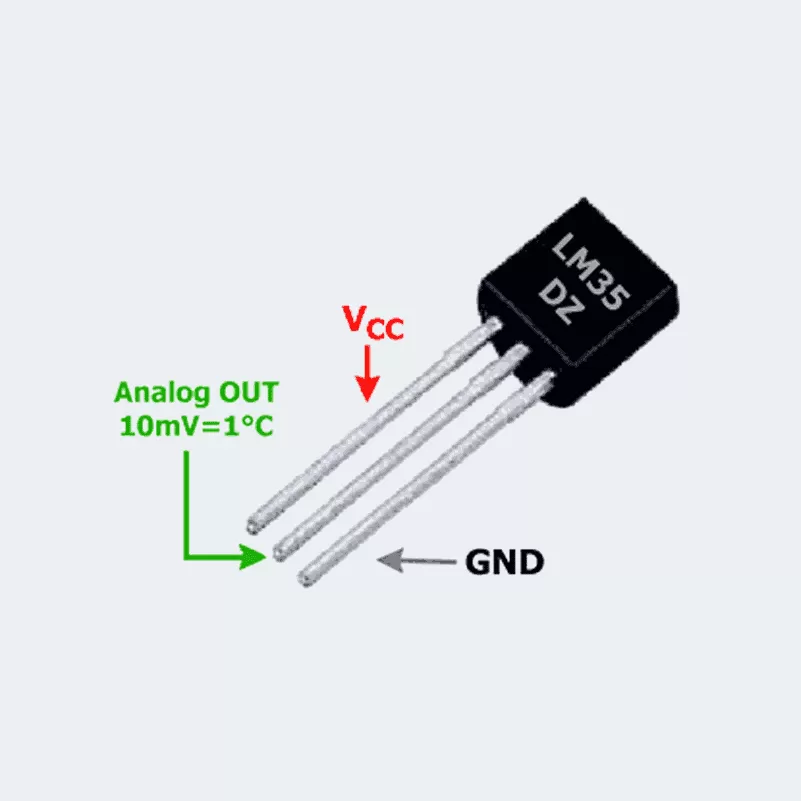

#### **1. ໃຫ້ອະທິບາຍອຸປະກອນແມ່ນຫຍັງ?**

**LM35** ແມ່ນເຊັນເຊີວັດແທກອຸນຫະພູມແບບວົງຈອນລວມ (Integrated Circuit - IC) ທີ່ມີຄວາມຊັດເຈນສູງ, ເຊິ່ງໃຫ້ຜົນຜະລິດເປັນສັນຍານອະນາລັອກ (Analog Output Voltage) ທີ່ເປັນອັດຕາສ່ວນໂດຍກົງ ແລະ ເປັນເສັ້ນຊື່ (Linearly Proportional) ກັບອຸນຫະພູມໃນ **ອົງສາເຊນຊຽສ $\left(^\circ\text{C}\right)$**.

- **ຄຸນລັກສະນະຫຼັກ:**
    
    - **ການປັບທຽບໃນຕົວ:** ຖືກປັບທຽບໂດຍກົງເປັນອົງສາເຊນຊຽສ (Centigrade) ຈາກໂຮງງານ, ໂດຍບໍ່ຈຳເປັນຕ້ອງມີການປັບທຽບພາຍນອກໃດໆ.
        
    - **ປັດໄຈຄ່າຂອງສັນຍານ (Scale Factor):** ມີອັດຕາສ່ວນຄົງທີ່ຄື: **$+10.0 \text{mV}$ ຕໍ່ $1^\circ\text{C}$** $(\text{Temperature} \times 10 \text{mV/}^\circ\text{C})$.
        
    - **ຄວາມຊັດເຈນ:** ມີຄວາມຊັດເຈນສູງ (ປົກກະຕິ $\pm 0.5^\circ\text{C}$ ທີ່ອຸນຫະພູມ $25^\circ\text{C}$).
        
    - **ຊ່ວງການວັດແທກ:** ສາມາດເຮັດວຽກໄດ້ໃນຊ່ວງກວ້າງ, ໂດຍທົ່ວໄປແມ່ນ $-55^\circ\text{C}$ ຫາ $+150^\circ\text{C}$ (ຂຶ້ນກັບລຸ້ນ).
        
    - **ການໃຫ້ຄວາມຮ້ອນໃນຕົວຕໍ່າ (Low Self-Heating):** ໃຊ້ກະແສໄຟຟ້າໜ້ອຍ (ພຽງແຕ່ $60\mu\text{A}$), ເຮັດໃຫ້ເກີດຄວາມຮ້ອນໃນຕົວໜ້ອຍກວ່າ $0.1^\circ\text{C}$ ເຊິ່ງເພີ່ມຄວາມຊັດເຈນໃນການວັດແທກ.
        
- **Pinout (ໃນຮູບແບບ TO-92):**
    
    - **Pin 1 (VCC/Vs):** ຕໍ່ກັບແຮງດັນໄຟລ້ຽງ (ປົກກະຕິ $4\text{V}$ ຫາ $30\text{V}$).
        
    - **Pin 2 (Output/Vout):** ສັນຍານຜົນໄດ້ຮັບອະນາລັອກ.
        
    - **Pin 3 (GND):** ຕໍ່ກັບສາຍດິນ (Ground).
        

#### **2. ການໃຊ້ງານຂອງອຸປະກອນເຮັດວຽກແນວໃດ?**

LM35 ເຮັດວຽກໂດຍການປ່ຽນແປງຂອງອຸນຫະພູມໃຫ້ກາຍເປັນການປ່ຽນແປງຂອງແຮງດັນໄຟຟ້າຕາມສູດຄິດໄລ່ທີ່ກຳນົດໄວ້.

1. **ການປ່ຽນແປງອຸນຫະພູມເປັນແຮງດັນ:**
    
    - LM35 ປະກອບດ້ວຍວົງຈອນພາຍໃນທີ່ຊັບຊ້ອນ (ເຊັ່ນ: ວົງຈອນທີ່ອີງໃສ່ຄວາມຕ່າງຂອງແຮງດັນໄຟຟ້າລະຫວ່າງ $2$ Transistors ທີ່ເຮັດວຽກຢູ່ທີ່ຄວາມໜາແໜ້ນຂອງກະແສໄຟຟ້າທີ່ແຕກຕ່າງກັນ) ເພື່ອຜະລິດແຮງດັນໄຟຟ້າທີ່ເປັນອັດຕາສ່ວນໂດຍກົງກັບອຸນຫະພູມແບບ Tuyt.
        
    - ທຸກໆການເພີ່ມຂຶ້ນ $1^\circ\text{C}$, ແຮງດັນ Output $\left(\text{V}_\text{out}\right)$ ຈະເພີ່ມຂຶ້ນ $+10\text{mV}$.
        
2. **ການອ່ານຄ່າໂດຍ Microcontroller (ເຊັ່ນ: Arduino):**
    
    - ເນື່ອງຈາກ LM35 ໃຫ້ຜົນຜະລິດເປັນສັນຍານອະນາລັອກ, ມັນຈຳເປັນຕ້ອງຕໍ່ເຂົ້າກັບ Pin ປ້ອນຂໍ້ມູນອະນາລັອກ (Analog Input Pin) ຂອງ Microcontroller (ເຊັ່ນ: Pin A0 ໃນ Arduino).
        
    - Microcontroller ໃຊ້ຕົວແປງສັນຍານອະນາລັອກເປັນດິຈິຕອລ (Analog-to-Digital Converter - ADC) ເພື່ອປ່ຽນຄ່າແຮງດັນ $(\text{V}_\text{out})$ ທີ່ໄດ້ຮັບຈາກ LM35 ໃຫ້ເປັນຄ່າຕົວເລກດິຈິຕອລ (ເຊັ່ນ: $0$ ຫາ $1023$).

## 22. [ ] Tilt sensor (x2).

.jpeg)

#### **1. ໃຫ້ອະທິບາຍອຸປະກອນແມ່ນຫຍັງ?**

**Tilt Sensor** (ເຊັນເຊີວັດແທກການອຽງ) ແມ່ນອຸປະກອນທີ່ໃຊ້ສຳລັບວັດແທກການອຽງ ຫຼື ທ່າທາງຂອງວັດຖຸໃດໜຶ່ງໂດຍອ້າງອີງກັບແຮງໂນ້ມຖ່ວງ (Gravity). ມັນຊ່ວຍໃຫ້ສາມາດກວດຈັບການປ່ຽນແປງຂອງມຸມ ຫຼື ທິດທາງຂອງວັດຖຸໃນແກນຕ່າງໆ (ເຊັ່ນ: ແກນ $X$, $Y$) ໄດ້ຢ່າງງ່າຍດາຍ.

- **ໜ້າທີ່ຫຼັກ:** ວັດແທກການອຽງ, ການສັ່ນສະເທືອນ, ການເຄື່ອນໄຫວພື້ນຖານ, ຫຼື ການກວດສອບວ່າອຸປະກອນຢູ່ໃນທ່າຕັ້ງ ຫຼື ທ່ານອນ.
    
- **ປະເພດຂອງ Tilt Sensor:** ມີຫຼາຍປະເພດ, ແຕ່ທີ່ນິຍົມໃຊ້ໃນໂຄງການຂະໜາດນ້ອຍ ແລະ ມີລາຄາຖືກແມ່ນ:
    
    - **Roll Ball Tilt Switch (ເຊັ່ນ: SW-520D):** ເປັນ Tilt Sensor ທີ່ເຮັດວຽກແບບສະວິດ (Switch), ໃຫ້ສັນຍານຜົນໄດ້ຮັບເປັນແບບດິຈິຕອລ (HIGH/LOW ຫຼື ON/OFF). ມັນມັກຈະປະກອບດ້ວຍກະເປາະໂລຫະ ຫຼື ພາດສະຕິກຂະໜາດນ້ອຍທີ່ມີລູກກົມນ້ອຍທີ່ສາມາດເຄື່ອນທີ່ໄດ້ຢູ່ພາຍໃນ.
        
    - **Mercury Tilt Switch:** ໃຊ້ຢາບາຫຼອດ (Mercury) ແທນລູກກົມໂລຫະເພື່ອສ້າງການຕິດຕໍ່ທາງໄຟຟ້າ. (ປະເພດນີ້ເລີ່ມບໍ່ນິຍົມໃຊ້ແລ້ວເນື່ອງຈາກມີສານພິດ).
        
    - **Inclinometer/Accelerometer-based Sensor (ເຊັ່ນ: ໃຊ້ MEMS):** ເຊັນເຊີປະເພດນີ້ໃຊ້ Accelerometer (ເຄື່ອງວັດແທກຄວາມເລັ່ງ) ເພື່ອວັດແທກຄວາມແຮງຂອງແຮງໂນ້ມຖ່ວງທີ່ກະທຳໃນແກນຕ່າງໆ. ມັນສາມາດໃຫ້ຄ່າຜົນໄດ້ຮັບທີ່ຊັດເຈນເປັນອົງສາ ຫຼື ຄ່າອະນາລັອກທີ່ເປັນອັດຕາສ່ວນກັບມຸມອຽງ (ບໍ່ແມ່ນພຽງແຕ່ ON/OFF).
        

#### **2. ການໃຊ້ງານຂອງອຸປະກອນເຮັດວຽກແນວໃດ?**

ການເຮັດວຽກຂອງ Tilt Sensor ແມ່ນຂຶ້ນກັບປະເພດຂອງມັນ. ໃນທີ່ນີ້ຈະອະທິບາຍຫຼັກການເຮັດວຽກຂອງ **Roll Ball Tilt Switch (ເຊັນເຊີແບບລູກກົມກິ້ງ)** ເຊິ່ງເປັນປະເພດທີ່ພົບເຫັນທົ່ວໄປທີ່ສຸດ:

1. **ໂຄງສ້າງພື້ນຖານ:**
    
    - ປະກອບມີ $2$ ແຜ່ນໂລຫະ (Electrodes) ຫຼື $2$ Pin ຢູ່ໃນຕຳແໜ່ງທີ່ໃກ້ຄຽງກັນພາຍໃນກະເປາະທີ່ປິດມິດ.
        
    - ມີ **ລູກກົມໂລຫະນ້ອຍ** ທີ່ສາມາດເຄື່ອນທີ່ໄດ້ຢ່າງອິດສະຫຼະຢູ່ພາຍໃນກະເປາະ.
        
2. **ຫຼັກການເຮັດວຽກ (ອີງຕາມແຮງໂນ້ມຖ່ວງ):**
    
    - **ຕຳແໜ່ງທີ່ບໍ່ອຽງ (ປົກກະຕິ):** ເມື່ອເຊັນເຊີຢູ່ໃນຕຳແໜ່ງທີ່ກຳນົດ (ເຊັ່ນ: ຕັ້ງຊື່), ແຮງໂນ້ມຖ່ວງຈະດຶງດູດລູກກົມໂລຫະນັ້ນໃຫ້ລົງໄປແຕະ ຫຼື ເຊື່ອມຕໍ່ກັບແຜ່ນໂລຫະທັງສອງ Pin.
        
        - **ຜົນໄດ້ຮັບ:** ການເຊື່ອມຕໍ່ສຳເລັດ, ວົງຈອນປິດ, ແລະເຊັນເຊີຈະສົ່ງສັນຍານ **ON (ຫຼື Logic LOW/0)**.
            
    - **ຕຳແໜ່ງທີ່ອຽງ:** ເມື່ອເຊັນເຊີຖືກອຽງເກີນກວ່າມຸມທີ່ກຳນົດ, ແຮງໂນ້ມຖ່ວງຈະດຶງດູດລູກກົມໂລຫະໃຫ້ກິ້ງອອກຈາກການເຊື່ອມຕໍ່ກັບແຜ່ນໂລຫະນັ້ນ.
        
        - **ຜົນໄດ້ຮັບ:** ການເຊື່ອມຕໍ່ຂາດ, ວົງຈອນເປີດ, ແລະເຊັນເຊີຈະສົ່ງສັນຍານ **OFF (ຫຼື Logic HIGH/1)**.
            
3. **ການນຳໃຊ້ກັບ Microcontroller:**
    
    - ເຊັນເຊີປະເພດນີ້ຈະໃຫ້ສັນຍານຜົນໄດ້ຮັບແບບດິຈິຕອລ (ມີພຽງ $2$ ສະຖານະ). Microcontroller (ເຊັ່ນ Arduino) ຈະອ່ານຄ່າຈາກ Pin ຂໍ້ມູນຂອງເຊັນເຊີເພື່ອຮູ້ວ່າອຸປະກອນຖືກອຽງ ຫຼື ບໍ່.
        
    - **ການໃຊ້ງານ:** ໃຊ້ໃນການກວດຈັບການລົ້ມ, ລະບົບປຸກເມື່ອມີການເຄື່ອນຍ້າຍ, ຫຼື ການຄວບຄຸມທິດທາງໃນເກມແບບງ່າຍດາຍ.

## 23. [ ] Photoresistor (LDRs x3).

.webp)

#### 1. ອຸປະກອນນີ້ແມ່ນຫຍັງ?

**Photoresistor** ຫຼື **LDR (Light Dependent Resistor)** ແມ່ນອຸປະກອນອີເລັກໂທຣນິກແບບຕົວຕັ້ງ (Passive Electronic Component) ທີ່ເຮັດໜ້າທີ່ເປັນ **ຕົວຕ້ານທານທີ່ປ່ຽນແປງຄ່າຕາມແສງສະຫວ່າງ**.

- **ຊື່ເອີ້ນອື່ນ**: Photocell ຫຼື Light Dependent Resistor (LDR).
    
- **ສ່ວນປະກອບ**: ມັນຖືກຜະລິດຈາກວັດສະດຸເຄິ່ງຕົວນໍາ (Semiconductor Material) ເຊັ່ນ: Cadmium Sulfide (CdS). ວັດສະດຸນີ້ມີການຈັດລຽງເປັນຮູບຊົງຄ້າຍຄືຟັນເລື່ອຍ (Zig-zag) ຢູ່ເທິງພື້ນຖານທີ່ເປັນເຊລາມິກ ເພື່ອເພີ່ມພື້ນທີ່ສໍາຜັດກັບແສງ.
    
- **ຄຸນສົມບັດ**: ຄ່າຄວາມຕ້ານທານທາງໄຟຟ້າຂອງມັນຈະປ່ຽນແປງຢ່າງຫຼວງຫຼາຍເມື່ອມີແສງສະຫວ່າງມາຕົກໃສ່.
    

#### 2. ການໃຊ້ງານຂອງອຸປະກອນເຮັດວຽກແນວໃດ?

ຫຼັກການເຮັດວຽກຂອງ Photoresistor ແມ່ນອີງໃສ່ປະກົດການທີ່ເອີ້ນວ່າ **Photoconductivity** (ການນໍາໄຟຟ້າດ້ວຍແສງ).

- **ເມື່ອຢູ່ໃນບ່ອນມືດ (ຄວາມເຂັ້ມຂອງແສງຕ່ໍາ)**:
    
    - **ການເຮັດວຽກ**: ບໍ່ມີແສງພຽງພໍທີ່ຈະກະຕຸ້ນອີເລັກຕຣົງສ່ວນໃຫຍ່ໃນວັດສະດຸເຄິ່ງຕົວນໍາ.
        
    - **ຜົນລັບ**: ອີເລັກຕຣົງຍັງຄົງຢູ່ໃນສະຖານະທີ່ຖືກຜູກມັດ, ເຮັດໃຫ້ມີການນໍາໄຟຟ້າຕ່ໍາ. ດັ່ງນັ້ນ, **ຄວາມຕ້ານທານຈະສູງທີ່ສຸດ** (ອາດຈະສູງເຖິງຫຼາຍ Megaohms - $M\Omega$).
        
- **ເມື່ອຖືກແສງສະຫວ່າງ (ຄວາມເຂັ້ມຂອງແສງສູງ)**:
    
    - **ການເຮັດວຽກ**: ໂຟຕອນ (ພະລັງງານແສງສະຫວ່າງ) ມາຕົກໃສ່ພື້ນຜິວຂອງ LDR ແລະຖືກດູດຊຶມໂດຍວັດສະດຸ. ພະລັງງານນີ້ຈະກະຕຸ້ນໃຫ້ອີເລັກຕຣົງທີ່ຖືກຜູກມັດມີພະລັງງານພຽງພໍທີ່ຈະໂດດໄປສູ່ແຖບການນໍາໄຟຟ້າ (Conduction Band).
        
    - **ຜົນລັບ**: ຈໍານວນອີເລັກຕຣົງອິດສະຫຼະ (ແລະ ຄູ່ຮູ - Hole partners) ທີ່ເພີ່ມຂຶ້ນເຮັດໃຫ້ການນໍາໄຟຟ້າສູງຂຶ້ນ. ດັ່ງນັ້ນ, **ຄວາມຕ້ານທານຈະຫຼຸດລົງ** (ອາດຈະຫຼຸດລົງເຫຼືອພຽງສອງສາມຮ້ອຍ Ohms - $\Omega$).

## 24. [ ] PIR sensor.

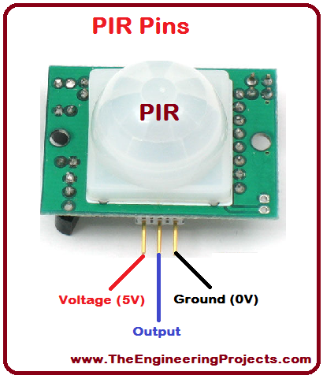

#### 1. ອຸປະກອນນີ້ແມ່ນຫຍັງ?

**PIR Sensor** ແມ່ນຊື່ຫຍໍ້ຂອງ **Passive Infrared Sensor** (ເຊັນເຊີອິນຟຣາເຣດແບບຕົວຕັ້ງ). ມັນເປັນອຸປະກອນອີເລັກໂທຣນິກທີ່ຖືກອອກແບບມາເພື່ອ **ກວດຈັບການເຄື່ອນໄຫວ** ໂດຍການວັດແທກການປ່ຽນແປງຂອງແສງ **ອິນຟຣາເຣດ (IR)** ຫຼື ຄວາມຮ້ອນ ທີ່ປ່ອຍອອກມາຈາກວັດຖຸຕ່າງໆ.

- **"Passive" (ຕົວຕັ້ງ)**: ໝາຍຄວາມວ່າເຊັນເຊີນີ້ບໍ່ໄດ້ປ່ອຍແສງ ຫຼື ພະລັງງານໃດໆອອກມາ, ແຕ່ມັນພຽງແຕ່ຮັບເອົາ (Passive) ແສງອິນຟຣາເຣດທີ່ປ່ອຍອອກມາຈາກວັດຖຸໃນບໍລິເວນທີ່ມັນກວດຈັບ.
    
- **ສ່ວນປະກອບຫຼັກ**: ຫົວໃຈຂອງມັນຄື **Pyroelectric Sensor** (ເຊັນເຊີໄພໂຣອີເລັກຕຣິກ), ເຊິ່ງເປັນວັດສະດຸທີ່ສ້າງສັນຍານໄຟຟ້າຂຶ້ນເມື່ອມັນສຳຜັດກັບການປ່ຽນແປງຂອງຄວາມຮ້ອນ (ແສງ IR).
    
- **ແຜ່ນເລນ Fresnel**: ເຊັນເຊີສ່ວນໃຫຍ່ມີຝາປິດດ້ວຍເລນພລາສຕິກລັກສະນະໂຄ້ງ (Fresnel Lens) ເພື່ອຊ່ວຍຂະຫຍາຍຂອບເຂດການກວດຈັບ ແລະ ສຸມແສງອິນຟຣາເຣດໄປຍັງເຊັນເຊີໄພໂຣອີເລັກຕຣິກ.
    

#### 2. ການໃຊ້ງານຂອງອຸປະກອນເຮັດວຽກແນວໃດ?

PIR Sensor ເຮັດວຽກໂດຍຫຼັກການທີ່ວ່າ **ທຸກສິ່ງທີ່ມີອຸນຫະພູມສູງກວ່າສູນສົມບູນ ($0$ Kelvin)** ຈະປ່ອຍລັງສີອິນຟຣາເຣດ (ຄວາມຮ້ອນ) ອອກມາ. ຮ່າງກາຍຂອງມະນຸດ ແລະ ສັດລ້ຽງແມ່ນປ່ອຍລັງສີ IR ທີ່ມີຄວາມເຂັ້ມຂຸ້ນສູງເມື່ອທຽບກັບສິ່ງແວດລ້ອມອ້ອມຂ້າງ.

##### ຫຼັກການເຮັດວຽກເປັນຂັ້ນຕອນ:

1. **ເຊັນເຊີຄູ່ (Dual Sensor)**: ເຊັນເຊີໄພໂຣອີເລັກຕຣິກພາຍໃນ PIR ປົກກະຕິແລ້ວຈະຖືກແບ່ງອອກເປັນສອງສ່ວນທີ່ເຮັດວຽກຮ່ວມກັນ ແລະ ເຊື່ອມຕໍ່ກັນໃນລັກສະນະທີ່ຂົ້ວໄຟຟ້າຫັກລ້າງກັນ. ໃນສະພາບປົກກະຕິ (ບໍ່ມີການເຄື່ອນໄຫວ), ທັງສອງສ່ວນຮັບແສງ IR ໃນປະລິມານທີ່ເທົ່າກັນ, ເຮັດໃຫ້ຜົນອອກ (Output) ເປັນສູນ ຫຼື ຄົງທີ່.
    
2. **ການກວດຈັບການເຄື່ອນໄຫວ**: ເມື່ອວັດຖຸທີ່ອົບອຸ່ນ (ເຊັ່ນ: ຄົນ) ເຄື່ອນຍ້າຍເຂົ້າໄປໃນຂອບເຂດການກວດຈັບ, ມັນຈະຜ່ານພາກສ່ວນໜຶ່ງຂອງເຊັນເຊີກ່ອນ.
    
    - **ຂັ້ນຕອນທີ 1**: ພາກສ່ວນທໍາອິດໄດ້ຮັບແສງ IR ທີ່ແຕກຕ່າງກັນ (ຄວາມຮ້ອນເພີ່ມຂຶ້ນ), ເຮັດໃຫ້ມີການປ່ຽນແປງຂອງສັນຍານໄຟຟ້າ (ເຊັ່ນ: $\text{Output HIGH}$).
        
    - **ຂັ້ນຕອນທີ 2**: ເມື່ອວັດຖຸນັ້ນເຄື່ອນທີ່ຜ່ານໄປພາກສ່ວນທີສອງ, ມັນຈະເຮັດໃຫ້ເກີດການປ່ຽນແປງຂອງສັນຍານອີກຄັ້ງໃນທິດທາງກົງກັນຂ້າມ (ເຊັ່ນ: $\text{Output LOW}$ ຫຼື ປ່ຽນຄ່າໄວ).
        
3. **ສັນຍານຜົນອອກ (Output Signal)**: ການປ່ຽນແປງຂອງສັນຍານໄຟຟ້າທີ່ເປັນຜົນມາຈາກຄວາມແຕກຕ່າງຂອງແສງ IR ລະຫວ່າງສອງສ່ວນຂອງເຊັນເຊີແມ່ນຖືກຂະຫຍາຍ ແລະ ປະມວນຜົນ. ຖ້າມີຄວາມແຕກຕ່າງຢ່າງຫຼວງຫຼາຍ (ໝາຍເຖິງມີການເຄື່ອນໄຫວ), PIR ຈະປ່ອຍ **ສັນຍານດິຈິຕອລ (Digital Signal)** ເປັນ **HIGH** (ການເຄື່ອນໄຫວຖືກກວດພົບ) ໄປໃຫ້ໄມໂຄຣຄອນໂທນເລີ (Microcontroller) ຫຼື ວົງຈອນອື່ນໆເພື່ອດໍາເນີນການຕໍ່ໄປ (ເຊັ່ນ: ເປີດໄຟ ຫຼື ສົ່ງສຽງເຕືອນ).

## 25. [ ] Ultrasonic module.

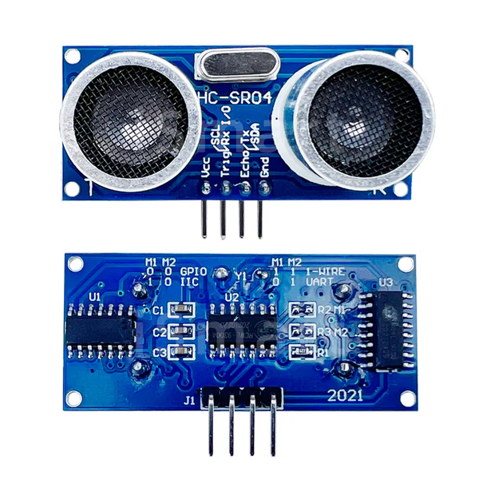
#### 1. ອຸປະກອນນີ້ແມ່ນຫຍັງ?

**Ultrasonic Module** ແມ່ນອຸປະກອນອີເລັກໂທຣນິກທີ່ໃຊ້ **ຄື້ນສຽງອຸນຕຣາໂຊນິກ (Ultrasonic Sound Waves)** ເພື່ອວັດແທກໄລຍະຫ່າງ (Distance) ລະຫວ່າງໂຕເຊັນເຊີເອງກັບວັດຖຸເປົ້າໝາຍ.

- **ຄື້ນອຸນຕຣາໂຊນິກ:** ແມ່ນຄື້ນສຽງທີ່ມີຄວາມຖີ່ສູງກວ່າຂອບເຂດທີ່ຫູມະນຸດສາມາດໄດ້ຍິນ (ປົກກະຕິ $40\text{ kHz}$).
    
- **ສ່ວນປະກອບ:** ໂມດູນປົກກະຕິປະກອບມີ:
    
    - **Transmitter (ຕົວສົ່ງ):** ປ່ອຍຄື້ນສຽງອອກໄປ.
        
    - **Receiver (ຕົວຮັບ/ECHO):** ຮັບເອົາຄື້ນສຽງທີ່ສະທ້ອນກັບຄືນມາ (Echo).
        
- **ການນຳໃຊ້:** ມັນໃຊ້ຫຼັກການດຽວກັບລະບົບ **Sonar** (ລະບົບຊອກຫາວັດຖຸດ້ວຍສຽງ) ເພື່ອວັດແທກໄລຍະຫ່າງແບບບໍ່ສຳຜັດ (Non-contact measurement).
    

#### 2. ການໃຊ້ງານຂອງອຸປະກອນເຮັດວຽກແນວໃດ?

Ultrasonic Module ເຮັດວຽກໂດຍການວັດແທກ **ເວລາເດີນທາງໄປ-ກັບ (Time-of-Flight - TOF)** ຂອງຄື້ນສຽງ.

##### ຫຼັກການເຮັດວຽກທີ່ສໍາຄັນ:

1. **ສົ່ງຄື້ນສຽງ (Transmit):**
    
    - ໄມໂຄຣຄອນໂທນເລີສົ່ງສັນຍານກະຕຸ້ນ (Trigger Pulse) ໄປທີ່ **ຂາ TRIG** ຂອງໂມດູນ.
        
    - ໂມດູນຈະປ່ອຍຄື້ນອຸນຕຣາໂຊນິກ ($8$ ຄື້ນ) ອອກໄປ.
        
    - ຂະນະດຽວກັນ, **ຂາ ECHO** ຈະປ່ຽນເປັນສະຖານະ **HIGH** (ເລີ່ມຈັບເວລາ).
        
2. **ສະທ້ອນກັບ (Echo):**
    
    - ຄື້ນສຽງເດີນທາງອອກໄປຕໍາໃສ່ວັດຖຸເປົ້າໝາຍ.
        
    - ຄື້ນຈະສະທ້ອນກັບຄືນມາຫາຕົວຮັບຂອງໂມດູນ.
        
3. **ຮັບສັນຍານ (Receive):**
    
    - ເມື່ອຕົວຮັບໄດ້ຮັບຄື້ນສະທ້ອນ, **ຂາ ECHO** ຈະປ່ຽນກັບຄືນເປັນສະຖານະ **LOW** (ຢຸດຈັບເວລາ).
        
4. **ຄິດໄລ່ໄລຍະຫ່າງ:**
    
    - ໄລຍະເວລາທີ່ຂາ ECHO ຢູ່ໃນສະຖານະ HIGH ແມ່ນເວລາເດີນທາງທັງໝົດ ($t$) ຂອງຄື້ນສຽງໄປ-ກັບ.
        
    - ໄລຍະຫ່າງ ($d$) ຖືກຄິດໄລ່ໂດຍໃຊ້ສູດທີ່ອີງຕາມຄວາມໄວສຽງ ($v$):
        
$$\text{ໄລຍະຫ່າງ } (d) = \frac{\text{ຄວາມໄວສຽງ } (v) \times \text{ເວລາ } (t)}{2}$$

## 26. [ ] Sound sensor.

#### 1. ອຸປະກອນນີ້ແມ່ນຫຍັງ?

**Sound Sensor** (ເຊັນເຊີສຽງ) ແມ່ນອຸປະກອນທີ່ອອກແບບມາເພື່ອ **ກວດຈັບສັນຍານສຽງ** (ຄື້ນສຽງ) ທີ່ເດີນທາງມາຕາມອາກາດ, ວັດແທກ **ຄວາມເຂັ້ມຂຸ້ນ** ຂອງສຽງນັ້ນ, ແລະ **ປ່ຽນຄື້ນສຽງ** ທີ່ເປັນພະລັງງານກົນຈັກ ໃຫ້ກາຍເປັນ **ສັນຍານໄຟຟ້າ** ທີ່ສາມາດອ່ານໄດ້ໂດຍລະບົບອີເລັກໂທຣນິກ (ເຊັ່ນ: ໄມໂຄຣຄອນໂທນເລີ).

- **ສ່ວນປະກອບຫຼັກ:** ໂມດູນເຊັນເຊີສຽງປົກກະຕິປະກອບມີ:
    
    - **Microphone (ໄມໂຄຣໂຟນ):** ເຮັດໜ້າທີ່ເປັນຕົວຮັບສຽງ ແລະ ປ່ຽນການສັ່ນສະເທືອນຂອງສຽງໃຫ້ເປັນສັນຍານໄຟຟ້າທີ່ອ່ອນ.
        
    - **Amplifier (ເຄື່ອງຂະຫຍາຍສັນຍານ):** ເພີ່ມຄວາມແຮງຂອງສັນຍານໄຟຟ້າທີ່ອ່ອນຈາກໄມໂຄຣໂຟນ. (ມັກໃຊ້ຊິບເຊັ່ນ LM393 ຫຼື LM386).
        
    - **Potentiometer (ຕົວປັບຄວາມຕ້ານທານ):** ໃຊ້ສຳລັບປັບຄວາມອ່ອນໄຫວ (Sensitivity) ຫຼື ປັບລະດັບຂອບເຂດ (Threshold) ຂອງສຽງທີ່ຈະຖືກກວດພົບ.
        
- **ຜົນອອກ (Output):** ໂມດູນເຊັນເຊີສຽງສ່ວນຫຼາຍໃຫ້ຜົນອອກສອງປະເພດ:
    
    - **Analog Output (AO):** ສັນຍານໄຟຟ້າຕໍ່ເນື່ອງທີ່ສອດຄ່ອງກັບຄວາມແຮງຂອງສຽງ (ຄວາມດັງ).
        
    - **Digital Output (DO):** ສັນຍານ HIGH ຫຼື LOW, ເຊິ່ງສະແດງວ່າສຽງທີ່ກວດພົບນັ້ນ **ເກີນຂອບເຂດທີ່ກໍານົດໄວ້** ໂດຍ Potentiometer ແລ້ວຫຼືບໍ່.
        

#### 2. ການໃຊ້ງານຂອງອຸປະກອນເຮັດວຽກແນວໃດ?

Sound Sensor ເຮັດວຽກຄ້າຍຄືກັບຫູຂອງຄົນ, ໂດຍການປ່ຽນພະລັງງານສຽງໃຫ້ເປັນພະລັງງານໄຟຟ້າ.

##### ຫຼັກການເຮັດວຽກເປັນຂັ້ນຕອນ:

1. **ການຮັບສຽງ:**
    
    - ຄື້ນສຽງ (ເຊັ່ນ: ການຕົບມື ຫຼື ສຽງເວົ້າ) ເດີນທາງໃນອາກາດ ແລະ ໄປຕໍາໃສ່ **Diaphragm** (ແຜ່ນບາງໆ) ທີ່ຢູ່ໃນໄມໂຄຣໂຟນ.
        
    - ການສັ່ນສະເທືອນຂອງຄື້ນສຽງເຮັດໃຫ້ Diaphragm ສັ່ນສະເທືອນ.
        
2. **ການປ່ຽນສັນຍານ (Transduction):**
    
    - ໄມໂຄຣໂຟນຈະປ່ຽນການສັ່ນສະເທືອນຂອງ Diaphragm ນັ້ນໃຫ້ກາຍເປັນ **ສັນຍານໄຟຟ້າທີ່ປ່ຽນແປງ** (Voltage Signal). ສັນຍານນີ້ແມ່ນອ່ອນຫຼາຍ.
        
3. **ການຂະຫຍາຍ ແລະ ປຽບທຽບສັນຍານ (Amplification & Comparison):**
    
    - **ສັນຍານ Analog:** ສັນຍານທີ່ອ່ອນຈະຖືກຂະຫຍາຍ (Amplify) ເພື່ອໃຫ້ໄມໂຄຣຄອນໂທນເລີສາມາດອ່ານຄ່າຄວາມດັງສຽງໄດ້ຢ່າງຕໍ່ເນື່ອງຜ່ານຂາ AO.
        
    - **ສັນຍານ Digital:** ສັນຍານ Analog ທີ່ຖືກຂະຫຍາຍແລ້ວຈະຖືກສົ່ງໄປຫາວົງຈອນປຽບທຽບ (Comparator). ວົງຈອນນີ້ຈະທຽບຄ່າຄວາມດັງສຽງກັບ **ຂອບເຂດ (Threshold)** ທີ່ຖືກກໍານົດໂດຍ Potentiometer:
        
        - **ຖ້າສຽງດັງເກີນຂອບເຂດ:** ຜົນອອກທາງຂາ DO ຈະເປັນ **HIGH** (ຫຼື LOW, ຂຶ້ນກັບການອອກແບບຂອງໂມດູນ).
            
        - **ຖ້າສຽງບໍ່ຮອດຂອບເຂດ:** ຜົນອອກທາງຂາ DO ຈະເປັນ **LOW** (ຫຼື HIGH).
            
4. **ການນຳໃຊ້:** ໄມໂຄຣຄອນໂທນເລີໃຊ້ສັນຍານ Digital (ການຕົບມືໜຶ່ງຄັ້ງ, ສອງຄັ້ງ) ຫຼື ສັນຍານ Analog (ຄວາມດັງສຽງ) ເພື່ອຄວບຄຸມອຸປະກອນຕ່າງໆ.

## 27. [ ] Water sensor.

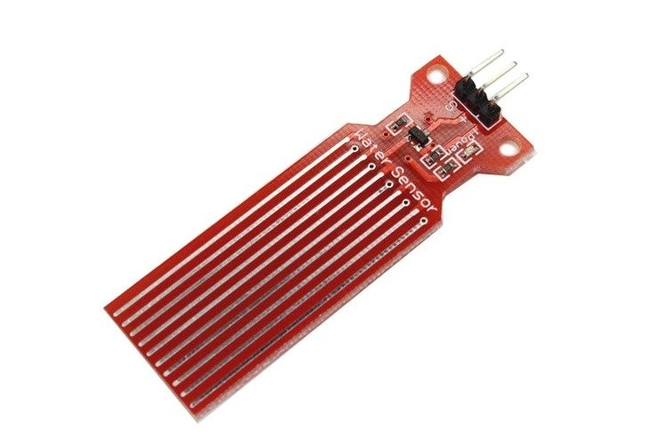

#### 1. ອຸປະກອນນີ້ແມ່ນຫຍັງ?

**Water Sensor** ແມ່ນອຸປະກອນທີ່ອອກແບບມາເພື່ອ **ກວດຈັບ, ວັດແທກ, ຫຼື ຕິດຕາມຄ່າຕ່າງໆທີ່ກ່ຽວຂ້ອງກັບນໍ້າ**. ການນຳໃຊ້ທີ່ພົບເຫັນຫຼາຍທີ່ສຸດແມ່ນການວັດແທກລະດັບນໍ້າ (Water Level) ແລະ ການກວດຈັບນໍ້າຮົ່ວ (Leak Detection).

- **ໜ້າທີ່ຫຼັກ:** ປ່ຽນຄຸນສົມບັດທາງກາຍະພາບ ຫຼື ທາງເຄມີຂອງນໍ້າ ໃຫ້ກາຍເປັນ **ສັນຍານໄຟຟ້າ** ທີ່ສາມາດນໍາໄປປະມວນຜົນໄດ້.
    
- **ປະເພດທົ່ວໄປ (ອີງຕາມຫຼັກການ):**
    
    1. **Conductive/Resistive Sensor (ເຊັນເຊີຄວາມນໍາໄຟຟ້າ):** ໃຊ້ສາຍນໍາໄຟຟ້າທີ່ສຳຜັດກັບນໍ້າ.
        
    2. **Float Sensor (ເຊັນເຊີລອຍນໍ້າ):** ໃຊ້ຫຼັກການລອຍຕົວເພື່ອເປີດ/ປິດສະວິດ.
        
    3. **Pressure Sensor (ເຊັນເຊີຄວາມດັນ):** ວັດແທກຄວາມດັນຂອງນໍ້າເພື່ອຄິດໄລ່ຄວາມເລິກ.
        
    4. **Ultrasonic Sensor:** ໃຊ້ຄື້ນສຽງເພື່ອວັດແທກໄລຍະຫ່າງຈາກເຊັນເຊີຫາໜ້ານໍ້າ (ບໍ່ໄດ້ສຳຜັດກັບນໍ້າໂດຍກົງ).
        

#### 2. ການໃຊ້ງານຂອງອຸປະກອນເຮັດວຽກແນວໃດ?

ຫຼັກການເຮັດວຽກແມ່ນຂຶ້ນກັບປະເພດຂອງເຊັນເຊີ. ໃນທີ່ນີ້, **ເຊັນເຊີລະດັບນໍ້າແບບ Resistive** ເຊິ່ງເປັນປະເພດທີ່ນິຍົມໃຊ້ໃນໂຄງການທົ່ວໄປ.

##### A. ຫຼັກການຂອງ Resistive Water Level Sensor (ເຊັ່ນ: ໂມດູນທີ່ມີລາຍແຜ່ນທອງແດງ)

ເຊັນເຊີຊະນິດນີ້ເຮັດວຽກໂດຍອີງໃສ່ຄຸນສົມບັດທີ່ນໍ້າ (ໂດຍສະເພາະນໍ້າທີ່ມີສານລະລາຍ ຫຼື ສິ່ງເຈືອປົນ) **ສາມາດນໍາໄຟຟ້າໄດ້**.

1. **ສ່ວນປະກອບ:** ເຊັນເຊີປະກອບດ້ວຍລາຍສາຍໄຟຟ້າ/ແຜ່ນທອງແດງຫຼາຍໆເສັ້ນທີ່ຂະໜານກັນ (Interlaced Traces). ເສັ້ນໜຶ່ງແມ່ນສາຍໄຟ (Power) ແລະ ອີກເສັ້ນໜຶ່ງແມ່ນສາຍສັນຍານ (Sense).
    
2. **ເວລາແຫ້ງ (Dry State):** ເມື່ອເຊັນເຊີແຫ້ງ, ຈະບໍ່ມີການເຊື່ອມຕໍ່ທາງໄຟຟ້າລະຫວ່າງລາຍທອງແດງເຫຼົ່ານີ້, ດັ່ງນັ້ນຄວາມຕ້ານທານ (Resistance) ຈຶ່ງ **ສູງທີ່ສຸດ**, ແລະຜົນອອກ (Output Voltage) ຈະ **ຕໍ່າ**.
    
3. **ເວລາສຳຜັດນໍ້າ (Water Contact):**
    
    - ເມື່ອນໍ້າສໍາຜັດກັບລາຍທອງແດງ, ນໍ້າຈະເຮັດໜ້າທີ່ເປັນ **ຂົວນໍາໄຟຟ້າ (Conductive Bridge)** ເຊື່ອມຕໍ່ລາຍຕ່າງໆເຂົ້າກັນ.
        
    - ການເຊື່ອມຕໍ່ນີ້ເຮັດໃຫ້ຄວາມຕ້ານທານຂອງເຊັນເຊີ **ຫຼຸດລົງ** ແລະກະແສໄຟຟ້າຂະໜາດນ້ອຍສາມາດໄຫຼຜ່ານນໍ້າໄດ້.
        
4. **ການວັດແທກລະດັບນໍ້າ:**
    
    - **ຍິ່ງມີນໍ້າສຳຜັດຫຼາຍ:** ຍິ່ງມີລາຍທອງແດງຖືກເຊື່ອມຕໍ່ຫຼາຍ, ຄວາມນໍາໄຟຟ້າກໍຍິ່ງດີຂຶ້ນ, ຄວາມຕ້ານທານກໍຍິ່ງ **ຕໍ່າລົງ**, ເຮັດໃຫ້ຜົນອອກເປັນສັນຍານ **Analog ທີ່ສູງຂຶ້ນ**.
        
    - ໄມໂຄຣຄອນໂທນເລີຈະອ່ານຄ່າແຮງດັນໄຟຟ້າ (Analog Voltage) ນີ້ ແລະແປມັນເປັນ **ລະດັບຄວາມເລິກຂອງນໍ້າ** ໂດຍປະມານ.
        

##### B. ຫຼັກການຂອງ Float Sensor (ເຊັນເຊີລອຍນໍ້າ)

ເຊັນເຊີນີ້ແມ່ນໃຊ້ກົນຈັກເພື່ອແຈ້ງສະຖານະຂອງນໍ້າ **ເປັນຈຸດດຽວ (Single Point)**.

1. **ສ່ວນປະກອບ:** ປະກອບມີ **ລູກລອຍ (Float)** ທີ່ມີແມ່ເຫຼັກຢູ່ພາຍໃນ, ແລະ **Reed Switch** ທີ່ຖືກຫຸ້ມຢູ່ພາຍໃນທໍ່ເຊັນເຊີ.
    
2. **ການເຮັດວຽກ:** ເມື່ອລະດັບນໍ້າປ່ຽນແປງ, ລູກລອຍຈະເຄື່ອນທີ່ຂຶ້ນ-ລົງຕາມໜ້ານໍ້າ. ເມື່ອແມ່ເຫຼັກທີ່ຢູ່ໃນລູກລອຍຜ່ານ Reed Switch, ມັນຈະເຮັດໃຫ້ສະວິດເປີດ ຫຼື ປິດ, ເປັນການສົ່ງສັນຍານ Digital (ON/OFF) ໄປບອກວ່າລະດັບນໍ້າຮອດຈຸດທີ່ກຳນົດໄວ້ແລ້ວ.

## 28. [ ] Flame sensor.

#### 1. ອຸປະກອນນີ້ແມ່ນຫຍັງ?

**Flame Sensor** ແມ່ນອຸປະກອນທີ່ອອກແບບມາເພື່ອ **ກວດຈັບການມີຢູ່ ແລະ ການປ່ອຍແສງລັງສີຈາກແປວໄຟ (Flame)** ຫຼື ຈາກໄຟ. ແປວໄຟຈະປ່ອຍລັງສີແມ່ເຫຼັກໄຟຟ້າ (Electromagnetic Radiation) ທີ່ມີລັກສະນະສະເພາະ, ເຊິ່ງເຊັນເຊີຈະໃຊ້ຄຸນສົມບັດນີ້ເພື່ອກວດຈັບ.

- **ເຕັກໂນໂລຊີຫຼັກ:** ເຊັນເຊີແປວໄຟທົ່ວໄປແມ່ນອີງໃສ່ການກວດຈັບຄື້ນແສງທີ່ເບິ່ງບໍ່ເຫັນ, ໂດຍສະເພາະ:
    
    - **Infrared (IR):** ກວດຈັບລັງສີອິນຟາເຣດທີ່ປ່ອຍອອກມາຈາກຄວາມຮ້ອນຂອງແປວໄຟ (ຄວາມຍາວຄື້ນ $760\text{ nm} - 1100\text{ nm}$).
        
    - **Ultraviolet (UV):** ກວດຈັບລັງສີອຸນຕຣາໄວໂອເລັດທີ່ປ່ອຍອອກມາເມື່ອມີການຈູດໄໝ້.
        
- **ສ່ວນປະກອບທົ່ວໄປ (ສຳລັບໂມດູນທົ່ວໄປເຊັ່ນ: ທີ່ໃຊ້ກັບ Arduino):**
    
    - **IR Receiver (ຕົວຮັບ IR):** ເຮັດໜ້າທີ່ເປັນສ່ວນປະກອບຫຼັກໃນການຮັບແສງລັງສີ IR ຈາກແປວໄຟ.
        
    - **Comparator Circuit (ວົງຈອນປຽບທຽບ):** ປ່ຽນສັນຍານທີ່ໄດ້ຮັບຈາກຕົວຮັບແສງໃຫ້ເປັນສັນຍານ Digital (ON/OFF).
        
    - **Potentiometer:** ໃຊ້ສຳລັບປັບຄວາມອ່ອນໄຫວໃນການກວດຈັບ (ການຕັ້ງຄ່າຂອບເຂດ).
        

#### 2. ການໃຊ້ງານຂອງອຸປະກອນເຮັດວຽກແນວໃດ?

Flame Sensor ເຮັດວຽກໂດຍການວິເຄາະລັງສີທີ່ປ່ອຍອອກມາຈາກແປວໄຟ ແລະປ່ຽນເປັນສັນຍານໄຟຟ້າ.

##### ຫຼັກການເຮັດວຽກ (ແບບ IR Flame Sensor):

1. **ການຮັບລັງສີ:**
    
    - ເມື່ອມີແປວໄຟປະກົດຂຶ້ນ, ມັນຈະປ່ອຍລັງສີອິນຟາເຣດ (IR Radiation) ອອກມາ.
        
    - ຕົວຮັບ IR (Photodiode ຫຼື Photo-transistor) ທີ່ຢູ່ໃນເຊັນເຊີຈະ **ຮັບແສງລັງສີ** ນີ້. ຄວາມເຂັ້ມຂຸ້ນຂອງລັງສີຈະເຮັດໃຫ້ຄຸນສົມບັດທາງໄຟຟ້າຂອງຕົວຮັບແສງປ່ຽນແປງ (ເຊັ່ນ: ຄວາມຕ້ານທານຫຼຸດລົງ ຫຼື ກະແສໄຟຟ້າເພີ່ມຂຶ້ນ).
        
2. **ການປ່ຽນສັນຍານ:**
    
    - ການປ່ຽນແປງທາງໄຟຟ້າທີ່ເກີດຂຶ້ນໂດຍຕົວຮັບ IR ຈະຖືກປ່ຽນເປັນ **ສັນຍານແຮງດັນໄຟຟ້າ Analog** (ຜົນອອກທາງຂາ AOUT). ແຮງດັນໄຟຟ້າທີ່ໄດ້ຮັບແມ່ນອັດຕາສ່ວນກັບຄວາມເຂັ້ມຂອງແປວໄຟ.
        
3. **ການປຽບທຽບ ແລະ ຜົນອອກ Digital:**
    
    - ສັນຍານ Analog ຖືກສົ່ງເຂົ້າໄປໃນ **ວົງຈອນປຽບທຽບ (Comparator)**.
        
    - ວົງຈອນຈະປຽບທຽບຄ່າແຮງດັນສັນຍານທີ່ໄດ້ຮັບກັບ **ຄ່າຂອບເຂດ (Threshold)** ທີ່ຖືກກໍານົດໄວ້ລ່ວງໜ້າໂດຍໃຊ້ Potentiometer.
        
    - **ຖ້າຄວາມເຂັ້ມຂອງແປວໄຟ (ສັນຍານ Analog) ເກີນຂອບເຂດທີ່ກໍານົດໄວ້:** ຜົນອອກທາງຂາ DO (Digital Output) ຈະປ່ຽນເປັນສະຖານະ **HIGH** (ຫຼື LOW), ເຊິ່ງເປັນການແຈ້ງເຕືອນວ່າໄດ້ກວດພົບແປວໄຟແລ້ວ.
        
    - **ຖ້າສັນຍານບໍ່ຮອດຂອບເຂດ:** ຜົນອອກທາງ DO ຈະຍັງຄົງຢູ່ໃນສະຖານະເດີມ.

## 29. [ ] RFID module.

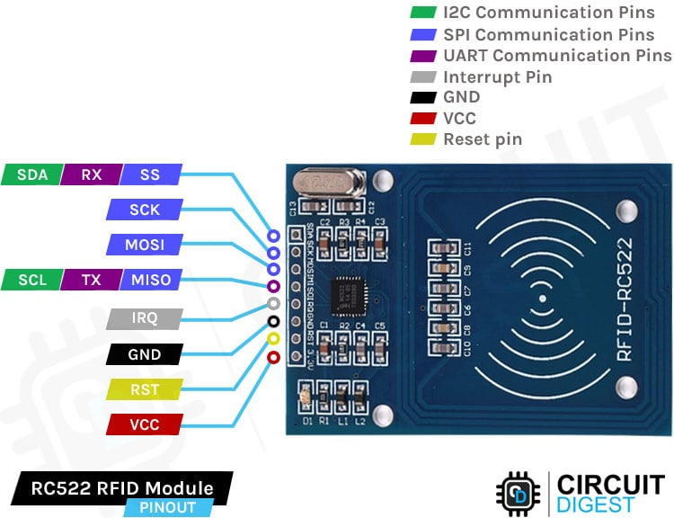

#### 1. ອຸປະກອນນີ້ແມ່ນຫຍັງ?

**RFID** ແມ່ນຄຳຫຍໍ້ຂອງ **R**adio **F**requency **ID**entification, ຊຶ່ງໝາຍເຖິງເຕັກໂນໂລຍີທີ່ໃຊ້ຄື້ນຄວາມຖີ່ວິທະຍຸແບບໄຮ້ສາຍເພື່ອ **ກວດສອບ, ຕິດຕາມ, ແລະເກັບກຳຂໍ້ມູນ** ຂອງວັດຖຸ, ສັດ, ຫຼືຄົນ.

**RFID Module** (ໂມດູນ RFID) ແມ່ນສ່ວນປະກອບຫຼັກຂອງລະບົບ RFID. ມັນເຮັດໜ້າທີ່ເປັນ **ເຄື່ອງອ່ານ (Reader)** ທີ່ຮັບຜິດຊອບໃນການສື່ສານກັບປ້າຍ RFID (Tags) ແລະຖ່າຍທອດຂໍ້ມູນນັ້ນໄປຍັງຄອມພິວເຕີ ຫຼື ໄມໂຄຣຄອນໂທນເລີ.

##### ສ່ວນປະກອບຫຼັກຂອງລະບົບ RFID:

1. **RFID Reader Module (ໂມດູນເຄື່ອງອ່ານ):** ປະກອບດ້ວຍເສົາອາກາດ (Antenna), ຕົວສົ່ງ-ຮັບສັນຍານ (Transceiver), ແລະໜ່ວຍປະມວນຜົນ (Microcontroller ຫຼື Decoder). ໜ້າທີ່ຂອງມັນແມ່ນການສົ່ງຄື້ນວິທະຍຸອອກໄປ ແລະ ຮັບຄື້ນທີ່ສະທ້ອນກັບມາຈາກປ້າຍ.
    
2. **RFID Tag/Transponder (ປ້າຍ RFID):** ເປັນອຸປະກອນນ້ອຍໆທີ່ຕິດຢູ່ກັບວັດຖຸ, ປະກອບດ້ວຍ:
    
    - **ເສົາອາກາດນ້ອຍ:** ສຳລັບຮັບພະລັງງານ ແລະ ສັນຍານ.
        
    - **Microchip (IC):** ເກັບຂໍ້ມູນສະເພາະຕົວ (ເຊັ່ນ: ລະຫັດ UID).
        
    - **ປ້າຍ Passive:** ສ່ວນໃຫຍ່ແມ່ນບໍ່ມີແບັດເຕີຣີ ແລະ ຈະໄດ້ຮັບພະລັງງານຈາກຄື້ນວິທະຍຸຂອງເຄື່ອງອ່ານເທົ່ານັ້ນ.
        

#### 2. ການໃຊ້ງານຂອງອຸປະກອນເຮັດວຽກແນວໃດ?

ຫຼັກການເຮັດວຽກຂອງລະບົບ RFID ສ່ວນຫຼາຍແມ່ນອີງໃສ່ການ **ຜູກມັດທາງແມ່ເຫຼັກໄຟຟ້າ (Electromagnetic Coupling)**, ໂດຍສະເພາະສຳລັບປ້າຍແບບ Passive (ທີ່ບໍ່ມີແບັດເຕີຣີ).

##### ຂັ້ນຕອນການເຮັດວຽກ:

1. **ການສົ່ງພະລັງງານ (Energy Transmission):**
    
    - ໂມດູນ RFID Reader ຈະສົ່ງ **ຄື້ນຄວາມຖີ່ວິທະຍຸ (Radio Frequency, RF)** ອອກມາຜ່ານເສົາອາກາດຂອງມັນ, ເຊິ່ງສ້າງ **ພາກສະໜາມແມ່ເຫຼັກໄຟຟ້າ (Electromagnetic Field)** ອ້ອມຮອບບໍລິເວນເຄື່ອງອ່ານ.
        
    - ຕົວຢ່າງໂມດູນ RC522 ທີ່ນິຍົມໃຊ້ແມ່ນເຮັດວຽກທີ່ຄວາມຖີ່ $13.56\text{ MHz}$ (HF - High Frequency).
        
2. **ການເປີດໃຊ້ງານປ້າຍ (Tag Activation):**
    
    - ເມື່ອປ້າຍ RFID ເຂົ້າມາໃນໄລຍະການອ່ານຂອງພາກສະໜາມແມ່ເຫຼັກໄຟຟ້າ, ເສົາອາກາດຂອງປ້າຍຈະ **ດູດເອົາພະລັງງານ** ຈາກຄື້ນ RF ນັ້ນ (ອັນນີ້ເອີ້ນວ່າ **Inductive Coupling**).
        
    - ພະລັງງານໄຟຟ້າຂະໜາດນ້ອຍນີ້ຈະຖືກປ່ຽນເປັນກະແສໄຟຟ້າເພື່ອ **ເປີດໃຊ້ງານ (Power up)** Microchip ທີ່ຢູ່ໃນປ້າຍ.
        
3. **ການຕອບກັບດ້ວຍຂໍ້ມູນ (Data Communication):**
    
    - ເມື່ອໄດ້ຮັບພະລັງງານແລ້ວ, Microchip ໃນປ້າຍຈະດຶງເອົາຂໍ້ມູນທີ່ເກັບໄວ້ (ເຊັ່ນ: ລະຫັດ UID ສະເພາະຕົວ).
        
    - ປ້າຍຈະສົ່ງຂໍ້ມູນນີ້ກັບຄືນໄປຫາເຄື່ອງອ່ານໂດຍການ **ດັດແປງ (Modulate)** ຄື້ນ RF ທີ່ເຄື່ອງອ່ານສົ່ງອອກມາ (ອັນນີ້ເອີ້ນວ່າ **Backscatter**).
        
4. **ການປະມວນຜົນຂໍ້ມູນ (Data Processing):**
    
    - ເຄື່ອງອ່ານ RFID ຈະຮັບເອົາສັນຍານທີ່ຖືກດັດແປງກັບຄືນມາ, ຖອດລະຫັດຂໍ້ມູນນັ້ນ, ແລະສົ່ງຜ່ານສາຍເຊື່ອມຕໍ່ (ເຊັ່ນ: SPI, I2C, ຫຼື UART) ໄປຍັງລະບົບປະມວນຜົນ (ເຊັ່ນ: Arduino ຫຼື Microcontroller).
        
    - ລະບົບປະມວນຜົນຫຼັກຈະໃຊ້ຂໍ້ມູນນີ້ເພື່ອປະຕິບັດໜ້າທີ່ທີ່ກຳນົດໄວ້, ເຊັ່ນ: ເປີດປະຕູ, ບັນທຶກສິນຄ້າ, ຫຼື ກວດສອບຕົວຕົນ.
        

#### ຕົວຢ່າງການນໍາໃຊ້:

- **ລະບົບຄວບຄຸມການເຂົ້າ-ອອກ (Access Control):** ໃຊ້ບັດ RFID ເພື່ອເປີດປະຕູ ຫຼື ລົງທະບຽນເວລາເຮັດວຽກ.
    
- **ການຈັດການສາງສິນຄ້າ (Inventory Management):** ຕິດຕາມ ແລະ ນັບສິນຄ້າໃນສາງຢ່າງວ່ອງໄວ.
    
- **ລະບົບຈ່າຍເງິນແບບ Contactless:** ເຊັ່ນ: ບັດໂດຍສານ ຫຼື ການຈ່າຍເງິນຜ່ານບັດ.

## 30. [ ] RFID tag.

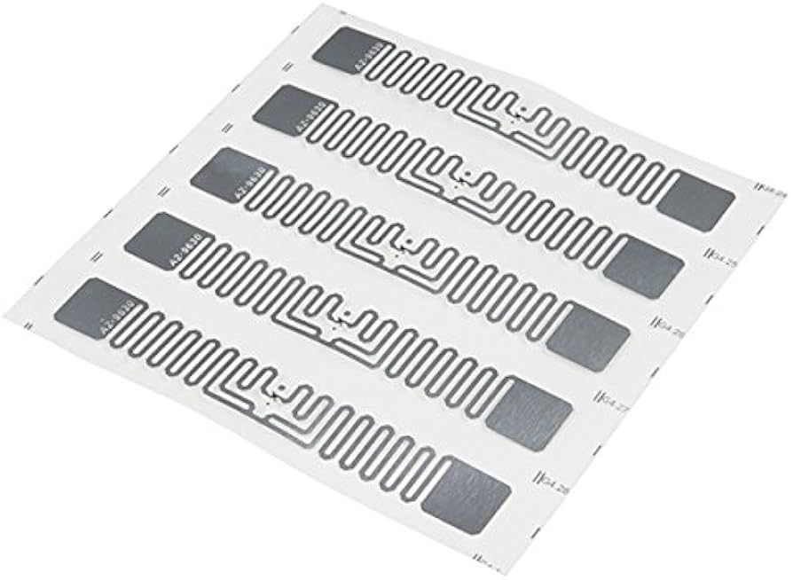

#### 1. ອຸປະກອນນີ້ແມ່ນຫຍັງ?

**RFID Tag** (ຫຼືເອີ້ນວ່າ Transponder) ແມ່ນອຸປະກອນໄຮ້ສາຍຂະໜາດນ້ອຍທີ່ໃຊ້ໃນການ **ເກັບຮັກສາຂໍ້ມູນດິຈິຕອລ** ແລະ **ສື່ສານ** ກັບເຄື່ອງອ່ານ RFID ໂດຍຜ່ານຄື້ນຄວາມຖີ່ວິທະຍຸ.

**ປ້າຍ RFID ປະກອບມີສ່ວນປະກອບຫຼັກ 3 ຢ່າງຄື:**

1. **Microchip (Integrated Circuit, IC):** ເປັນສ່ວນທີ່ເກັບຮັກສາຂໍ້ມູນສະເພາະຕົວ (ເຊັ່ນ: ລະຫັດ ID ທີ່ເປັນເອກະລັກ, ຫຼື **EPC - Electronic Product Code**).
    
2. **Antenna (ເສົາອາກາດ):** ເປັນເສັ້ນລວດ ຫຼື ແຜ່ນໂລຫະທີ່ໃຊ້ເພື່ອ **ຮັບພະລັງງານ** ຈາກເຄື່ອງອ່ານ ແລະ **ສົ່ງສັນຍານ** ຂໍ້ມູນກັບຄືນ.
    
3. **Substrate/Encasing (ພື້ນຜິວ/ຫໍ່ຫຸ້ມ):** ເປັນວັດສະດຸ (ເຊັ່ນ: ກະດາດ, ພລາສຕິກ, ຫຼື ຝັງຢູ່ໃນວັດຖຸ) ທີ່ໃຊ້ຍຶດສ່ວນປະກອບຕ່າງໆເຂົ້າກັນ.
    

##### ປະເພດຂອງ RFID Tag ທີ່ສຳຄັນ:

|**ປະເພດ**|**ແຫຼ່ງພະລັງງານ**|**ໄລຍະການອ່ານ**|**ການນຳໃຊ້ຫຼັກ**|
|---|---|---|---|
|**Passive Tag**|ບໍ່ມີແບັດເຕີຣີ; ໄດ້ຮັບພະລັງງານຈາກເຄື່ອງອ່ານ|ສັ້ນ (ສອງສາມຊັງຕີແມັດ ຫາ 10 ແມັດ)|ການຈັດການສິນຄ້າຄົງຄັງ, ບັດເຂົ້າອອກ, NFC.|
|**Active Tag**|ມີແບັດເຕີຣີໃນຕົວ|ຍາວ (ສູງສຸດເຖິງ 100 ແມັດ)|ການຕິດຕາມຊັບສິນມູນຄ່າສູງ, ການຕິດຕາມພາຫະນະ.|
|**Semi-Passive (BAP)**|ມີແບັດເຕີຣີສຳລັບ Microchip, ແຕ່ໃຊ້ພະລັງງານຈາກເຄື່ອງອ່ານສຳລັບການສື່ສານ|ປານກາງຫາຢາວ|ການກວດສອບທີ່ຕ້ອງການຄວາມແມ່ນຍຳສູງ.|

#### 2. ການໃຊ້ງານຂອງອຸປະກອນເຮັດວຽກແນວໃດ?

ປ້າຍ RFID ເຮັດວຽກຮ່ວມກັບເຄື່ອງອ່ານ RFID ໂດຍໃຊ້ຄື້ນຄວາມຖີ່ວິທະຍຸ, ໂດຍສະເພາະປ້າຍແບບ Passive ເຊິ່ງເປັນທີ່ນິຍົມໃຊ້ຫຼາຍທີ່ສຸດ, ມີຫຼັກການເຮັດວຽກດັ່ງນີ້:

##### ຫຼັກການເຮັດວຽກຂອງ Passive RFID Tag:

1. **ການຮັບສັນຍານ ແລະ ພະລັງງານ (Inductive Coupling):**
    
    - ເຄື່ອງອ່ານ RFID ສົ່ງຄື້ນວິທະຍຸ (ຄື້ນ RF) ອອກມາ, ເຊິ່ງສ້າງພາກສະໜາມແມ່ເຫຼັກໄຟຟ້າ.
        
    - ເມື່ອປ້າຍ RFID ເຂົ້າໄປໃນພາກສະໜາມນີ້, ເສົາອາກາດຂອງປ້າຍຈະ **ດູດຊຶມພະລັງງານ** ໂດຍຜ່ານຫຼັກການ **Inductive Coupling** (ຄືກັບການສົ່ງໄຟຟ້າແບບໄຮ້ສາຍ).
        
    - ພະລັງງານໄຟຟ້າທີ່ເກີດຂຶ້ນນີ້ຈະໃຊ້ເພື່ອ **ເປີດໃຊ້ງານ Microchip** ທີ່ຢູ່ໃນປ້າຍ.
        
2. **ການສົ່ງຂໍ້ມູນກັບຄືນ (Backscatter Modulation):**
    
    - ເມື່ອ Microchip ມີພະລັງງານແລ້ວ, ມັນຈະດຶງຂໍ້ມູນທີ່ເກັບໄວ້ (ເຊັ່ນ: ລະຫັດ UID) ແລະໃຊ້ເຕັກນິກທີ່ເອີ້ນວ່າ **Backscatter Modulation**.
        
    - ການ Backscatter ແມ່ນການທີ່ປ້າຍຈະ **ສະທ້ອນຄື້ນວິທະຍຸຂອງເຄື່ອງອ່ານກັບຄືນ** ໄປພ້ອມກັບການ **ດັດແປງ** ຄື້ນນັ້ນ ເພື່ອຝັງຂໍ້ມູນເຂົ້າໄປໃນສັນຍານທີ່ສະທ້ອນ.
        
3. **ການກວດສອບ ແລະ ປະມວນຜົນ:**
    
    - ເຄື່ອງອ່ານຈະຮັບເອົາສັນຍານທີ່ສະທ້ອນກັບຄືນມາ, ຖອດລະຫັດສັນຍານທີ່ຖືກດັດແປງ, ແລະດຶງເອົາຂໍ້ມູນດິຈິຕອລທີ່ຢູ່ໃນປ້າຍອອກມາ.
        
    - ຂໍ້ມູນນີ້ຈະຖືກສົ່ງໄປຍັງຄອມພິວເຕີ ຫຼື ຖານຂໍ້ມູນເພື່ອຢືນຢັນຕົວຕົນ (ເຊັ່ນ: ຖ້າລະຫັດຖືກຕ້ອງ, ອະນຸຍາດໃຫ້ເຂົ້າເຖິງ).
        

#### ຂໍ້ໄດ້ປຽບຂອງ RFID Tag:

- **ບໍ່ຕ້ອງມີການເບິ່ງເຫັນ (No Line-of-Sight):** ບໍ່ຄືກັບ Barcode, ເຄື່ອງອ່ານສາມາດອ່ານປ້າຍໄດ້ເຖິງແມ່ນວ່າຈະມີສິ່ງກີດຂວາງ (ເຊັ່ນ: ໃນກ່ອງ ຫຼື ພາຍໃນເສື້ອຜ້າ).
    
- **ການອ່ານຫຼາຍອັນພ້ອມກັນ (Bulk Reading):** ເຄື່ອງອ່ານສາມາດອ່ານປ້າຍໄດ້ຫຼາຍຮ້ອຍປ້າຍພ້ອມກັນໃນເວລາດຽວ (ສຳລັບ UHF Tags).

## 31. [ ] Infrared receiver.

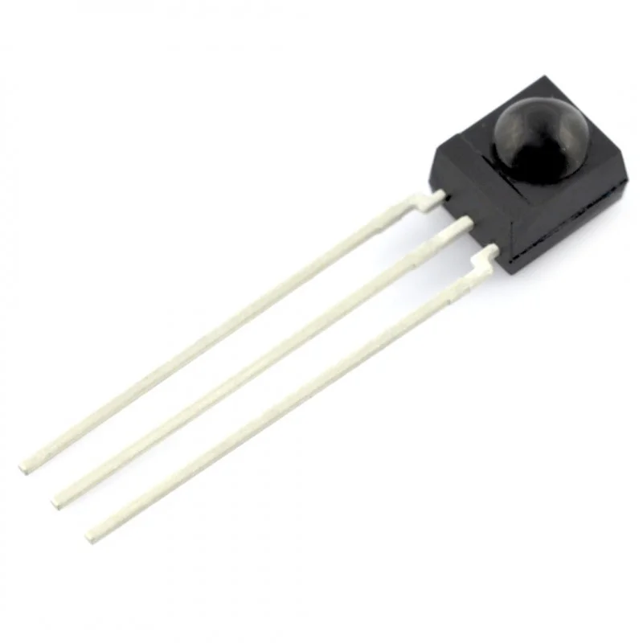

#### 1. ອຸປະກອນນີ້ແມ່ນຫຍັງ?

**Infrared Receiver (IR Receiver)**, ຫຼືມັກເອີ້ນວ່າ **IR Receiver Module**, ແມ່ນອຸປະກອນເອເລັກໂຕຣນິກທີ່ອອກແບບມາເພື່ອ **ຮັບ ແລະ ແປ** ສັນຍານແສງອິນຟາເຣດ (Infrared light, IR) ທີ່ຖືກສົ່ງມາໂດຍອຸປະກອນສົ່ງສັນຍານ IR (ເຊັ່ນ: ຣີໂໝດຄວບຄຸມໂທລະທັດ).

ແສງອິນຟາເຣດແມ່ນແສງທີ່ມະນຸດບໍ່ສາມາດເຫັນໄດ້ດ້ວຍຕາເປົ່າ, ເຊິ່ງມີຄວາມຍາວຄື້ນຍາວຫຼາຍກວ່າແສງສີແດງ.

##### ສ່ວນປະກອບຫຼັກຂອງ IR Receiver Module:

- **Photodiode ຫຼື Phototransistor:** ເປັນເຊັນເຊີຫຼັກທີ່ໃຊ້ໃນການກວດຈັບແສງ IR. ມັນຈະປ່ຽນແສງ IR ທີ່ໄດ້ຮັບໃຫ້ກາຍເປັນກະແສໄຟຟ້າ.
    
- **Amplifier Circuit (ວົງຈອນຂະຫຍາຍສັນຍານ):** ເຮັດໜ້າທີ່ຂະຫຍາຍສັນຍານໄຟຟ້າທີ່ອ່ອນໆທີ່ໄດ້ຈາກ Photodiode.
    
- **Filter (ຕົວກັ່ນຕອງ):** ເຮັດໜ້າທີ່ກັ່ນຕອງແສງລົບກວນຈາກສະພາບແວດລ້ອມ (ເຊັ່ນ: ແສງຕາເວັນ ຫຼື ໄຟຟລູອໍເຣສເຊັນ) ເພື່ອໃຫ້ສາມາດກວດຈັບໄດ້ສະເພາະສັນຍານ IR ທີ່ຖືກສົ່ງມາຈາກຣີໂໝດເທົ່ານັ້ນ.
    
- **Demodulator (ຕົວຖອດສັນຍານ):** ເຮັດໜ້າທີ່ປ່ຽນສັນຍານ IR ທີ່ຖືກເຂົ້າລະຫັດ (Modulated) ໃຫ້ເປັນສັນຍານດິຈິຕອລ (Digital signal) ທີ່ອຸປະກອນຮັບ (ເຊັ່ນ: ໂທລະທັດ ຫຼື ໄມໂຄຣຄອນໂທນເລີ) ສາມາດເຂົ້າໃຈໄດ້.
    

#### 2. ການໃຊ້ງານຂອງອຸປະກອນເຮັດວຽກແນວໃດ?

ການເຮັດວຽກຂອງ IR Receiver ແມ່ນອີງໃສ່ຫຼັກການຂອງການສື່ສານແບບມີການ **ເຂົ້າລະຫັດ (Modulation)** ຂອງແສງອິນຟາເຣດ.

##### ຂັ້ນຕອນການເຮັດວຽກຂອງລະບົບ IR ຄວບຄຸມ:

1. **ການເຂົ້າລະຫັດ ແລະ ສົ່ງສັນຍານ (Transmitting - ໂດຍ Remote):**
    
    - ເມື່ອຜູ້ໃຊ້ກົດປຸ່ມໃດໜຶ່ງເທິງຣີໂໝດ (ເຊັ່ນ: ປຸ່ມເພີ່ມສຽງ), ໄມໂຄຣຄອນໂທນເລີພາຍໃນຣີໂໝດຈະສ້າງ **ລະຫັດດິຈິຕອລ** ສະເພາະສຳລັບຄຳສັ່ງນັ້ນ.
        
    - ຈາກນັ້ນ, ຣີໂໝດຈະໃຊ້ **IR LED (Light-Emitting Diode)** ເພື່ອສົ່ງແສງ IR ທີ່ຖືກ **ເຂົ້າລະຫັດດ້ວຍຄວາມຖີ່ໃດໜຶ່ງ (ເຊັ່ນ: $38\text{ kHz}$)** ອອກໄປ. ການເຂົ້າລະຫັດຄວາມຖີ່ນີ້ມີຈຸດປະສົງເພື່ອກຳຈັດສຽງລົບກວນຈາກແສງອື່ນໆ.
        
2. **ການຮັບສັນຍານ (Reception - ໂດຍ IR Receiver):**
    
    - IR Receiver Module ຈະເປີດຮັບແສງ IR.
        
    - **Photodiode** ຈະກວດຈັບແສງ IR ທີ່ຖືກສົ່ງມາ ແລະ ປ່ຽນມັນເປັນກະແສໄຟຟ້າ.
        
3. **ການກັ່ນຕອງ ແລະ ຖອດສັນຍານ (Filtering and Demodulation):**
    
    - ວົງຈອນພາຍໃນ IR Receiver ຈະ **ກັ່ນຕອງ** ເພື່ອໃຫ້ແນ່ໃຈວ່າມັນຮັບເອົາສະເພາະສັນຍານ IR ທີ່ຖືກເຂົ້າລະຫັດດ້ວຍຄວາມຖີ່ທີ່ກຳນົດໄວ້ ($38\text{ kHz}$) ເທົ່ານັ້ນ.
        
    - **Demodulator** ຈະຖອດສັນຍານຄວາມຖີ່ນັ້ນອອກ ແລະ ປ່ຽນມັນໃຫ້ເປັນ **ຊຸດຄຳສັ່ງດິຈິຕອລ (Digital Pulse)** ທີ່ມີຄ່າສູງ-ຕໍ່າ (High/Low).
        
4. **ການປະມວນຜົນຄຳສັ່ງ (Processing - ໂດຍອຸປະກອນປາຍທາງ):**
    
    - ຊຸດຄຳສັ່ງດິຈິຕອລທີ່ໄດ້ຮັບຈະຖືກສົ່ງໄປຫາໄມໂຄຣຄອນໂທນເລີຫຼັກຂອງອຸປະກອນ (ເຊັ່ນ: ໂທລະທັດ).
        
    - ໄມໂຄຣຄອນໂທນເລີຈະ **ແປລະຫັດ** ນັ້ນ ແລະ ປະຕິບັດຄຳສັ່ງທີ່ກົງກັນ (ເຊັ່ນ: ເພີ່ມສຽງ, ປ່ຽນຊ່ອງ, ຫຼື ປິດເຄື່ອງ).
        

#### ການນຳໃຊ້ຫຼັກ:

- **ຣີໂໝດຄວບຄຸມ:** ໂທລະທັດ, ເຄື່ອງປັບອາກາດ, ເຄື່ອງຫຼິ້ນ DVD.
    
- **ເຊັນເຊີໄລຍະໃກ້/ການກວດຈັບສິ່ງກີດຂວາງ:** ໃຊ້ໃນຫຸ່ນຍົນເພື່ອຫຼີກເວັ້ນການຕຳ.
    
- **ລະບົບນັບ:** ໃຊ້ໃນການນັບສິ່ງຂອງເມື່ອມັນຕັດແສງ IR.

# 🎮 Remote & Control

## 32. [ ] Infrared remote control.

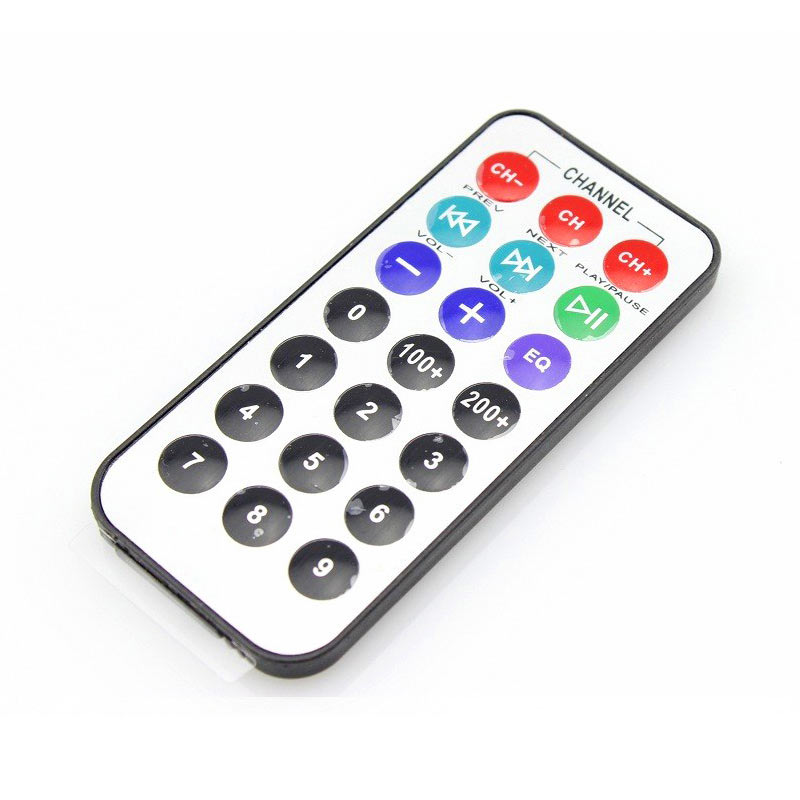

### 1. ອຸປະກອນນີ້ແມ່ນຫຍັງ?

**Infrared Remote Control (IR Remote Control)** ແມ່ນອຸປະກອນໄຮ້ສາຍຂະໜາດນ້ອຍທີ່ໃຊ້ສຳລັບການ **ຄວບຄຸມອຸປະກອນເອເລັກໂຕຣນິກ** ຈາກໄລຍະໄກໂດຍໃຊ້ **ແສງອິນຟາເຣດ (IR)**. ມັນເປັນຮູບແບບການສື່ສານທີ່ພົບເຫັນຫຼາຍທີ່ສຸດໃນເຄື່ອງໃຊ້ພາຍໃນບ້ານ ເຊັ່ນ: ໂທລະທັດ, ເຄື່ອງປັບອາກາດ, ແລະເຄື່ອງຫຼິ້ນດີວີດີ.

**ຣີໂໝດ IR ປະກອບມີສ່ວນປະກອບຫຼັກຄື:**

- **ປຸ່ມກົດ (Keypad):** ເປັນສ່ວນທີ່ຜູ້ໃຊ້ກົດຄຳສັ່ງ (ເຊັ່ນ: ເປີດ/ປິດ, ເພີ່ມສຽງ).
    
- **Microcontroller (ໄມໂຄຣຄອນໂທນເລີ):** ເປັນສ່ວນສະໝອງທີ່ປ່ຽນການກົດປຸ່ມແຕ່ລະຄັ້ງໃຫ້ເປັນ **ລະຫັດດິຈິຕອລ** ສະເພາະຕົວ (ເຊັ່ນ: ລະຫັດ $4\text{ byte}$ ໃນໂປຣໂຕຄໍ NEC).
    
- **Oscillator/Modulator Circuit:** ເປັນວົງຈອນທີ່ສ້າງ **ຄວາມຖີ່ຂອງສັນຍານຂົນສົ່ງ (Carrier Frequency)** ໂດຍທົ່ວໄປແມ່ນ $38\text{ kHz}$, ເຊິ່ງໃຊ້ໃນການເຂົ້າລະຫັດຂໍ້ມູນ.
    
- **IR LED (Infrared Light-Emitting Diode):** ເປັນສ່ວນສົ່ງສັນຍານຫຼັກ. ມັນປ່ຽນສັນຍານດິຈິຕອລທີ່ຖືກເຂົ້າລະຫັດໃຫ້ເປັນ **ແສງອິນຟາເຣດ** ແລ້ວສົ່ງອອກໄປຫາອຸປະກອນທີ່ຕ້ອງການຄວບຄຸມ.
    

> **ຂໍ້ຄວນຮູ້:** ການສື່ສານດ້ວຍ IR ຕ້ອງການ **ສາຍຕາທີ່ຕໍ່ກັນໂດຍກົງ (Line-of-Sight)** ລະຫວ່າງຣີໂໝດ ແລະ ເຄື່ອງຮັບ (IR Receiver) ຢູ່ເທິງອຸປະກອນ, ຍ້ອນວ່າແສງ IR ບໍ່ສາມາດຜ່ານວັດຖຸແຂງໄດ້.

### 2. ການໃຊ້ງານຂອງອຸປະກອນເຮັດວຽກແນວໃດ?

ຂະບວນການເຮັດວຽກຂອງຣີໂໝດຄວບຄຸມອິນຟາເຣດແມ່ນປະກອບດ້ວຍ 3 ຂັ້ນຕອນຫຼັກ: **ການເຂົ້າລະຫັດ (Encoding), ການສົ່ງສັນຍານ (Transmitting),** ແລະ **ການຖອດລະຫັດ (Decoding)**.

#### ຫຼັກການເຮັດວຽກເປັນຂັ້ນຕອນ:

|**ຂັ້ນຕອນ**|**ການກະທຳໃນຣີໂໝດ (Transmitter)**|**ການກະທຳໃນອຸປະກອນ (Receiver)**|
|---|---|---|
|**1. ການເຂົ້າລະຫັດຄຳສັ່ງ**|ເມື່ອຜູ້ໃຊ້ກົດປຸ່ມ (ເຊັ່ນ: ປຸ່ມ 'Volume Up'), ໄມໂຄຣຄອນໂທນເລີຈະກວດຈັບການກົດ ແລະ **ສ້າງຊຸດລະຫັດດິຈິຕອລ** ທີ່ເປັນເອກະລັກສະເພາະສຳລັບຄຳສັ່ງນັ້ນ.|-|
|**2. ການເຂົ້າລະຫັດດ້ວຍຄວາມຖີ່ (Modulation)**|ໄມໂຄຣຄອນໂທນເລີຈະໃຊ້ຊຸດລະຫັດດິຈິຕອລນີ້ໄປ **ຄວບຄຸມ (Modulate)** ຄວາມຖີ່ຂອງສັນຍານຂົນສົ່ງ ($38\text{ kHz}$), ເພື່ອໃຫ້ສັນຍານມີຄວາມເຂັ້ມແຂງຂຶ້ນ ແລະ ແຍກອອກຈາກແສງລົບກວນອື່ນໆ.|-|
|**3. ການສົ່ງສັນຍານ**|**IR LED** ຈະປ່ອຍ **ແສງອິນຟາເຣດ** ທີ່ມີການເຂົ້າລະຫັດ (modulated) ອອກໄປໃນທິດທາງຂອງອຸປະກອນ.|-|
|**4. ການຮັບສັນຍານ**|**IR Receiver Module** ທີ່ຢູ່ເທິງອຸປະກອນ (ເຊັ່ນ: ໂທລະທັດ) ຈະຮັບແສງ IR ນັ້ນດ້ວຍ **Photodiode**.|**IR Receiver** ຈະ **ກັ່ນຕອງ** ເພື່ອຮັບເອົາສະເພາະຄວາມຖີ່ຂົນສົ່ງທີ່ກຳນົດໄວ້ ($38\text{ kHz}$) ເທົ່ານັ້ນ.|
|**5. ການຖອດລະຫັດ (Demodulation)**|-|**IR Receiver** ຈະ **ຖອດສັນຍານ (Demodulate)** ເພື່ອປ່ຽນສັນຍານແສງກັບຄືນເປັນຊຸດລະຫັດດິຈິຕອລທີ່ບໍລິສຸດ.|
|**6. ການປະຕິບັດຄຳສັ່ງ**|-|ໄມໂຄຣຄອນໂທນເລີຂອງອຸປະກອນຈະ **ອ່ານຊຸດລະຫັດ** ນັ້ນ, ປຽບທຽບກັບຕາຕະລາງຄຳສັ່ງ, ແລະ **ປະຕິບັດໜ້າທີ່** ຕາມທີ່ລະບຸ (ເຊັ່ນ: ເພີ່ມລະດັບສຽງ).|

## 33. [ ] Joystick module.

### 1. ອຸປະກອນນີ້ແມ່ນຫຍັງ?

**Joystick Module** ແມ່ນອຸປະກອນປ້ອນຂໍ້ມູນ (Input Device) ທີ່ສາມາດວັດແທກ **ການເຄື່ອນໄຫວຂອງມືຈັບ (stick)** ໃນສອງທິດທາງຄື: **ແກນ X (ແນວນອນ)** ແລະ **ແກນ Y (ແນວຕັ້ງ)**. ໂມດູນປະເພດນີ້ມັກຖືກນຳໃຊ້ໃນໂຄງການຫຸ່ນຍົນ, ການຄວບຄຸມກ້ອງຖ່າຍຮູບ, ແລະໂຄງການເກມ DIY ຕ່າງໆ.

#### ສ່ວນປະກອບຫຼັກຂອງ Joystick Module (ເຊັ່ນ: KY-023):

- **Potentiometers (ຕົວຕ້ານທານປັບຄ່າໄດ້) 2 ອັນ:**
    
    - ອັນໜຶ່ງສຳລັບ **ແກນ X** (ການເຄື່ອນໄຫວຊ້າຍ-ຂວາ).
        
    - ອີກອັນໜຶ່ງສຳລັບ **ແກນ Y** (ການເຄື່ອນໄຫວຂຶ້ນ-ລົງ).
        
    - Potentiometers ເຫຼົ່ານີ້ຈະປ່ຽນ **ມຸມ** ຂອງມືຈັບໃຫ້ເປັນ **ຄ່າແຮງດັນ (Voltage)**.
        
- **Self-Centering Mechanism (ກົນໄກການກັບຄືນສູນກາງ):** ໂມດູນສ່ວນຫຼາຍຈະມີສະປຣິງທີ່ດຶງມືຈັບໃຫ້ກັບຄືນສູ່ **ຕຳແໜ່ງກາງ (Resting Position)** ໂດຍອັດຕະໂນມັດເມື່ອຜູ້ໃຊ້ປ່ອຍມື.
    
- **Push-Button Switch (ປຸ່ມກົດ):** ໂດຍປົກກະຕິແລ້ວ, ໂມດູນຍັງມີປຸ່ມກົດທີ່ສາມາດເປີດໃຊ້ງານໄດ້ໂດຍການ **ກົດມືຈັບລົງ** ໂດຍກົງ (ເປັນສັນຍານດິຈິຕອລ).
    

#### Pinout ຫຼັກ (ການເຊື່ອມຕໍ່):

|**Pin**|**ໜ້າທີ່**|**ປະເພດສັນຍານ**|
|---|---|---|
|**GND**|ສາຍດິນ (Ground)|-|
|**+5V / VCC**|ການສະໜອງພະລັງງານ (ມັກຈະແມ່ນ 3.3V ຫຼື 5V)|-|
|**VRx**|ແຮງດັນຂາອອກສຳລັບ **ແກນ X**|Analog|
|**VRy**|ແຮງດັນຂາອອກສຳລັບ **ແກນ Y**|Analog|
|**SW (Key)**|ສັນຍານຂາອອກສຳລັບ **ປຸ່ມກົດ**|Digital|

### 2. ການໃຊ້ງານຂອງອຸປະກອນເຮັດວຽກແນວໃດ?

ການເຮັດວຽກຂອງ Joystick Module ແມ່ນອີງໃສ່ຫຼັກການຂອງ **ການປ່ຽນແປງຄ່າຄວາມຕ້ານທານ** ຂອງ Potentiometers.

#### ຫຼັກການເຮັດວຽກຂອງແກນ X ແລະ Y:

1. **ການປ່ຽນແປງຕຳແໜ່ງ:** ພາຍໃນໂມດູນ, Potentiometer ແຕ່ລະອັນຖືກຕັ້ງຄ່າໃຫ້ເປັນ **ຕົວແບ່ງແຮງດັນ (Voltage Divider Circuit)**.
    
2. **ການເຄື່ອນໄຫວ:** ເມື່ອມືຈັບຖືກຍູ້ໄປໃນທິດທາງໃດໜຶ່ງ (ເຊັ່ນ: ເຄື່ອນໄປທາງຂວາຕາມແກນ X):
    
    - ການເຄື່ອນໄຫວນັ້ນຈະເຮັດໃຫ້ແຂນກວດຈັບ (wiper) ຂອງ Potentiometer ທີ່ກ່ຽວຂ້ອງ **ໝູນ**.
        
    - ການໝູນເຮັດໃຫ້ **ຄ່າຄວາມຕ້ານທານ** ປ່ຽນແປງ.
        
    - ການປ່ຽນແປງຄວາມຕ້ານທານນີ້ສົ່ງຜົນໃຫ້ **ແຮງດັນຂາອອກ (Output Voltage)** ທີ່ Pin VRx ຫຼື VRy ປ່ຽນແປງໄປຕາມທິດທາງ.
        
3. **ການສົ່ງສັນຍານ Analog:**
    
    - **ຕຳແໜ່ງກາງ (Center):** ເມື່ອມືຈັບຢູ່ໃນຕຳແໜ່ງພັກ (ກາງ), ແຮງດັນຂາອອກຈະຢູ່ທີ່ **ເຄິ່ງໜຶ່ງຂອງແຮງດັນສະໜອງ** (ເຊັ່ນ: $2.5\text{V}$ ສຳລັບລະບົບ $5\text{V}$). ເມື່ອອ່ານດ້ວຍ Microcontroller 10-bit (ເຊັ່ນ: Arduino), ຄ່າທີ່ໄດ້ຈະປະມານ **512**.
        
    - **ການເຄື່ອນໄຫວສຸດຂີດ:**
        
        - ເມື່ອຍູ້ໄປສຸດທາງໃດໜຶ່ງ (ເຊັ່ນ: ຂວາສຸດ), ແຮງດັນຈະເປັນ **$5\text{V}$** (ຄ່າ ADC: **1023**).
            
        - ເມື່ອຍູ້ໄປສຸດທາງກົງກັນຂ້າມ (ເຊັ່ນ: ຊ້າຍສຸດ), ແຮງດັນຈະເປັນ **$0\text{V}$** (ຄ່າ ADC: **0**).
            
4. **ການອ່ານໂດຍ Microcontroller:** Microcontroller (ເຊັ່ນ: Arduino) ຈະໃຊ້ **ADC (Analog-to-Digital Converter)** ເພື່ອອ່ານແຮງດັນ Analog ທີ່ປ່ຽນແປງນີ້ (ຈາກ $0 \text{V}$ ຫາ $5\text{V}$) ແລະປ່ຽນເປັນ **ຄ່າຕົວເລກດິຈິຕອລ** (ຈາກ $0$ ຫາ $1023$) ເພື່ອໃຊ້ໃນການຄວບຄຸມໂຄງການ.

## 34. [ ] 4x4 Matrix Keyboard Module.

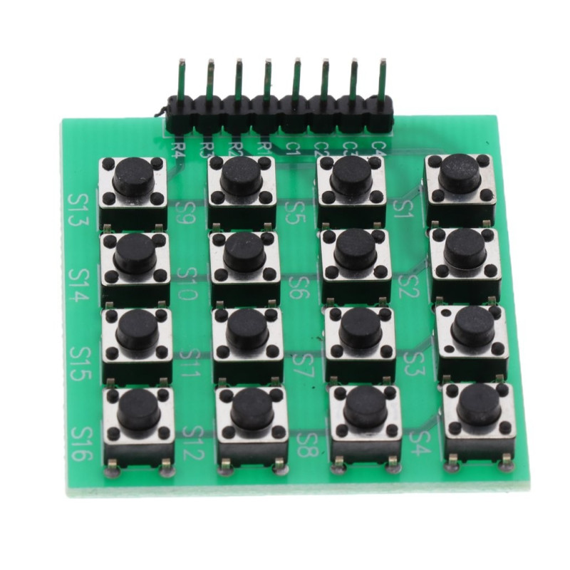

### 1. ອຸປະກອນນີ້ແມ່ນຫຍັງ?

**4x4 Matrix Keyboard Module** (ຫຼື 4x4 Keypad) ແມ່ນອຸປະກອນປ້ອນຂໍ້ມູນ (Input Device) ຂະໜາດນ້ອຍທີ່ມີ **16 ປຸ່ມກົດ** ຈັດລຽງຢູ່ໃນຮູບແບບ **ຕາຕະລາງ $4$ ແຖວ (Rows) ຄູນ $4$ ຖັນ (Columns)**.

ຈຸດປະສົງຫຼັກຂອງການຈັດຮຽງແບບ **Matrix** ແມ່ນເພື່ອ **ປະຢັດຈຳນວນຂາ I/O (Input/Output Pins)** ທີ່ຕ້ອງການເຊື່ອມຕໍ່ກັບ Microcontroller (ເຊັ່ນ: Arduino).

- ຖ້າແປ້ນພິມມີ 16 ປຸ່ມກົດ ແລ້ວແຕ່ລະປຸ່ມເຊື່ອມຕໍ່ແຍກກັນ, ຈະຕ້ອງໃຊ້ເຖິງ 16 ຂາ I/O.
    
- ແຕ່ດ້ວຍການຈັດຮຽງແບບ $4 \times 4$ Matrix, ຕ້ອງການພຽງແຕ່:
    
    - **4 ຂາ** ສຳລັບການຄວບຄຸມແຖວ (R1, R2, R3, R4)
        
    - **4 ຂາ** ສຳລັບການກວດສອບຖັນ (C1, C2, C3, C4)
        
    - **ລວມທັງໝົດ 8 ຂາ I/O** ເທົ່ານັ້ນ ເພື່ອຄວບຄຸມ 16 ປຸ່ມ.
        

#### ການນຳໃຊ້ຫຼັກ:

- ລະບົບປ້ອນລະຫັດຜ່ານ (Password Lock).
    
- ການປ້ອນຂໍ້ມູນ ຫຼື ຕົວເລກສຳລັບ Microcontroller.
    
- ການນຳທາງເມນູໃນໂຄງການເອເລັກໂຕຣນິກ DIY.
    

### 2. ການໃຊ້ງານຂອງອຸປະກອນເຮັດວຽກແນວໃດ?

ຫຼັກການເຮັດວຽກຂອງ Matrix Keypad ແມ່ນອີງໃສ່ເຕັກນິກທີ່ເອີ້ນວ່າ **Keypad Scanning** (ການສະແກນແປ້ນພິມ). Microcontroller ຈະກວດສອບການກົດປຸ່ມໂດຍການສົ່ງສັນຍານຜ່ານແຖວ (Rows) ແລະອ່ານສັນຍານທີ່ກັບຄືນມາຈາກຖັນ (Columns).

#### ຫຼັກການເຮັດວຽກເປັນຂັ້ນຕອນ (Scanning Process):

**1. ກຳນົດຄ່າເລີ່ມຕົ້ນ:**

- **ແຖວ (Rows):** ກຳນົດ 4 ຂາແຖວ (R1-R4) ໃຫ້ເປັນ **Output Pins** ໂດຍມີຄ່າເລີ່ມຕົ້ນເປັນ **LOW** (ຫຼື $0\text{V}$).
    
- **ຖັນ (Columns):** ກຳນົດ 4 ຂາຖັນ (C1-C4) ໃຫ້ເປັນ **Input Pins** ໂດຍມີການເປີດໃຊ້ **Pull-up Resistor** ພາຍໃນ ຫຼື ພາຍນອກ ເພື່ອໃຫ້ຄ່າເລີ່ມຕົ້ນເປັນ **HIGH** (ເຊັ່ນ: $5\text{V}$) ເມື່ອບໍ່ມີການກົດປຸ່ມ.
    

**2. ການກວດສອບການກົດປຸ່ມ (Detecting a Press):**

- Microcontroller ຈະກວດສອບຄ່າຂອງຂາຖັນທັງໝົດ (C1-C4).
    
- ຖ້າຄ່າທີ່ໄດ້ທັງໝົດແມ່ນ **HIGH** ($\text{1111}$), ໝາຍຄວາມວ່າ **ບໍ່ມີປຸ່ມໃດຖືກກົດ**.
    
- ຖ້າຄ່າໃດໜຶ່ງປ່ຽນເປັນ **LOW** (ເຊັ່ນ: $\text{1011}$ ໝາຍເຖິງ C2 ເປັນ LOW), ໝາຍຄວາມວ່າ **ມີປຸ່ມຖືກກົດ** ຢູ່ໃນຖັນນັ້ນ.
    

3. ການກຳນົດຕຳແໜ່ງທີ່ແນ່ນອນ (Identifying the Key):

ເມື່ອກວດພົບວ່າປຸ່ມຖືກກົດຢູ່ໃນຖັນໃດ, Microcontroller ຈະເລີ່ມຂະບວນການສະແກນແຖວເທື່ອລະອັນເພື່ອຊອກຫາແຖວທີ່ເຊື່ອມຕໍ່:

- **ສະແກນແຖວ R1:** ຕັ້ງຄ່າ R1 ເປັນ **LOW** (ສ່ວນແຖວອື່ນຍັງຄົງເປັນ HIGH).
    
- **ອ່ານຄ່າຖັນ (C1-C4):**
    
    - ຖ້າມີປຸ່ມຖືກກົດເຊັ່ນ: **R1 ແລະ C2**, ແລ້ວ C2 ຈະເປັນ **LOW** ເຊິ່ງຢືນຢັນວ່າປຸ່ມຢູ່ຕຳແໜ່ງ $(\text{R1}, \text{C2})$ ຖືກກົດ.
        
    - ຖ້າຖັນໃດກໍຕາມບໍ່ເປັນ LOW, ໝາຍຄວາມວ່າປຸ່ມທີ່ກົດບໍ່ໄດ້ຢູ່ໃນແຖວ R1, ແລ້ວຈະສືບຕໍ່ໄປຍັງແຖວ R2.
        
- **ສືບຕໍ່ສະແກນ:** Microcontroller ຈະເຮັດຊ້ຳຂັ້ນຕອນນີ້ (ຕັ້ງ R2 ເປັນ LOW, ແລ້ວອ່ານຄ່າຖັນ) ຈົນກວ່າຈະພົບແຖວທີ່ເຊື່ອມຕໍ່.
    
- **ຜົນລัพธ์:** ດ້ວຍການຮູ້ທັງແຖວ ແລະ ຖັນ, ໂປຣແກຣມສາມາດກຳນົດໄດ້ຢ່າງແນ່ນອນວ່າປຸ່ມໃດໃນ 16 ປຸ່ມຖືກກົດ.
    

> **ຕົວຢ່າງ:** ຖ້າປຸ່ມ **'5'** ຖືກກົດ, ມັນຈະເຊື່ອມຕໍ່ **ແຖວ 2 (R2)** ກັບ **ຖັນ 2 (C2)**. ໃນຂະນະທີ່ສະແກນ R2 ເປັນ LOW, ໂປຣແກຣມຈະອ່ານຄ່າ LOW ຈາກ C2, ດັ່ງນັ້ນຈຶ່ງກຳນົດວ່າປຸ່ມ $(\text{R2}, \text{C2})$ ຖືກກົດ.

## 35. [ ] Relay module.

### 1. ອຸປະກອນນີ້ແມ່ນຫຍັງ?

**Relay Module** ແມ່ນແຜງວົງຈອນທີ່ປະກອບດ້ວຍ **Relay** (ສະວິດທີ່ຄວບຄຸມດ້ວຍໄຟຟ້າ) ພ້ອມດ້ວຍອົງປະກອບສະໜັບສະໜູນທີ່ຈຳເປັນ ເຊັ່ນ: Transistor, Diode, ແລະ LED.

#### 🎯 ໜ້າທີ່ຫຼັກ:

Relay Module ເຮັດໜ້າທີ່ເປັນ **ສະວິດໄຟຟ້າທີ່ເປັນຕົວເຊື່ອມຕໍ່ (Interface)** ລະຫວ່າງ:

1. **ວົງຈອນຄວບຄຸມແຮງດັນຕ່ຳ (Low-Voltage Control Circuit):** ໂດຍປົກກະຕິແມ່ນ Microcontroller ເຊັ່ນ: Arduino, ທີ່ໃຊ້ແຮງດັນຕ່ຳ ($5\text{V}$ ຫຼື $3.3\text{V}$) ແລະກະແສໄຟຟ້າໜ້ອຍ.
    
2. **ວົງຈອນໂຫຼດແຮງດັນສູງ (High-Voltage/High-Current Load Circuit):** ເຊັ່ນ: ໄຟສາຍ, ພັດລົມ, ມໍເຕີ, ຫຼືເຄື່ອງໃຊ້ໄຟຟ້າອື່ນໆທີ່ໃຊ້ແຮງດັນສູງ (ເຊັ່ນ: $220\text{V}$ AC) ຫຼືກະແສໄຟຟ້າຫຼາຍ.
    

#### 🧩 ສ່ວນປະກອບສຳຄັນຂອງໂມດູນ:

- **Relay:** ຕົວສະວິດແມ່ເຫຼັກໄຟຟ້າທີ່ເຮັດໜ້າທີ່ປິດ ຫຼື ເປີດວົງຈອນໂຫຼດ.
    
    - **Coil (ຂົດລວດ):** ໃຊ້ສັນຍານແຮງດັນຕ່ຳຈາກ Microcontroller ເພື່ອສ້າງສະໜາມແມ່ເຫຼັກ.
        
    - **Contacts (ໜ້າສຳຜັດ):** ປະກອບມີ:
        
        - **COM (Common):** ຂາຕໍ່ຮ່ວມ.
            
        - **NO (Normally Open):** ເປີດປົກກະຕິ (ປິດເມື່ອ Relay ເຮັດວຽກ).
            
        - **NC (Normally Closed):** ປິດປົກກະຕິ (ເປີດເມື່ອ Relay ເຮັດວຽກ).
            
- **Transistor:** ໃຊ້ເພື່ອຂະຫຍາຍກະແສໄຟຟ້າທີ່ຕໍ່າຈາກ Microcontroller ໃຫ້ພຽງພໍເພື່ອເປີດໃຊ້ງານຂົດລວດຂອງ Relay.
    
- **Flyback/Freewheeling Diode:** ປ້ອງກັນ Microcontroller ຈາກແຮງດັນໄຟຟ້າກະທັນຫັນ (voltage spikes) ທີ່ເກີດຂຶ້ນເມື່ອຂົດລວດຂອງ Relay ຖືກປິດ.
    
- **LED Indicator:** ໄຟສະແດງສະຖານະ, ມັກຈະໃຊ້ເພື່ອບອກວ່າ Relay ຖືກເປີດໃຊ້ງານຢູ່ (Coil ໄດ້ຮັບໄຟ).
    

### 2. ການໃຊ້ງານຂອງອຸປະກອນເຮັດວຽກແນວໃດ?

Relay Module ເຮັດວຽກບົນຫຼັກການຂອງ **ແມ່ເຫຼັກໄຟຟ້າ (Electromagnetism)** ເພື່ອຄວບຄຸມສະວິດກົນຈັກ.

#### ຂັ້ນຕອນການເຮັດວຽກ:

**1. ຮັບສັນຍານຄວບຄຸມ (Control Signal):**

- Microcontroller ສົ່ງສັນຍານ **ດິຈິຕອລ (Digital Signal)** (LOW ຫຼື HIGH) ໄປຫາ Pin ຄວບຄຸມ (ເຊັ່ນ: IN1, IN2) ຂອງ Relay Module.
    
- ສັນຍານນີ້ (ເຊິ່ງເປັນກະແສໄຟຟ້າຕ່ຳ) ຈະຖືກສົ່ງຜ່ານ **Transistor** ເພື່ອເພີ່ມກະແສໄຟຟ້າໃຫ້ພຽງພໍທີ່ຈະເປີດໃຊ້ງານຂົດລວດ Relay.
    

**2. ການສ້າງສະໜາມແມ່ເຫຼັກ:**

- ເມື່ອຂົດລວດ (Coil) ຂອງ Relay ໄດ້ຮັບກະແສໄຟຟ້າທີ່ພຽງພໍ, ມັນຈະສ້າງ **ສະໜາມແມ່ເຫຼັກ**.
    

**3. ການປ່ຽນສະຖານະສະວິດ (Switching Action):**

- ສະໜາມແມ່ເຫຼັກດັ່ງກ່າວຈະ **ດຶງດູດ Armature (ແຂນກົນຈັກ)** ພາຍໃນ Relay.
    
- ການເຄື່ອນໄຫວຂອງ Armature ນີ້ຈະເຮັດໃຫ້ສະຖານະຂອງໜ້າສຳຜັດປ່ຽນແປງ:
    
    - ການເຊື່ອມຕໍ່ລະຫວ່າງ **COM** ແລະ **NC** ຈະ **ເປີດອອກ (Break)**.
        
    - ການເຊື່ອມຕໍ່ລະຫວ່າງ **COM** ແລະ **NO** ຈະ **ປິດເຂົ້າ (Make)** ເຊິ່ງເຮັດໃຫ້ວົງຈອນໂຫຼດແຮງດັນສູງຄົບວົງຈອນ, ແລະອຸປະກອນໂຫຼດເລີ່ມເຮັດວຽກ.
        

**4. ການກັບຄືນສູ່ສະຖານະປົກກະຕິ:**

- ເມື່ອ Microcontroller ຢຸດການສົ່ງສັນຍານໄປຫາໂມດູນ (ປິດກະແສໄຟຟ້າທີ່ຂົດລວດ), ສະໜາມແມ່ເຫຼັກຈະ **ຫາຍໄປ**.
    
- ສະປຣິງພາຍໃນ Relay ຈະ **ດຶງ Armature ກັບຄືນ** ສູ່ຕຳແໜ່ງເດີມ, ເຊິ່ງ:
    
    - ການເຊື່ອມຕໍ່ **COM** ກັບ **NO** ຈະ **ເປີດອອກ**.
        
    - ການເຊື່ອມຕໍ່ **COM** ກັບ **NC** ຈະ **ປິດເຂົ້າ** ຄືນ.
        

#### 💡 ຄວາມສຳຄັນຂອງ Relay Module:

- **ການແຍກວົງຈອນ (Isolation):** ມັນແຍກວົງຈອນຄວບຄຸມແຮງດັນຕ່ຳອອກຈາກວົງຈອນໂຫຼດແຮງດັນສູງຢ່າງສົມບູນ, ເພີ່ມຄວາມປອດໄພໃຫ້ແກ່ Microcontroller ແລະຜູ້ໃຊ້.
    
- **ການຄວບຄຸມໂຫຼດ AC/DC:** Relay ສາມາດສະຫຼັບ (switch) ໄດ້ທັງໂຫຼດກະແສສະຫຼັບ (AC) ແລະ ກະແສກົງ (DC) ທີ່ມີກະແສໄຟຟ້າສູງ.

# ⚙️ Motors & Drivers

## 36. [ ] Servo motor.

### 1. ອຸປະກອນນີ້ແມ່ນຫຍັງ?

**Servo Motor** ແມ່ນມໍເຕີໄຟຟ້າຊະນິດໜຶ່ງທີ່ຖືກອອກແບບມາເພື່ອໃຫ້ສາມາດ **ຄວບຄຸມຕຳແໜ່ງມຸມ (Angular Position), ຄວາມໄວ (Speed), ແລະ ແຮງບິດ (Torque)** ໄດ້ຢ່າງຊັດເຈນແລະມີຄວາມແມ່ນຍໍາສູງ.

ມັນບໍ່ໄດ້ເປັນພຽງແຕ່ມໍເຕີທຳມະດາ, ແຕ່ເປັນສ່ວນປະກອບຫຼັກຂອງ **ລະບົບ Servo (Servo System)**, ເຊິ່ງປະກອບດ້ວຍ 3 ສ່ວນສຳຄັນ:

1. **Motor (ມໍເຕີ):** ຕົວກຳເນີດການເຄື່ອນທີ່ (ເຊັ່ນ: DC Motor ຫຼື AC Motor).
    
2. **Gear Mechanism (ກົນໄກເກຍ):** ໃຊ້ເພື່ອເພີ່ມແຮງບິດ ແລະ ຄວບຄຸມການເຄື່ອນທີ່ໃຫ້ລຽບງ່າຍ.
    
3. **Position Sensor/Encoder (ເຊັນເຊີ/ຕົວເຂົ້າລະຫັດຕຳແໜ່ງ):** ເຮັດໜ້າທີ່ວັດແທກຕຳແໜ່ງຕົວຈິງຂອງແກນມໍເຕີ ແລະ ສົ່ງຄ່າດັ່ງກ່າວຄືນໃຫ້ກັບວົງຈອນຄວບຄຸມ.
    

#### 💡 ຈຸດເດັ່ນຂອງ Servo Motor:

ຄວາມແຕກຕ່າງທີ່ສຳຄັນຂອງ Servo Motor ແມ່ນມັນເຮັດວຽກໂດຍໃຊ້ **ລະບົບຄວບຄຸມແບບວົງປິດ (Closed-Loop Control System)**, ເຊິ່ງຮັບປະກັນວ່າການເຄື່ອນທີ່ຕົວຈິງຂອງມໍເຕີຈະກົງກັບຄຳສັ່ງທີ່ໄດ້ຮັບຢ່າງຖືກຕ້ອງທີ່ສຸດ.

#### ການນຳໃຊ້ຫຼັກ:

- **Robotics (ຫຸ່ນຍົນ):** ໃຊ້ໃນແຂນຫຸ່ນຍົນ ແລະ ຂໍ້ຕໍ່ຕ່າງໆ ເພື່ອການເຄື່ອນທີ່ແບບຊັດເຈນ.
    
- **CNC Machines:** ຄວບຄຸມການເຄື່ອນທີ່ຂອງເຄື່ອງມືຕັດ ຫຼື ໂຕະເຮັດວຽກ.
    
- **Home Automation:** ໃຊ້ໃນການຄວບຄຸມປ່ຽນຕຳແໜ່ງຂອງວາວ, ຜ້າມ່ານ, ຫຼື ປະຕູ.
    

---

### 2. ການໃຊ້ງານຂອງອຸປະກອນເຮັດວຽກແນວໃດ?

Servo Motor ເຮັດວຽກໂດຍອີງໃສ່ຫຼັກການຂອງ **Feedback Control** (ການຄວບຄຸມໂດຍການສົ່ງຄ່າກັບ).

#### ຂັ້ນຕອນການເຮັດວຽກຂອງລະບົບ Servo:

**1. ໄດ້ຮັບຄຳສັ່ງ (Receiving the Command):**

- ລະບົບຄວບຄຸມ (ເຊັ່ນ: Microcontroller) ສົ່ງ **ສັນຍານຄຳສັ່ງ (Command Signal)** ໄປຫາ Servo Drive/Controller. ສັນຍານນີ້ກຳນົດ **ຕຳແໜ່ງທີ່ຕ້ອງການ (Desired Position)** ຂອງມໍເຕີ (ເຊັ່ນ: ໝຸນໄປທີ່ມຸມ $90^\circ$).
    

**2. ການປຽບທຽບຂໍ້ມູນ (Error Detection):**

- **Feedback Sensor** (ເຊັ່ນ: Encoder) ທີ່ຕິດຢູ່ກັບແກນມໍເຕີຈະ **ວັດແທກຕຳແໜ່ງຕົວຈິງ (Actual Position)** ຂອງແກນມໍເຕີໃນປັດຈຸບັນ.
    
- Servo Controller ຈະປຽບທຽບ:
    
    $$\text{Error} = \text{Desired Position} - \text{Actual Position}$$
    
- ຄວາມແຕກຕ່າງນີ້ຖືກເອີ້ນວ່າ **Error (ຄວາມຜິດພາດ)**.
    

**3. ການປັບແກ້ (Correction):**

- ຖ້າຄ່າ Error ບໍ່ແມ່ນສູນ, ໝາຍຄວາມວ່າມໍເຕີຍັງບໍ່ເຖິງຕຳແໜ່ງທີ່ຕ້ອງການ.
    
- Servo Controller ຈະສົ່ງ **ສັນຍານຂັບເຄື່ອນ (Correction Signal)** ໄປຫາ Motor ເພື່ອໃຫ້ມໍເຕີໝຸນໄປໃນທິດທາງທີ່ຖືກຕ້ອງ.
    

**4. ການຄວບຄຸມຢ່າງຕໍ່ເນື່ອງ (Continuous Adjustment):**

- ລະບົບຈະສືບຕໍ່ວັດແທກ, ປຽບທຽບ, ແລະ ປັບແກ້ຢ່າງຕໍ່ເນື່ອງໃນລັກສະນະຂອງ **ວົງປິດ (Closed-Loop)**.
    
- ມໍເຕີຈະໄດ້ຮັບການຂັບເຄື່ອນຈົນກ່ວາຄ່າ **Error ເທົ່າກັບສູນ** (ຫຼືໃກ້ຄຽງທີ່ສຸດ), ໝາຍຄວາມວ່າມໍເຕີໄດ້ບັນລຸຕຳແໜ່ງທີ່ຕ້ອງການແລ້ວ ແລະຈະຮັກສາຕຳແໜ່ງນັ້ນໄວ້ເຖິງແມ່ນວ່າມີແຮງພາຍນອກມາລົບກວນກໍຕາມ.

## 37. [ ] Stepper motor.

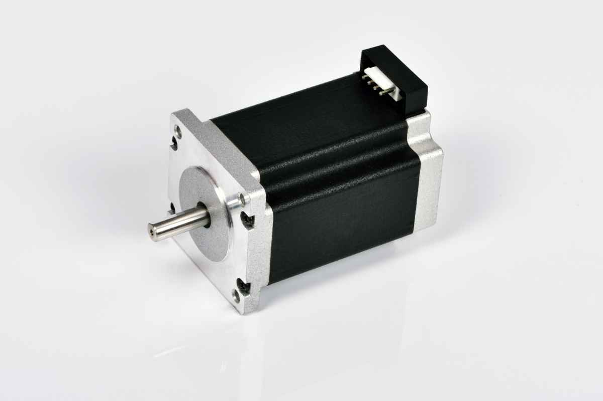

### 1. ອຸປະກອນນີ້ແມ່ນຫຍັງ?

**Stepper Motor** ຫຼື ມໍເຕີກ້າວ ແມ່ນມໍເຕີໄຟຟ້າ DC ແບບບໍ່ມີແປງ (Brushless DC Electric Motor) ທີ່ເຮັດວຽກໂດຍການ **ໝຸນເປັນຂັ້ນຕອນ (Steps) ທີ່ຊັດເຈນແລະບໍ່ຕໍ່ເນື່ອງກັນ**.

ແທນທີ່ຈະໝຸນແບບຕໍ່ເນື່ອງຄືກັບມໍເຕີ DC ທົ່ວໄປ, Stepper Motor ຈະເຄື່ອນທີ່ເທື່ອລະມຸມນ້ອຍໆທີ່ກຳນົດໄວ້. ມຸມແຕ່ລະກ້າວ (Step Angle) ໂດຍທົ່ວໄປແມ່ນມີຂະໜາດນ້ອຍຫຼາຍ ເຊັ່ນ: $1.8^\circ$ (ເຊິ່ງໝາຍເຖິງ 200 ກ້າວຕໍ່ການໝູນຄົບ 1 ຮອບ).

#### 🎯 ຈຸດເດັ່ນຂອງ Stepper Motor:

- **ການຄວບຄຸມແບບວົງເປີດ (Open-Loop Control):** ໂດຍປົກກະຕິແລ້ວ, ມັນສາມາດຄວບຄຸມຕຳແໜ່ງໄດ້ຢ່າງຊັດເຈນໂດຍບໍ່ຈຳເປັນຕ້ອງມີເຊັນເຊີປ້ອນກັບ (Feedback Sensor) ເຊັ່ນ: Encoder (ຕາບໃດທີ່ມໍເຕີບໍ່ເກີດການພາດກ້າວ ຫຼື Stall). ຕຳແໜ່ງແມ່ນຖືກກຳນົດໂດຍການນັບຈຳນວນກ້າວ (Pulses) ທີ່ຖືກປ້ອນເຂົ້າໄປ.
    
- **ແຮງບິດສູງເມື່ອຢຸດ (High Holding Torque):** ມັນມີແຮງບິດສູງເມື່ອຢຸດນິ້ງຢູ່ກັບທີ່, ຖ້າວົງຈອນຍັງມີໄຟຟ້າຢູ່.
    

#### ໂຄງສ້າງຫຼັກ:

- **Stator (ສ່ວນຢູ່ກັບທີ່):** ປະກອບດ້ວຍແມ່ເຫຼັກໄຟຟ້າ (Electromagnets) ທີ່ມີຂົດລວດ (Windings) ທີ່ຈັດລຽງເປັນກຸ່ມ (Phases).
    
- **Rotor (ສ່ວນໝຸນ):** ເປັນແຂນທີ່ຕິດຢູ່ກັບແກນມໍເຕີ, ປະກອບດ້ວຍແມ່ເຫຼັກຖາວອນ (Permanent Magnets) ຫຼື ແຂ້ວເຫຼັກ.
    

### 2. ການໃຊ້ງານຂອງອຸປະກອນເຮັດວຽກແນວໃດ?

Stepper Motor ເຮັດວຽກໂດຍອີງໃສ່ຫຼັກການຂອງ **ແມ່ເຫຼັກໄຟຟ້າ** ແລະ **ການດຶງດູດຂອງຂົ້ວແມ່ເຫຼັກ** ໃນລັກສະນະຂອງການສະຫຼັບຂົ້ວໄປຕາມລຳດັບ.

#### ຂັ້ນຕອນການເຮັດວຽກ:

**1. ການສ້າງສະໜາມແມ່ເຫຼັກ (Energizing the Coils):**

- **Driver Circuit** (ວົງຈອນຂັບ) ຈະສົ່ງກະແສໄຟຟ້າເຂົ້າໄປໃນຂົດລວດ (Phases) ຂອງ Stator ຕາມ **ລຳດັບ (Sequence)** ທີ່ກຳນົດໄວ້.
    
- ເມື່ອຂົດລວດຖືກກະຕຸ້ນ, ມັນຈະສ້າງ **ຂົ້ວແມ່ເຫຼັກ (Magnetic Poles)** ຢູ່ທີ່ Stator.
    

**2. ການດຶງດູດ ແລະ ການຈັດລຽງຕົວ (Rotor Alignment):**

- ຂົ້ວແມ່ເຫຼັກທີ່ຖືກສ້າງຂຶ້ນຢູ່ Stator ຈະ **ດຶງດູດ** ຂົ້ວທີ່ກົງກັນຂ້າມຂອງ Rotor.
    
- Rotor ຈະໝຸນເພື່ອຈັດລຽງຕົວເອງໃຫ້ກົງກັບສະໜາມແມ່ເຫຼັກຂອງ Stator, ເຊິ່ງເຮັດໃຫ້ເກີດການເຄື່ອນທີ່ $1$ **ກ້າວ (Step)**.
    

**3. ການເຄື່ອນທີ່ເປັນຂັ້ນຕອນ (Stepping):**

- ເພື່ອເຮັດໃຫ້ມໍເຕີໝຸນຕໍ່ໄປ, Driver Circuit ຈະ **ປິດໄຟ** ຈາກຂົດລວດທຳອິດ ແລະ **ເປີດໄຟ** ໃຫ້ກັບຂົດລວດທີ່ຢູ່ຖັດໄປຕາມລຳດັບ.
    
- ສະໜາມແມ່ເຫຼັກໃໝ່ຈະຖືກສ້າງຂຶ້ນ, ດຶງດູດ Rotor ໃຫ້ໝຸນໄປອີກ $1$ ກ້າວ, ແລະ Rotor ຈະຈັດລຽງຕົວເອງໄປຕາມຂົ້ວແມ່ເຫຼັກໃໝ່.
    

**4. ການຄວບຄຸມທິດທາງ ແລະ ຄວາມໄວ:**

- **ທິດທາງການໝຸນ:** ຖືກຄວບຄຸມໂດຍ **ລຳດັບ** ຂອງການເປີດ/ປິດຂົດລວດ (ເຊັ່ນ: A-B-C-D ສໍາລັບການໝຸນຕາມເຂັມໂມງ, ແລະ A-D-C-B ສໍາລັບການໝຸນທວນເຂັມໂມງ).
    
- **ຄວາມໄວ:** ຖືກຄວບຄຸມໂດຍ **ຄວາມຖີ່ (Frequency)** ຂອງ Pulses ທີ່ສົ່ງໄປຫາ Driver Circuit. ອັດຕາການປ້ອນ Pulses ໄວຂຶ້ນ, ມໍເຕີກໍ່ຈະໝຸນໄວຂຶ້ນ.
    

#### ວິທີການຂັບເຄື່ອນ (Driving Modes):

- **Full Step (ກ້າວເຕັມ):** ໝຸນດ້ວຍມຸມກ້າວທີ່ຖືກອອກແບບ (ເຊັ່ນ: $1.8^\circ$).
    
- **Half Step (ເຄິ່ງກ້າວ):** ເປີດໃຊ້ງານ 1 Phase ແລະ 2 Phases ສະຫຼັບກັນ ເພື່ອໃຫ້ໄດ້ມຸມກ້າວທີ່ນ້ອຍລົງເຄິ່ງໜຶ່ງ (ເຊັ່ນ: $0.9^\circ$), ເພີ່ມຄວາມລະອຽດ.
    
- **Microstepping (ກ້າວຈຸນລະພາກ):** ຄວບຄຸມກະແສໄຟຟ້າໃນຂົດລວດຢ່າງລະອຽດດ້ວຍຮູບແບບຄື້ນ Sine ເພື່ອແບ່ງມຸມກ້າວໃຫ້ຍິ່ງນ້ອຍລົງໄປອີກ (ເຊັ່ນ: $1/16$ ຂອງກ້າວເຕັມ), ເຮັດໃຫ້ການເຄື່ອນທີ່ລຽບນຽນຂຶ້ນ ແລະ ຫຼຸດສຽງດັງ.

## 38. [ ] Stepper motor driver board.

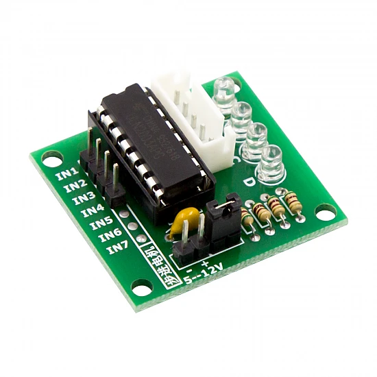

### 1. ອຸປະກອນນີ້ແມ່ນຫຍັງ?

**Stepper Motor Driver Board** ແມ່ນວົງຈອນອີເລັກໂທຣນິກທີ່ສຳຄັນທີ່ເຮັດໜ້າທີ່ເປັນ **ໂຕກາງ (Interface)** ລະຫວ່າງລະບົບຄວບຄຸມ (ເຊັ່ນ: Microcontroller ຫຼື PLC) ແລະ Stepper Motor. ມໍເຕີກ້າວບໍ່ສາມາດເຊື່ອມຕໍ່ກັບ Microcontroller ໄດ້ໂດຍກົງ.

#### ເຫດຜົນທີ່ຕ້ອງມີ Driver Board:

1. **ການເພີ່ມກຳລັງ (Power Amplification):** ລະບົບຄວບຄຸມ (ເຊັ່ນ: Arduino ຫຼື Raspberry Pi) ຈະສົ່ງສັນຍານໄຟຟ້າທີ່ມີແຮງດັນຕ່ຳ (ເຊັ່ນ: 5V) ແລະກະແສໄຟຟ້າຕ່ຳ. Stepper Motor ຕ້ອງການ **ແຮງດັນສູງ** (ເຊັ່ນ: 12V, 24V, ຫຼືສູງກວ່າ) ແລະ **ກະແສໄຟຟ້າສູງ** ເພື່ອສ້າງແຮງບິດທີ່ພຽງພໍ. Driver Board ຈະເປັນຕົວຮັບສັນຍານຄວບຄຸມຕ່ຳ ແລະ ໃຊ້ພະລັງງານຈາກແຫຼ່ງພາຍນອກ (Motor Power Supply) ທີ່ມີກຳລັງສູງເພື່ອຂັບເຄື່ອນຂົດລວດຂອງມໍເຕີ.
    
2. **ການຈັດລຽງລຳດັບ (Sequencing/Commutation):** Driver Board ມີໜ້າທີ່ຈັດລຽງລຳດັບການເປີດ/ປິດຂົດລວດ (Phases) ຂອງມໍເຕີຢ່າງຖືກຕ້ອງຕາມເວລາ ເພື່ອເຮັດໃຫ້ມໍເຕີໝຸນໄປເທື່ອລະກ້າວ.
    

#### ສ່ວນປະກອບຫຼັກ:

- **IC Driver (Integrated Circuit):** ເປັນຊິບຫຼັກທີ່ປະມວນຜົນສັນຍານຄວບຄຸມ. ຕົວຢ່າງເຊັ່ນ: A4988, DRV8825, ຫຼື TMC Series.
    
- **H-Bridge/Transistors:** ເປັນວົງຈອນທີ່ໃຊ້ Transistors ທີ່ມີກຳລັງສູງ (ມັກຈະຈັດລຽງເປັນ H-Bridge) ເພື່ອຄວບຄຸມທິດທາງ ແລະ ກະແສໄຟຟ້າທີ່ໄຫຼຜ່ານຂົດລວດມໍເຕີ.
    
- **Current Regulation Circuit:** ວົງຈອນຄວບຄຸມກະແສໄຟຟ້າ ເພື່ອຈຳກັດກະແສໄຟຟ້າສູງສຸດບໍ່ໃຫ້ເກີນຄ່າທີ່ມໍເຕີສາມາດຮັບໄດ້ (ປ້ອງກັນມໍເຕີຮ້ອນເກີນໄປ ຫຼື ເສຍຫາຍ).
    

---

### 2. ການໃຊ້ງານຂອງອຸປະກອນເຮັດວຽກແນວໃດ?

Driver Board ປະຕິບັດໜ້າທີ່ສອງຢ່າງຫຼັກຄື: ການແປພາສາຄຳສັ່ງ ແລະ ການສົ່ງພະລັງງານສູງໄປຫາຂົດລວດ.

#### ຫຼັກການເຮັດວຽກທີ່ສຳຄັນ:

|**ບາດກ້າວ**|**ໜ້າທີ່**|**ລາຍລະອຽດ**|
|---|---|---|
|**1. ຮັບຄຳສັ່ງ (Step/Dir Input)**|**ການແປພາສາສັນຍານ**|ຮັບສັນຍານຄວບຄຸມ **ຕ່ຳ (Low-level)** ຈາກ Microcontroller, ໂດຍທົ່ວໄປແມ່ນ 2 ສັນຍານຫຼັກ: * **STEP:** Pulse ແຕ່ລະອັນ (ແຮງດັນຂຶ້ນລົງ) ໝາຍເຖິງໃຫ້ມໍເຕີເຄື່ອນທີ່ 1 ກ້າວ. * **DIR (Direction):** ບອກທິດທາງການໝຸນ (ຕາມ ຫຼື ທວນເຂັມໂມງ).|
|**2. ຄວບຄຸມລຳດັບ**|**ການຈັດລຽງ Phase (Commutation)**|ພາຍໃນ Driver IC ຈະແປ Pulse ທີ່ໄດ້ຮັບໄປເປັນ **ລຳດັບການເປີດ/ປິດ** ຂອງຂົດລວດມໍເຕີທີ່ຖືກຕ້ອງ (ເຊັ່ນ: A-AB-B-BC...).|
|**3. ສົ່ງກະແສໄຟຟ້າ**|**ການຂັບເຄື່ອນກຳລັງສູງ**|ໃຊ້ Transistors ທີ່ເຊື່ອມຕໍ່ກັບແຫຼ່ງພະລັງງານມໍເຕີ **ສູງ (High-power)** ເພື່ອສົ່ງກະແສໄຟຟ້າທີ່ສູງຕາມລຳດັບທີ່ກຳນົດໄວ້ໄປຫາຂົດລວດຂອງ Stepper Motor.|
|**4. ການຄວບຄຸມກະແສ (ສຳຄັນທີ່ສຸດ)**|**Current Regulation**|ວົງຈອນຈະຕິດຕາມກະແສໄຟຟ້າທີ່ໄຫຼຜ່ານຂົດລວດ ແລະ ຈະ **ປິດ/ເປີດ** ໄຟຟ້າຢ່າງໄວວາ (ດ້ວຍວິທີ Chopping) ເພື່ອຮັກສາກະແສໄຟຟ້າສູງສຸດໃຫ້ຢູ່ໃນຄ່າທີ່ກຳນົດໄວ້ (ເຊິ່ງກຳນົດດ້ວຍ Trimmer Pot ຫຼື ການຕັ້ງຄ່າຊອບແວ), ຮັບປະກັນວ່າ: * ມໍເຕີສ້າງແຮງບິດສູງສຸດ. * ມໍເຕີບໍ່ຮ້ອນເກີນໄປ.|

#### ຟັງຊັນເພີ່ມເຕີມ: **Microstepping**

Driver Board ສ່ວນໃຫຍ່ມີຄວາມສາມາດໃນການເຮັດ **Microstepping** (ກ້າວຈຸນລະພາກ).

- **ຫຼັກການ:** ແທນທີ່ຈະເປີດ/ປິດໄຟຟ້າໃນຂົດລວດເຕັມທີ່, Driver ຈະ **ຄວບຄຸມກະແສໄຟຟ້າ** ທີ່ໄຫຼຜ່ານສອງຂົດລວດທີ່ຕິດກັນໃນຮູບແບບຄື້ນ Sine ແລະ Cosine.
    
- **ຜົນປະໂຫຍດ:**
    
    - **ເພີ່ມຄວາມລະອຽດ:** ແບ່ງ $1$ ກ້າວເຕັມ (ເຊັ່ນ: $1.8^\circ$) ອອກເປັນ $2, 4, 8, 16$ ຫຼືຫຼາຍກວ່ານັ້ນ (ເຊັ່ນ: $1/16$ ກ້າວ).
        
    - **ການເຄື່ອນທີ່ລຽບນຽນ:** ຫຼຸດຜ່ອນການສັ່ນສະເທືອນແລະສຽງດັງຂອງມໍເຕີ.

# 🧠 ICs & Modules

## 39. [ ] Real-time Clock Module DS1302.

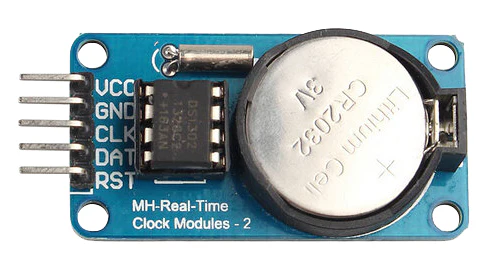

### 1. ອຸປະກອນນີ້ແມ່ນຫຍັງ?

**DS1302 Real-time Clock (RTC) Module** ແມ່ນແຜງວົງຈອນທີ່ປະກອບດ້ວຍຊິບ **DS1302** ເຊິ່ງເຮັດໜ້າທີ່ເປັນ **ໂມງ ແລະ ປະຕິທິນແບບດິຈິຕອລ** ທີ່ມີຄວາມສາມາດໃນການບອກເວລາທີ່ຊັດເຈນ.

#### ຟັງຊັນຫຼັກ:

- **ການຕິດຕາມເວລາ:** ຕິດຕາມຂໍ້ມູນ: ວິນາທີ, ນາທີ, ຊົ່ວໂມງ, ມື້ຂອງອາທິດ, ວັນທີ, ເດືອນ, ແລະ ປີ.
    
- **ການປັບອັດຕະໂນມັດ:** ສາມາດປັບປ່ຽນຈຳນວນວັນຕໍ່ເດືອນ ແລະ ປັບປີອະທິກະຕິ (Leap Year) ໄດ້ໂດຍອັດຕະໂນມັດ.
    
- **ໜ່ວຍຄວາມຈຳ RAM:** ມີໜ່ວຍຄວາມຈຳ Static RAM (SRAM) ຂະໜາດ 31 ໄບຕ໌ (Bytes) ພາຍໃນຊິບ ເພື່ອເກັບຂໍ້ມູນອື່ນໆນອກເໜືອຈາກຂໍ້ມູນເວລາ.
    

#### ສ່ວນປະກອບຫຼັກຂອງໂມດູນ:

1. **ຊິບ DS1302:** ຕົວຄວບຄຸມເວລາຫຼັກ.
    
2. **ແກນ Quartz (Crystal Oscillator):** ຂະໜາດ $32.768 \text{ kHz}$ ເປັນຕົວສ້າງຄວາມຖີ່ຄົງທີ່ເພື່ອຮັບປະກັນຄວາມຊັດເຈນຂອງເວລາ.
    
3. **ຊ່ອງໃສ່ແບັດເຕີຣີສຳຮອງ (Backup Battery Holder):** ໃຊ້ສຳລັບໃສ່ແບັດເຕີຣີແບບຫຼຽນ (ເຊັ່ນ: CR2032) ເພື່ອໃຫ້ໂມງຍັງສືບຕໍ່ເຮັດວຽກໄດ້ຢ່າງຕໍ່ເນື່ອງ ເຖິງແມ່ນວ່າໄຟຟ້າຫຼັກຈະຖືກຕັດໄປກໍຕາມ.
    
4. **Interface Pins:** ຂາເຊື່ອມຕໍ່ແບບ Serial 3 ສາຍ ເພື່ອສື່ສານກັບ Microcontroller (ເຊັ່ນ: Arduino).
    

### 2. ການໃຊ້ງານຂອງອຸປະກອນເຮັດວຽກແນວໃດ?

DS1302 ເຮັດວຽກໂດຍອີງໃສ່ຫຼັກການຂອງ **ການນັບຄວາມຖີ່** ຈາກແກນ Quartz ແລະ ການສື່ສານແບບ **Synchronous Serial Communication** ກັບ Microcontroller.

#### ຫຼັກການເຮັດວຽກພາຍໃນ:

1. **ການສ້າງສັນຍານເວລາ:**
    
    - **ແກນ Quartz ($32.768 \text{ kHz}$):** ສ້າງສັນຍານຄື້ນທີ່ສັ່ນສະເທືອນດ້ວຍຄວາມຖີ່ທີ່ຊັດເຈນແລະຄົງທີ່.
        
    - **Frequency Divider (ວົງຈອນຫານຄວາມຖີ່):** ຊິບ DS1302 ຈະນຳຄວາມຖີ່ $32.768 \text{ kHz}$ ນີ້ໄປຜ່ານວົງຈອນຫານຄວາມຖີ່ຈົນກວ່າຈະໄດ້ Pulse ທີ່ຄວາມຖີ່ $1 \text{ Hz}$ (1 ຄັ້ງຕໍ່ວິນາທີ).
        
    - **Counting Registers:** Pulse $1 \text{ Hz}$ ນີ້ຈະຖືກປ້ອນເຂົ້າໄປໃນ Register (ໜ່ວຍຄວາມຈຳພາຍໃນ) ເພື່ອເລີ່ມຕົ້ນການນັບ ວິນາທີ, ນາທີ, ຊົ່ວໂມງ, ແລະ ວັນທີ.
        
2. **ການສື່ສານກັບ Microcontroller:**
    
    - DS1302 ໃຊ້ Interface ແບບ **Serial 3 ສາຍ** ເຊິ່ງງ່າຍດາຍ ແລະ ໃຊ້ຂາເຊື່ອມຕໍ່ໜ້ອຍ:
        
        - **RST/CE (Reset/Chip Enable):** ຂາເປີດ/ປິດການສື່ສານ.
            
        - **I/O (Input/Output):** ສາຍສຳລັບສົ່ງແລະຮັບຂໍ້ມູນ.
            
        - **SCLK (Serial Clock):** ສາຍສຳລັບກຳນົດຈັງຫວະເວລາຂອງການສົ່ງຂໍ້ມູນ.
            
    - Microcontroller ສົ່ງຄຳສັ່ງໄປຫາ DS1302 ເພື່ອ:
        
        - **ກຳນົດຄ່າ (Write):** ຕັ້ງເວລາ ແລະ ວັນທີເລີ່ມຕົ້ນ.
            
        - **ອ່ານຄ່າ (Read):** ອ່ານຂໍ້ມູນເວລາ ແລະ ວັນທີປັດຈຸບັນ.
            
3. **ລະບົບໄຟຟ້າສຳຮອງ (Backup Power):**
    
    - DS1302 ມີຂາປ້ອນໄຟຟ້າສອງຊຸດຄື: $\text{VCC2}$ (ໄຟຟ້າຫຼັກ) ແລະ $\text{VCC1}$ (ໄຟຟ້າສຳຮອງຈາກແບັດເຕີຣີ).
        
    - ຊິບຈະເລືອກໃຊ້ແຫຼ່ງພະລັງງານທີ່ມີແຮງດັນສູງກວ່າ.
        
    - ເມື່ອໄຟຟ້າຫຼັກ ($\text{VCC2}$) ຖືກຕັດອອກ, ໂມດູນຈະ **ສະຫຼັບອັດຕະໂນມັດ** ໄປໃຊ້ພະລັງງານຈາກແບັດເຕີຣີສຳຮອງ ($\text{VCC1}$). ຍ້ອນວ່າ DS1302 ໃຊ້ພະລັງງານຕ່ຳຫຼາຍ, ແບັດເຕີຣີສຳຮອງຈຶ່ງສາມາດຮັກສາຂໍ້ມູນເວລາໄວ້ໄດ້ຫຼາຍປີ.
        

#### ຕົວຢ່າງການນຳໃຊ້:

- **Data Loggers:** ບັນທຶກຂໍ້ມູນພ້ອມກັບເວລາທີ່ຂໍ້ມູນນັ້ນຖືກເກັບກຳ.
    
- **Timers/Alarm Systems:** ໃຊ້ກຳນົດການເປີດ/ປິດອຸປະກອນຕາມເວລາທີ່ແນ່ນອນ.
    
- **Digital Clocks:** ເປັນໂມງດິຈິຕອລໃນອຸປະກອນຕ່າງໆ.

## 40. [ ] 74HC595 Chip.

### 1. ອຸປະກອນນີ້ແມ່ນຫຍັງ?

**74HC595** ແມ່ນຊິບວົງຈອນລວມ (IC) ທີ່ນິຍົມໃຊ້ກັນຢ່າງກວ້າງຂວາງ ເຊິ່ງເປັນຕົວແບບຂອງ **Shift Register ແບບ Serial-In, Parallel-Out (SIPO)**.

#### ຄວາມໝາຍໂດຍຫຍໍ້:

- **Shift Register:** ແມ່ນວົງຈອນ Digital Logic ທີ່ໃຊ້ເພື່ອເກັບຂໍ້ມູນແລະເຄື່ອນຍ້າຍ (Shift) ຂໍ້ມູນນັ້ນໄປເທື່ອລະບິດ ຕາມຈັງຫວະຂອງໂມງ (Clock Pulse).
    
- **Serial-In, Parallel-Out (SIPO):**
    
    - **Serial-In (SI):** ຂໍ້ມູນຖືກປ້ອນເຂົ້າໄປໃນຊິບແບບ **ລຽນຕາມລຳດັບ (Bit by Bit)** ໂດຍໃຊ້ສາຍພຽງເສັ້ນດຽວ.
        
    - **Parallel-Out (PO):** ຫຼັງຈາກປ້ອນຂໍ້ມູນຄົບແລ້ວ, ຂໍ້ມູນທັງໝົດຈະຖືກສະແດງອອກພ້ອມກັນ **ທັງໝົດ 8 ບິດ** ຜ່ານຂາອອກ 8 ຂາ.
        

#### ຈຸດປະສົງຫຼັກໃນການນຳໃຊ້:

74HC595 ແມ່ນໃຊ້ເປັນເຄື່ອງມືເພື່ອ **ຂະຫຍາຍຈຳນວນຂາອອກ (Output)** ຂອງ Microcontroller (ເຊັ່ນ: Arduino) ໂດຍໃຊ້ຂາຄວບຄຸມພຽງແຕ່ **3 ຂາ** ເທົ່ານັ້ນ ເພື່ອຄວບຄຸມຂາອອກໄດ້ເຖິງ **8 ຂາ** (ຫຼື ຫຼາຍກວ່ານັ້ນ ຖ້າມີການເຊື່ອມຕໍ່ແບບຕໍ່ກັນ).

#### ຄຸນລັກສະນະສຳຄັນ:

- **ຈຳນວນບິດ:** 8-bit.
    
- **ການສື່ສານ:** ໃຊ້ການສື່ສານແບບ Serial (3-Wire Interface).
    
- **Cascadable:** ສາມາດເຊື່ອມຕໍ່ຊິບ 74HC595 ຫຼາຍຕົວເຂົ້າກັນແບບຕໍ່ກັນ (Daisy-chain) ເພື່ອຂະຫຍາຍຈຳນວນຂາອອກໃຫ້ໄດ້ $16, 24, 32, \dots$ ຂາ ໂດຍທີ່ຍັງໃຊ້ຂາຄວບຄຸມຂອງ Microcontroller ພຽງ 3 ຂາຄືເກົ່າ.
    

---

### 2. ການໃຊ້ງານຂອງອຸປະກອນເຮັດວຽກແນວໃດ?

ການເຮັດວຽກຂອງ 74HC595 ປະກອບດ້ວຍ 3 ຂັ້ນຕອນຫຼັກຄື: **Shift (ປ່ຽນ), Store (ເກັບ), ແລະ Output (ປ່ອຍອອກ)** ໂດຍໃຊ້ການສື່ສານຜ່ານ 3 ສັນຍານຫຼັກ:

|**ສັນຍານ**|**ຕົວຫຍໍ້**|**ໜ້າທີ່**|
|---|---|---|
|**Data Pin**|$\text{DS}$ (Data Serial)|ສາຍປ້ອນຂໍ້ມູນ Serial (ບິດທີ່ 0 ຫຼື 1) ເຂົ້າໄປໃນ Shift Register.|
|**Shift Clock**|$\text{SHCP}$ (Shift Register Clock)|Pulse ທີ່ໃຊ້ເພື່ອບອກໃຫ້ Shift Register **ຮັບເອົາບິດໃໝ່** ແລະ **ຍ້າຍ** ຂໍ້ມູນທັງໝົດທີ່ເກັບໄວ້ໄປຂ້າງໜຶ່ງ.|
|**Latch Clock**|$\text{STCP}$ (Storage Register Clock)|Pulse ທີ່ໃຊ້ເພື່ອສັ່ງໃຫ້ຂໍ້ມູນທີ່ຢູ່ໃນ Shift Register **ຖ່າຍໂອນ** ໄປຍັງ Storage Register ເພື່ອສະແດງຜົນອອກ.|

#### ຫຼັກການເຮັດວຽກ:

1. **Shift (ຂັ້ນຕອນການຍ້າຍຂໍ້ມູນ):**
    
    - Microcontroller ສົ່ງຄ່າ **1 ບິດ** (High ຫຼື Low) ໄປຫາຂາ $\text{DS}$.
        
    - Microcontroller ສົ່ງ **Pulse** ໄປຫາຂາ $\text{SHCP}$ (Shift Clock).
        
    - **ຜົນ:** Shift Register ຈະຍ້າຍບິດທີ່ເກັບໄວ້ທັງໝົດໄປຂ້າງໜຶ່ງ (ຄືກັບການເລື່ອນຄິວ) ແລະ ຮັບເອົາບິດໃໝ່ທີ່ $\text{DS}$ ເຂົ້າມາແທນທີ່ບ່ອນຫວ່າງ.
        
    - ຂັ້ນຕອນນີ້ຈະຖືກເຮັດຊ້ຳ 8 ຄັ້ງ ເພື່ອປ້ອນຂໍ້ມູນ 8 ບິດ (ທັງໝົດ 1 ໄບຕ໌) ເຂົ້າໄປໃນ Shift Register.
        
2. **Store (ຂັ້ນຕອນການເກັບຂໍ້ມູນ):**
    
    - ຫຼັງຈາກທີ່ປ້ອນຂໍ້ມູນ 8 ບິດຄົບແລ້ວ, ຂໍ້ມູນນັ້ນຍັງຢູ່ໃນ Shift Register ເຊິ່ງບໍ່ໄດ້ຖືກສະແດງຜົນອອກໄປ.
        
    - Microcontroller ສົ່ງ **Pulse** ໄປຫາຂາ $\text{STCP}$ (Latch Clock).
        
3. **Output (ຂັ້ນຕອນການສະແດງຜົນ):**
    
    - **ຜົນ:** ຂໍ້ມູນ 8 ບິດທີ່ຢູ່ໃນ Shift Register ຈະຖືກ **ຖ່າຍໂອນພ້ອມກັນ** ໄປຍັງ Storage Register.
        
    - ຂາອອກ $\text{Q0}$ ຫາ $\text{Q7}$ ຈະປ່ຽນແປງສະຖານະຕາມຂໍ້ມູນທີ່ຖືກຖ່າຍໂອນມາ, ເຊັ່ນ: ຖ້າບິດທຳອິດເປັນ **1** ແລ້ວ $\text{Q0}$ ຈະເປັນ $\text{HIGH}$ (ໄຟຟ້າເປີດ).

# Mr. Xokananh KHAMSOMPHOU No: 52 End